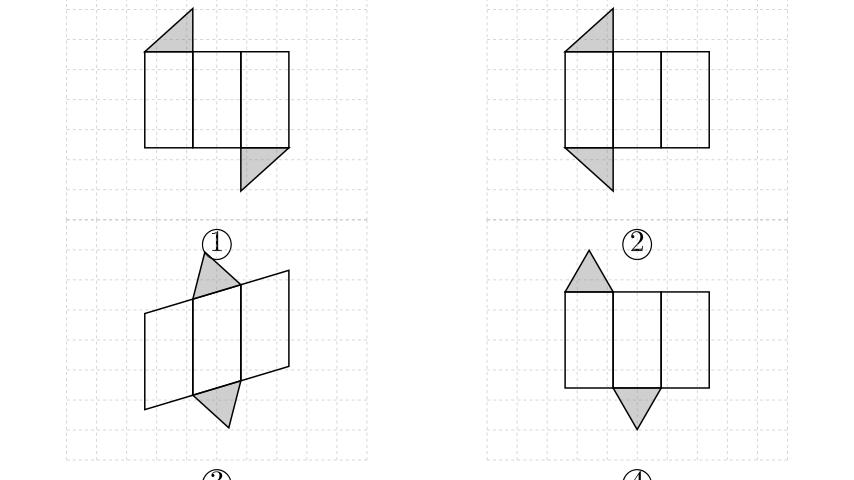
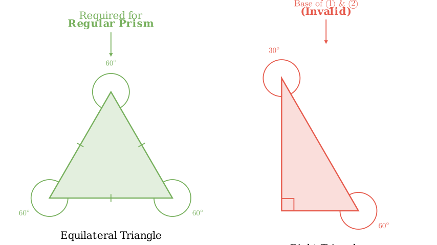
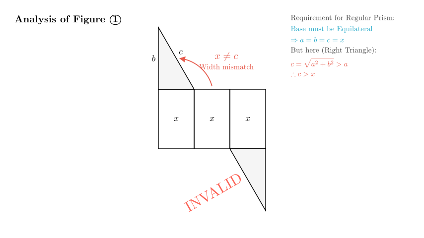

# problem_100_math_g9

**Problem Statement:**
The figures ①~④ in the square grid are shown below.
- In figures ① and ②, the shaded triangles are right-angled triangles with one angle of $60^\circ$.
- In figures ③ and ④, the shaded triangles are acute triangles with one angle of $60^\circ$.

Which of the above figures can be folded to form a **regular triangular prism**?

A. ① and ④
B. ③ and ④
C. ① and ②
D. ②, ③, and ④

**Solution Approach:**
To solve this, we must understand the geometric properties of a "regular triangular prism."
1.  **Definition:** A regular triangular prism is a right prism whose bases are **equilateral triangles**.
2.  **Base Analysis:** We will check if the shaded triangles in the figures can be equilateral.
3.  **Lateral Surface Analysis:** We will check if the rectangular side faces match the side lengths of the base.

By comparing the properties of the given shapes with the definition, we can eliminate the incorrect options.

**Step 1: Analyze the Base Requirements**

A **regular triangular prism** (正三棱柱) is defined by two key features:
1.  It is a **right prism** (side faces are perpendicular to the base).
2.  Its bases are **equilateral triangles** (all three sides are equal, and all three angles are $60^\circ$).

An equilateral triangle is a specific type of **acute triangle** where all angles are $60^\circ$. It cannot be a right-angled triangle because a right triangle has one $90^\circ$ angle.

**Step 2: Evaluate Figures ① and ②**
The problem states: *"In figures ① and ②, the shaded triangles are right-angled triangles..."*

Since a regular triangular prism requires an **equilateral** base, and figures ① and ② have **right-angled** bases, these figures cannot form a regular triangular prism. The side lengths of a right triangle ($a, b, c$) satisfy $a^2 + b^2 = c^2$, meaning the sides are not all equal. However, the lateral faces in the diagrams (the row of rectangles) appear to have equal widths. This mismatch between the unequal sides of the base and the equal widths of the faces would prevent the net from folding into a closed prism.

Therefore, **① and ② are invalid**.

**Step 3: Evaluate Figures ③ and ④**

The problem states: *"In figures ③ and ④, the shaded triangles are acute triangles with one angle of $60^\circ$."*

- **Figure ④:** This shows a standard net for a prism. It has three rectangular faces of equal width in a row, which corresponds to the three equal sides of an equilateral triangle. The bases are acute (potentially equilateral). This structure is valid for a regular triangular prism.

- **Figure ③:** This figure shows a slanted lateral surface (a parallelogram divided into strips). While this often represents an oblique prism, in the context of multiple-choice elimination, we must look at the options. Since we have definitively eliminated ① and ②, any option containing them is incorrect.

**Step 4: Elimination Strategy**
Let's check the given options:
- **A. ① and ④**: Contains ① (Invalid).
- **B. ③ and ④**: Contains neither ① nor ②.
- **C. ① and ②**: Contains both (Invalid).
- **D. ②, ③, and ④**: Contains ② (Invalid).

By process of elimination, **Option B** is the only possible answer. This implies that in the context of this problem, Figure ③ is considered a valid net (possibly representing a specific unfolding or simply being the only "acute" option paired with ④).

**Conclusion:**

1.  A regular triangular prism must have **equilateral** bases.
2.  Figures ① and ② have **right-angled** bases, which are not equilateral. Thus, they are disqualified.
3.  This eliminates options A, C, and D.
4.  Figures ③ and ④ have **acute** bases, which is a requirement for equilateral triangles.
5.  Therefore, the only valid combination is ③ and ④.

**Final Answer:** The correct option is **B**.

