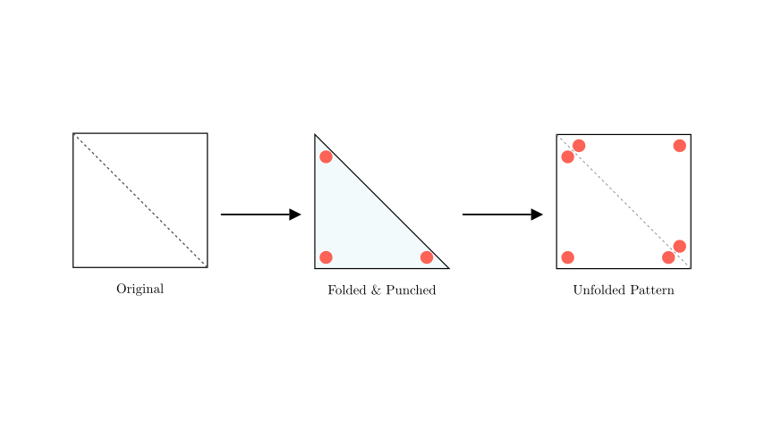
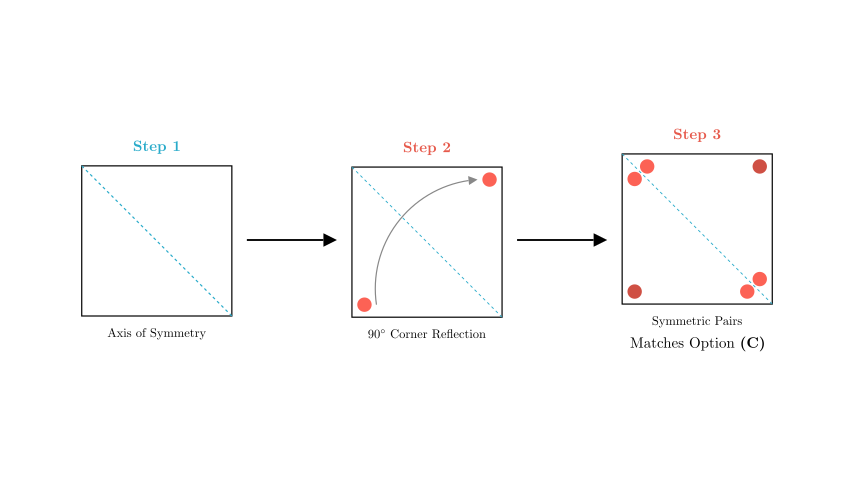
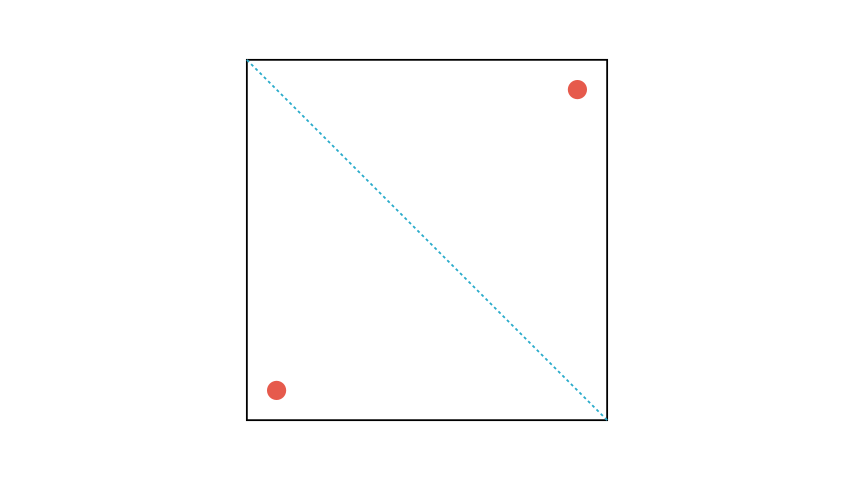
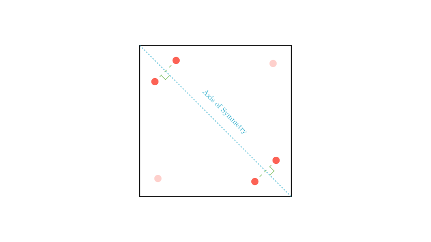

# problem_101_math_g9

**Problem Statement:**
As shown in the figure, a square piece of paper is folded once along the diagonal. Then, a circular hole is cut at each of the three corners of the resulting triangle. Finally, the square paper is unfolded. The resulting pattern is ():

A) [Pattern with vertical/horizontal pairs]
B) [Pattern with center holes]
C) [Pattern with diagonal pairs]
D) [Pattern with pairs at all corners]

**Solution Approach:**
To solve this spatial reasoning problem, we will use the principle of **symmetry**. Folding a paper creates an axis of symmetry along the fold line. Any cut made through the folded layers will be reflected across this axis when unfolded. We will track the position of each hole relative to the fold line (the diagonal) to determine the final pattern.

**Step 1: Analyze the Fold and Layers**

The square is folded along a diagonal. Let's assume the fold is along the diagonal connecting the top-left and bottom-right corners. This creates a triangle consisting of **two layers** of paper.

Because the paper is folded, any hole punched through the triangle goes through both layers. When we unfold the paper:
1. The fold line acts as a **mirror line** (axis of symmetry).
2. Every hole punched will appear twice: once in its original position and once reflected across the diagonal.

**Step 2: Analyzing the 90° Corner Hole**

Look at the hole punched near the 90° corner of the triangle (Hole H1).

- In the folded state, this corner is composed of the remaining two corners of the square (top-right and bottom-left) stacked on top of each other.
- The fold line does *not* pass through this corner.
- When punched, the hole goes through both the top layer and the bottom layer.
- **Unfolding Result:** When we open the paper, these two layers separate to opposite corners of the square. We will see one single hole at the top-right and one single hole at the bottom-left.

**Step 3: Analyzing the 45° Corner Holes**

Now look at the holes punched near the acute (45°) angles of the triangle (Holes H2 and H3).

- These corners lie *on* the fold line (the diagonal).
- The hole is punched slightly inside the triangle, through the double layer.
- **Unfolding Result:** Since the hole is near the axis of symmetry but not centered exactly on it, the hole and its reflection will appear side-by-side.
- This creates a **pair of holes** near the top-left corner and a **pair of holes** near the bottom-right corner.
- Crucially, because they are reflections across the diagonal, the line connecting each pair must be **perpendicular** to the diagonal fold line.

**Conclusion and Verification**

Let's combine our observations:
1.  **Top-Right & Bottom-Left:** Single holes (from the 90° corner punch).
2.  **Top-Left & Bottom-Right:** Pairs of holes (from the 45° corner punches).
3.  **Orientation:** The pairs must be symmetric across the diagonal.

**Comparing with Options:**
- **A:** Has pairs at two corners, but they are arranged vertically and horizontally, which is not symmetric across a diagonal fold.
- **B:** Incorrect hole placement (center).
- **C:** Shows single holes at two opposite corners and pairs at the other two. The pairs are arranged symmetrically across the diagonal (perpendicular to it). This matches our derivation.
- **D:** Shows pairs at all four corners, which is incorrect.

**Final Answer:** The correct pattern is **C**.

