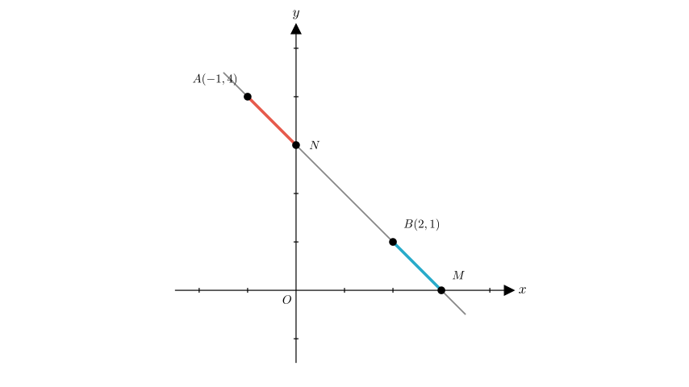
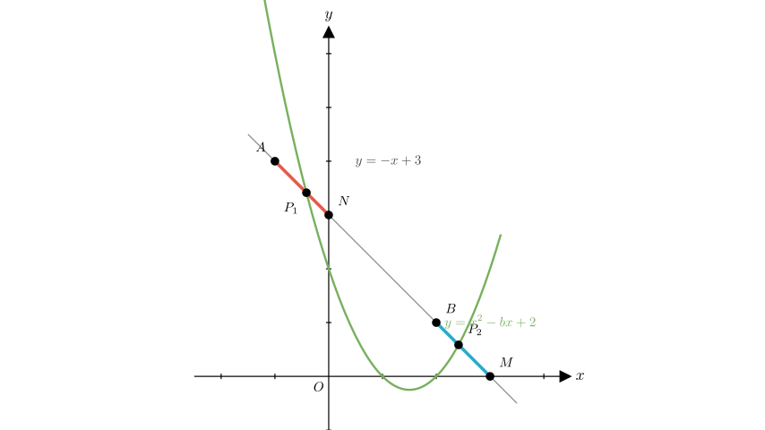
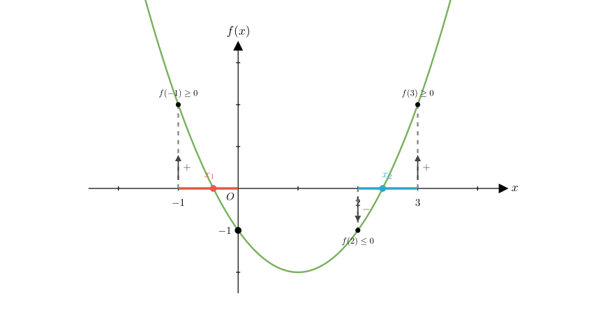

# problem_102_math_g9

**Problem Statement:**
In the plane Cartesian coordinate system, given points $A(-1, 4)$ and $B(2, 1)$, the line $AB$ intersects the $x$-axis and $y$-axis at points $M$ and $N$, respectively. If the parabola $y = x^2 - bx + 2$ intersects the line $AB$ at two distinct points, such that one intersection point lies on the segment $AN$ (including endpoints $A, N$) and the other intersection point lies on the segment $BM$ (including endpoints $B, M$), determine the range of values for $b$.

**Solution Approach:**
1.  Determine the equation of the line $AB$ and find the coordinates of points $M$ and $N$.
2.  Establish the system of equations for the intersection of the parabola and the line.
3.  Convert the geometric intersection conditions into algebraic constraints on the roots of the resulting quadratic equation.
4.  Solve the inequalities to find the range of $b$.

**Step 1: Analyze the Line $AB$**

First, we calculate the slope ($k$) of the line passing through $A(-1, 4)$ and $B(2, 1)$:
$$k = \frac{1 - 4}{2 - (-1)} = \frac{-3}{3} = -1$$

Using the point-slope form with point $B(2, 1)$, the equation of line $AB$ is:
$$y - 1 = -1(x - 2)$$
$$y = -x + 3$$

**Step 2: Find Coordinates of $M$ and $N$**
- The line intersects the $y$-axis at $N$. Setting $x=0$, we get $y=3$. So, $N(0, 3)$.
- The line intersects the $x$-axis at $M$. Setting $y=0$, we get $0 = -x + 3 \Rightarrow x=3$. So, $M(3, 0)$.

**Step 3: Define the Intersection Segments**
The problem requires intersection points on specific segments defined by their $x$-coordinates:
- **Segment $AN$:** $x$ ranges from $-1$ (at $A$) to $0$ (at $N$). So, $x \in [-1, 0]$.
- **Segment $BM$:** $x$ ranges from $2$ (at $B$) to $3$ (at $M$). So, $x \in [2, 3]$.

**Step 4: Formulate the Intersection Equation**

To find the intersection points, we equate the expressions for $y$ from the parabola and the line:
$$x^2 - bx + 2 = -x + 3$$

Rearranging this into a standard quadratic equation $Ax^2 + Bx + C = 0$:
$$x^2 + (1 - b)x - 1 = 0$$

Let $f(x) = x^2 + (1 - b)x - 1$.
The roots of this equation, $x_1$ and $x_2$, correspond to the $x$-coordinates of the intersection points.

**Step 5: Analyze Root Conditions**
Based on the problem statement:
- One root ($x_1$) must be in $[-1, 0]$ (Segment $AN$).
- The other root ($x_2$) must be in $[2, 3]$ (Segment $BM$).

Let's analyze the properties of $f(x) = x^2 + (1 - b)x - 1$:
1.  The parabola opens upwards (coefficient of $x^2$ is positive).
2.  The $y$-intercept of this function is $f(0) = -1$.

Since $f(0) = -1$ (which is less than 0), the vertex of the parabola $f(x)$ lies below the x-axis. For the parabola to open upwards and cross the axis, it must have one negative root and one positive root.

**Step 6: Solve for $b$**

Because $f(0) = -1$, the function is negative at $x=0$.

**Condition for the positive root ($x_2 \in [2, 3]$):**
For the root to exist between 2 and 3, the function must go from negative to positive in that interval.
- At $x=2$, the value must be $\le 0$:
$$f(2) = 2^2 + (1 - b)(2) - 1 \le 0$$
$$4 + 2 - 2b - 1 \le 0$$
$$5 - 2b \le 0 \Rightarrow 2b \ge 5 \Rightarrow b \ge \frac{5}{2}$$

- At $x=3$, the value must be $\ge 0$:
$$f(3) = 3^2 + (1 - b)(3) - 1 \ge 0$$
$$9 + 3 - 3b - 1 \ge 0$$
$$11 - 3b \ge 0 \Rightarrow 3b \le 11 \Rightarrow b \le \frac{11}{3}$$

**Condition for the negative root ($x_1 \in [-1, 0]$):**
We can check if the range found above satisfies the condition for the negative root.
Note that the product of roots $x_1 \cdot x_2 = \frac{c}{a} = -1$.
If $x_2 \in [2, 3]$, then $x_1 = -1/x_2$.
Since $2 \le x_2 \le 3$, it follows that $\frac{1}{3} \le \frac{1}{x_2} \le \frac{1}{2}$, so $-\frac{1}{2} \ge -\frac{1}{x_2} \ge -\frac{1}{3}$.
This means $x_1 \in [-\frac{1}{2}, -\frac{1}{3}]$, which is fully contained within $[-1, 0]$.
Therefore, satisfying the condition for $x_2$ automatically satisfies the condition for $x_1$.

**Conclusion:**
The range of $b$ is determined solely by the inequalities for the root on segment $BM$:
$$\frac{5}{2} \le b \le \frac{11}{3}$$

**Final Answer:**
The range of values for $b$ is $\frac{5}{2} \le b \le \frac{11}{3}$.
This corresponds to Option C.

