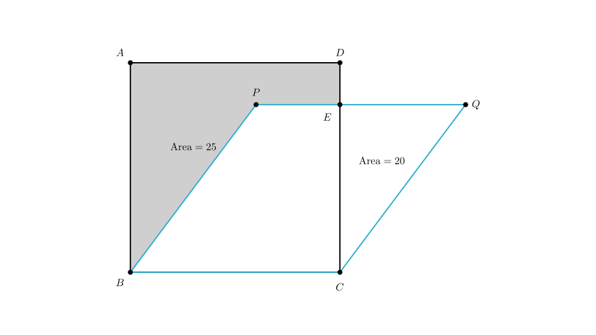
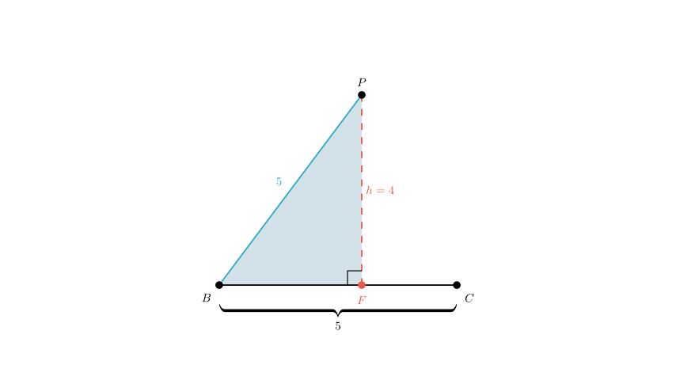
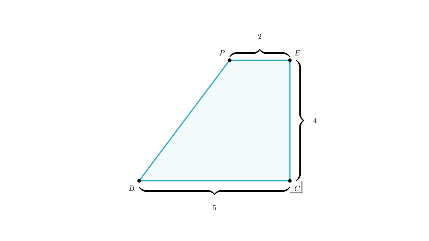

# problem_103_math_g9

**Problem Statement:**
Given, as shown in the figure, the area of square $ABCD$ is 25, and the area of rhombus $PQCB$ is 20. Find the area of the shaded region.

**Options:**
A. 11
B. 6.5
C. 7
D. 7.5

**Solution Approach:**
To find the area of the shaded region, we can use the subtraction method. The shaded region is part of the square $ABCD$. Specifically, it is the area of the square minus the unshaded white region that lies inside the square. By analyzing the properties of the square and the rhombus, we can determine the geometric shape and dimensions of this unshaded region and subtract its area from the total area of the square.

**Step 1: Determine the side lengths.**

First, let's look at the square $ABCD$. We are given that its area is 25.
Since the area of a square is given by $side^2$, we can calculate the side length:
$$BC = \sqrt{25} = 5$$

Next, consider the rhombus $PQCB$. By definition, a rhombus has all sides equal in length. Since it shares side $BC$ with the square, the side length of the rhombus is also 5.
$$PB = PQ = QC = BC = 5$$

**Step 2: Determine the height of the rhombus.**

We are given that the area of the rhombus $PQCB$ is 20. The area of a rhombus (which is a type of parallelogram) is calculated as:
$$\text{Area} = \text{Base} \times \text{Height}$$

Using $BC$ as the base:
$$20 = 5 \times h$$
$$h = 4$$

This height $h$ represents the perpendicular distance from line $PQ$ to line $BC$. In our coordinate system, this means the y-coordinate of points $P$ and $Q$ is 4.

**Step 3: Locate Point P horizontally.**

We need to find the exact position of point $P$ to determine the shape of the unshaded region. Consider the right-angled triangle formed by the height dropped from $P$ to the base $BC$. Let's call the foot of this altitude $F$.

In right triangle $\triangle PFB$:
- Hypotenuse $PB = 5$ (side of the rhombus).
- Height $PF = 4$.

Using the Pythagorean theorem ($a^2 + b^2 = c^2$):
$$FB^2 + 4^2 = 5^2$$
$$FB^2 + 16 = 25$$
$$FB^2 = 9$$
$$FB = 3$$

So, point $P$ is located 3 units horizontally from point $B$.

**Step 4: Analyze the unshaded region (Trapezoid $BCEP$).**

The unshaded region inside the square is the polygon $BCEP$. Let's identify its shape:
- Side $BC$ is horizontal with length 5.
- Side $PE$ is part of the line $PQ$, which is parallel to $BC$.
- Therefore, $BCEP$ is a trapezoid.

We need the length of the top base $PE$.
The total width of the square is 5 (distance from line $AB$ to line $CD$).
Point $P$ is 3 units to the right of line $AB$.
Therefore, the distance from $P$ to the right edge of the square ($CD$) is:
$$PE = \text{Total Width} - \text{Horizontal Offset of P}$$
$$PE = 5 - 3 = 2$$

**Step 5: Calculate the area of the unshaded trapezoid.**

Now we calculate the area of trapezoid $BCEP$:
$$\text{Area}_{\text{trapezoid}} = \frac{(\text{Top Base} + \text{Bottom Base}) \times \text{Height}}{2}$$
$$\text{Area}_{\text{trapezoid}} = \frac{(2 + 5) \times 4}{2}$$
$$\text{Area}_{\text{trapezoid}} = \frac{7 \times 4}{2}$$
$$\text{Area}_{\text{trapezoid}} = 14$$

**Step 6: Calculate the shaded area.**

Finally, we subtract the unshaded trapezoid area from the total square area to find the shaded region.

$$\text{Area}_{\text{shaded}} = \text{Area}_{\text{square}} - \text{Area}_{\text{trapezoid}}$$
$$\text{Area}_{\text{shaded}} = 25 - 14$$
$$\text{Area}_{\text{shaded}} = 11$$

**Conclusion:**
The area of the shaded portion is 11.

**Verification:**
- Square Area = 25.
- Unshaded region consists of a rectangle (3x4) missing a triangle (3x4/2 = 6)? No, let's view it simply.
- The unshaded part is composed of a rectangle of $2 \times 4$ (right side) and a triangle of base $3$, height $4$.
- Rectangle area = $2 \times 4 = 8$.
- Triangle area = $0.5 \times 3 \times 4 = 6$.
- Total unshaded = $8 + 6 = 14$.
- Shaded = $25 - 14 = 11$.
The calculation holds.

**Final Answer:**
The correct option is **A**.

