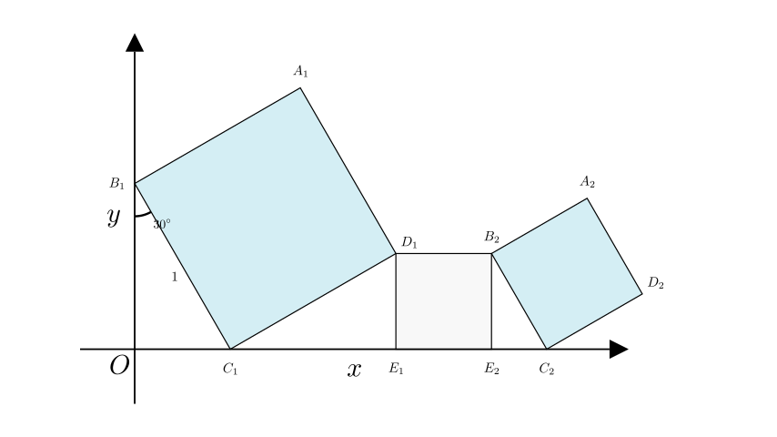
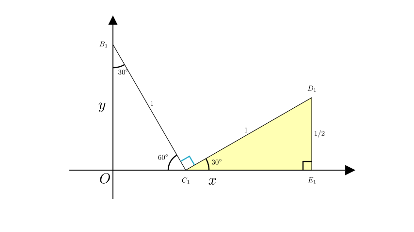
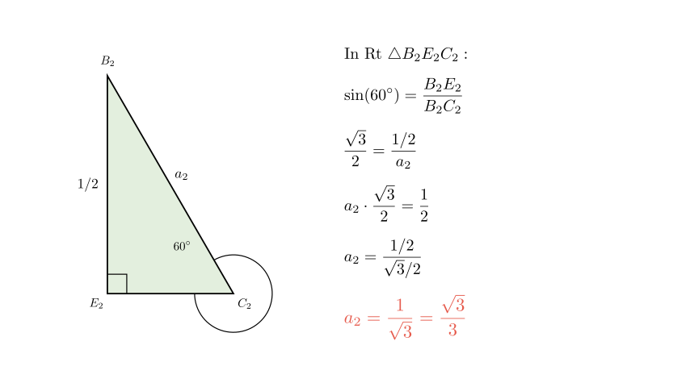

# problem_104_math_g9

**题目描述：**
在平面直角坐标系中，正方形 $A_{1}B_{1}C_{1}D_{1}$，$D_{1}E_{1}E_{2}B_{2}$，$A_{2}B_{2}C_{2}D_{2}$，$D_{2}E_{3}E_{4}B_{3}$，$A_{3}B_{3}C_{3}D_{3}$... 如图所示放置。点 $B_{1}$ 在 y 轴上，点 $C_{1}, E_{1}, E_{2}, C_{2}, E_{3}, E_{4}, C_{3}$... 在 x 轴上。已知正方形 $A_{1}B_{1}C_{1}D_{1}$ 的边长为 1，$\angle C_{1}B_{1}O=30^{\circ}$，且 $B_{1}C_{1} \parallel B_{2}C_{2} \parallel B_{3}C_{3}$...

求正方形 $A_{2016}B_{2016}C_{2016}D_{2016}$ 的边长。

**选项：**
A. $(\frac{1}{2})^{2015}$
B. $(\frac{1}{2})^{2016}$
C. $(\frac{\sqrt{3}}{3})^{2015}$
D. $(\frac{\sqrt{3}}{3})^{2016}$

**解题思路：**
我们将分析相邻正方形之间的几何关系，找出它们边长的公比。这是一个等比数列问题。通过计算第二个正方形相对于第一个正方形的边长，我们可以建立第 $n$ 个正方形的通项公式。

**步骤 1：分析第一个正方形 ($A_1B_1C_1D_1$)**

让我们确定与第一个正方形相关的角度和坐标。

*   已知在直角三角形 $\triangle B_1OC_1$ 中，$\angle C_1B_1O = 30^{\circ}$。
*   由于三角形内角和为 $180^{\circ}$ 且 $\angle B_1OC_1 = 90^{\circ}$，因此 $C_1$ 处的角为：
$\angle B_1C_1O = 90^{\circ} - 30^{\circ} = 60^{\circ}$。

**步骤 2：分析连接正方形 ($D_1E_1E_2B_2$)**

接下来，我们观察向小正方形 $D_1E_1E_2B_2$ 的过渡。

*   点 $C_1, E_1$ 在 x 轴上。因为 $A_1B_1C_1D_1$ 是正方形，所以 $\angle B_1C_1D_1 = 90^{\circ}$。
*   角 $\angle D_1C_1E_1$ 与 $\angle B_1C_1O$ 以及正方形的直角构成一个平角。然而，观察几何图形，$D_1$ 向下投影到 $E_1$。
*   让我们计算角 $\angle D_1C_1E_1$。在 $C_1$ 处直线上的总角度为 $180^{\circ}$。
$\angle D_1C_1E_1 = 180^{\circ} - \angle B_1C_1O - \angle B_1C_1D_1$
$\angle D_1C_1E_1 = 180^{\circ} - 60^{\circ} - 90^{\circ} = 30^{\circ}$。

现在，考虑直角三角形 $\triangle D_1E_1C_1$（其中 $D_1E_1$ 垂直于 x 轴）。
*   斜边 $D_1C_1 = 1$（第一个正方形的边长）。
*   竖直边 $D_1E_1$ 代表连接正方形的边长。
*   $D_1E_1 = D_1C_1 \cdot \sin(30^{\circ}) = 1 \cdot \frac{1}{2} = \frac{1}{2}$。

因此，连接正方形 $D_1E_1E_2B_2$ 的边长为 $\frac{1}{2}$。从而，竖直线段 $B_2E_2$ 的长度也为 $\frac{1}{2}$。

**步骤 3：分析第二个倾斜正方形 ($A_2B_2C_2D_2$)**

现在我们求第二个大正方形的边长。设正方形 $A_nB_nC_nD_n$ 的边长为 $a_n$。

*   我们知道 $B_1C_1 \parallel B_2C_2$。这意味着正方形相对于 x 轴的倾斜度是相同的。
*   因此，在直角三角形 $\triangle B_2E_2C_2$ 中，角 $\angle B_2C_2E_2$ 对应于 $\angle B_1C_1O$。
*   $\angle B_2C_2E_2 = 60^{\circ}$。

我们知道竖直直角边 $B_2E_2$ 是我们刚刚计算出的连接正方形的边长：
$B_2E_2 = \frac{1}{2}$。

在 $\triangle B_2E_2C_2$ 中：
*   $\sin(\angle B_2C_2E_2) = \frac{\text{对边}}{\text{斜边}} = \frac{B_2E_2}{B_2C_2}$
*   $\sin(60^{\circ}) = \frac{1/2}{a_2}$
*   $\frac{\sqrt{3}}{2} = \frac{1/2}{a_2}$

解出 $a_2$：
$a_2 = \frac{1/2}{\sqrt{3}/2} = \frac{1}{\sqrt{3}} = \frac{\sqrt{3}}{3}$。

**步骤 4：建立规律**

第二个正方形与第一个正方形的边长之比为：
$q = \frac{a_2}{a_1} = \frac{\sqrt{3}/3}{1} = \frac{\sqrt{3}}{3}$。

因为几何构造是重复的（相似三角形和正方形），这个比率 $q$ 对于所有后续正方形都将保持不变。

**步骤 5：通项公式与最终计算**

正方形的边长构成一个等比数列：
*   $a_1 = 1$
*   $a_2 = \frac{\sqrt{3}}{3}$
*   $a_3 = (\frac{\sqrt{3}}{3})^2$
*   ...
*   $a_n = a_1 \cdot q^{n-1} = 1 \cdot (\frac{\sqrt{3}}{3})^{n-1}$

我们需要求第 2016 个正方形的边长 $a_{2016}$。

代入 $n = 2016$：
$a_{2016} = (\frac{\sqrt{3}}{3})^{2016-1}$
$a_{2016} = (\frac{\sqrt{3}}{3})^{2015}$

**结论：**
正方形 $A_{2016}B_{2016}C_{2016}D_{2016}$ 的边长为 $(\frac{\sqrt{3}}{3})^{2015}$。

将此结果与给定选项进行比较：
A. $(\frac{1}{2})^{2015}$
B. $(\frac{1}{2})^{2016}$
C. $(\frac{\sqrt{3}}{3})^{2015}$
D. $(\frac{\sqrt{3}}{3})^{2016}$

正确选项是 **C**。