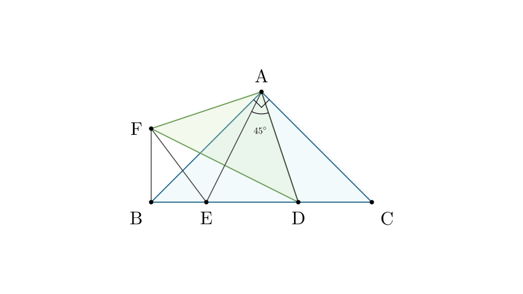
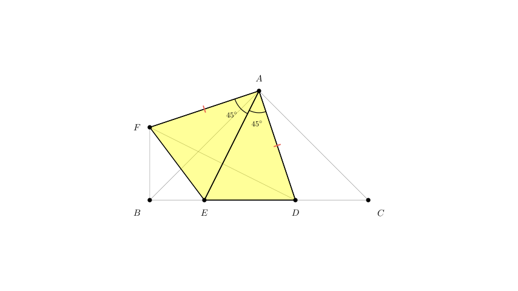
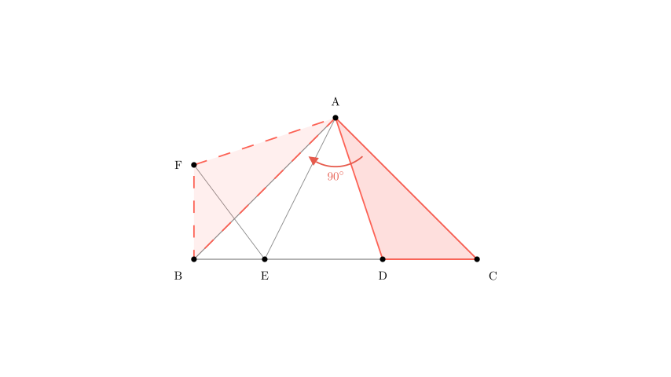
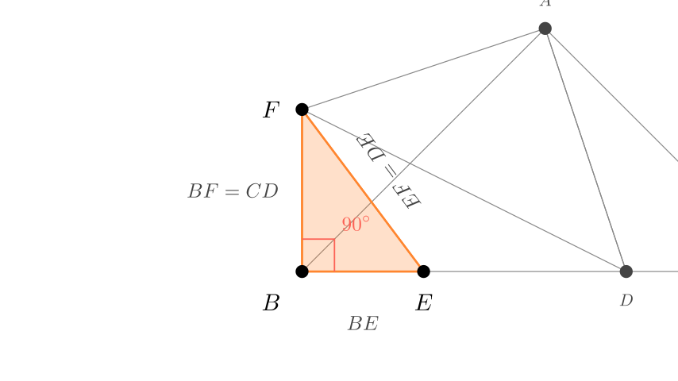

# problem_105_math_g9

**Problem Statement:**
As shown in the figure, $\angle BAC = \angle DAF = 90^\circ$, $AB = AC$, $AD = AF$. Points $D$ and $E$ are on side $BC$, and $\angle DAE = 45^\circ$. Connect $EF$ and $BF$. Which of the following conclusions are correct?

① $\triangle AED \cong \triangle AEF$
② $\triangle ABE \sim \triangle ACD$
③ $BE + DC > DE$
④ $BE^2 + DC^2 = DE^2$

**Options:**
A. 1
B. 2
C. 3
D. 4

**Solution Approach:**
We will analyze the geometry step-by-step. First, we verify the congruence of triangles $\triangle AED$ and $\triangle AEF$ using the given angles. Then, we will use a rotation argument (rotating $\triangle ACD$ around point $A$) to map $CD$ to $BF$, creating a right-angled triangle that allows us to verify the remaining inequalities and equations using the Pythagorean theorem.

**Step 1: Analyzing Statement ① ($\triangle AED \cong \triangle AEF$)**

Let's examine the relationship between $\triangle AED$ and $\triangle AEF$.

1.  **Given Sides:** We are given that $AD = AF$.
2.  **Common Side:** The side $AE$ is shared by both triangles.
3.  **Included Angle:** We need to find $\angle EAF$.
*   We know $\angle DAF = 90^\circ$.
*   We are given $\angle DAE = 45^\circ$.
*   Therefore, $\angle EAF = \angle DAF - \angle DAE = 90^\circ - 45^\circ = 45^\circ$.

Since $AD = AF$, $\angle DAE = \angle EAF = 45^\circ$, and $AE = AE$, we can conclude by the **SAS (Side-Angle-Side)** congruency criterion that **$\triangle AED \cong \triangle AEF$**.

This implies that corresponding sides are equal: **$ED = EF$**.

**Conclusion:** Statement ① is **Correct**.

**Step 2: Analyzing Statement ② ($\triangle ABE \sim \triangle ACD$)**

For these two triangles to be similar, their corresponding angles must be equal.

*   In isosceles right $\triangle ABC$, we know $\angle B = \angle C = 45^\circ$. This gives us one pair of equal angles.
*   However, for similarity, we would also need $\angle BAE = \angle CAD$.
*   We know $\angle BAC = 90^\circ$ and $\angle DAE = 45^\circ$. This means $\angle BAE + \angle CAD = 90^\circ - 45^\circ = 45^\circ$.
*   There is no constraint in the problem stating that $\angle BAE$ must equal $\angle CAD$. Points $E$ and $D$ are only constrained by the $45^\circ$ angle between them, not by symmetry relative to the altitude from $A$.

Since the angles are not necessarily equal, the triangles are not necessarily similar.

**Conclusion:** Statement ② is **Incorrect**.

**Step 3: Analyzing Statements ③ and ④ (Using Rotation)**

To solve for the relationships involving $BE$, $DC$, and $DE$, we can use a rotation technique.

Consider rotating $\triangle ACD$ clockwise by $90^\circ$ around point $A$.
*   Since $AC = AB$ and $\angle BAC = 90^\circ$, side $AC$ maps onto side $AB$.
*   Since $AD = AF$ and $\angle DAF = 90^\circ$, side $AD$ maps onto side $AF$.
*   Therefore, $\triangle ACD \cong \triangle ABF$.

**Consequences of this congruence:**
1.  **$CD = BF$** (Corresponding sides).
2.  $\angle ACD = \angle ABF$.

Since $\triangle ABC$ is an isosceles right triangle, $\angle ACB = 45^\circ$.
Therefore, $\angle ABF = 45^\circ$.

Now, let's look at the angle $\angle FBE$:
$$ \angle FBE = \angle ABF + \angle ABE $$
Since $\triangle ABC$ is isosceles right, $\angle ABE = 45^\circ$.
$$ \angle FBE = 45^\circ + 45^\circ = 90^\circ $$

So, $\triangle FBE$ is a **right-angled triangle**.

**Step 4: Verifying Conclusions ③ and ④**

Now we apply standard geometry theorems to the right-angled triangle $\triangle FBE$.

**For Statement ④ ($BE^2 + DC^2 = DE^2$):**
In right $\triangle FBE$, by the Pythagorean theorem:
$$ BE^2 + BF^2 = EF^2 $$
Substituting our known equalities from the previous steps:
*   $BF = DC$ (from rotation congruence)
*   $EF = DE$ (from Statement ① congruence)

We get:
$$ BE^2 + DC^2 = DE^2 $$
**Conclusion:** Statement ④ is **Correct**.

**For Statement ③ ($BE + DC > DE$):**
In any triangle, the sum of two sides must be greater than the third side (Triangle Inequality Theorem).
In $\triangle FBE$:
$$ BE + BF > EF $$
Substituting the same values ($BF = DC$ and $EF = DE$):
$$ BE + DC > DE $$
**Conclusion:** Statement ③ is **Correct**.

**Final Summary:**
*   ① Correct
*   ② Incorrect
*   ③ Correct
*   ④ Correct

There are 3 correct conclusions.

**Final Answer:**
The correct choice is **C (3 correct conclusions)**.

