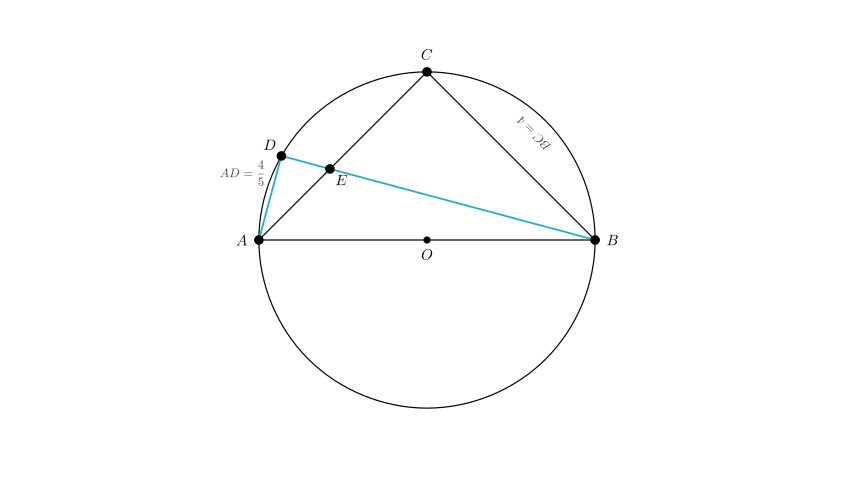
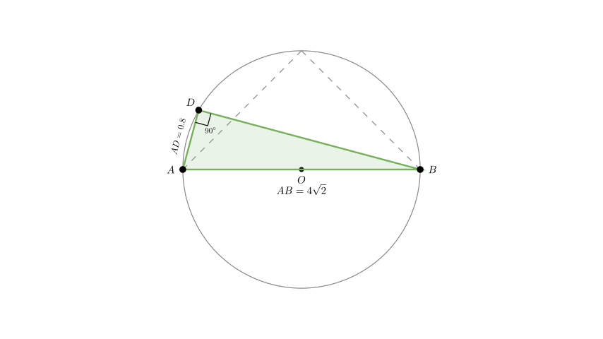
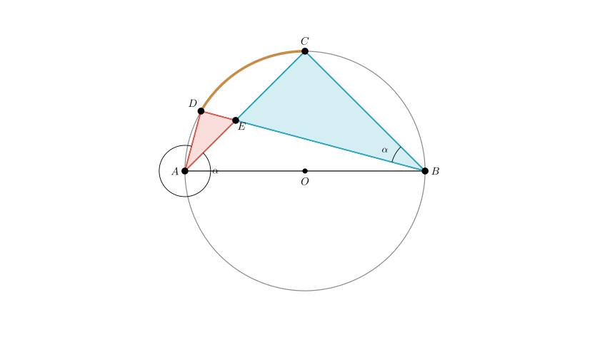

# problem_106_math_g9

**Problem Statement:**
As shown in the figure, circle $O$ is the circumcircle of the isosceles right triangle $ABC$. Point $D$ is a point on the arc $AC$. The line segment $BD$ intersects $AC$ at point $E$. If $BC = 4$ and $AD = \frac{4}{5}$, determine the length of $AE$.

**Options:**
A. 3
B. 2
C. 1
D. 1.2

**Solution Approach:**
1.  Identify the geometric properties of the isosceles right triangle inscribed in a circle (specifically that the hypotenuse $AB$ is the diameter).
2.  Use the diameter property to establish that $\angle ADB = 90^\circ$.
3.  Calculate the length of the chord $BD$ using the Pythagorean theorem.
4.  Prove that $\triangle ADE$ is similar to $\triangle BCE$.
5.  Use the ratio of similarity to set up an equation for $AE$ and solve.

**Step 1: Analyze Geometric Properties**

Since $\triangle ABC$ is an isosceles right triangle inscribed in circle $O$, and $\angle ACB$ must be $90^\circ$, the hypotenuse $AB$ passes through the center $O$. Thus, $AB$ is the diameter of the circle.

Given $BC = 4$ and the triangle is isosceles ($AC = BC$), we have:
$$AC = 4$$

Using the Pythagorean theorem for $\triangle ABC$:
$$AB = \sqrt{AC^2 + BC^2} = \sqrt{4^2 + 4^2} = \sqrt{32} = 4\sqrt{2}$$

**Step 2: Calculate Length of BD**

Since $AB$ is the diameter, the angle subtended by it at any point on the circle is a right angle. Therefore, $\angle ADB = 90^\circ$.

In the right-angled $\triangle ADB$:
- Hypotenuse $AB = 4\sqrt{2}$
- Leg $AD = \frac{4}{5} = 0.8$

We can find $BD$ using the Pythagorean theorem:
$$BD^2 = AB^2 - AD^2$$
$$BD^2 = (4\sqrt{2})^2 - (0.8)^2$$
$$BD^2 = 32 - 0.64 = 31.36$$
$$BD = \sqrt{31.36} = 5.6$$

**Step 3: Establish Similarity**

Now consider $\triangle ADE$ and $\triangle BCE$.

1.  **Right Angles:**
- We established $\angle ADB = 90^\circ$. Since $A, D, E, B$ are related such that $E$ lies on $BD$ and $D$ is on the circle, $\angle ADE$ refers to the angle at vertex $D$ formed by $AD$ and $DB$. Thus, $\angle ADE = 90^\circ$.
- We know $\angle ACB = 90^\circ$, so $\angle BCE = 90^\circ$.
- Therefore, $\angle ADE = \angle BCE$.

2.  **Angles on the Same Arc:**
- $\angle DAE$ (which is $\angle DAC$) subtends the arc $CD$.
- $\angle CBE$ (which is $\angle CBD$) also subtends the arc $CD$.
- Therefore, $\angle DAE = \angle CBE$.

By Angle-Angle (AA) similarity criterion:
$$\triangle ADE \sim \triangle BCE$$

**Step 4: Solve for AE**

From the similarity $\triangle ADE \sim \triangle BCE$, the ratio of corresponding sides is constant:
$$\frac{AD}{BC} = \frac{AE}{BE} = \frac{DE}{CE}$$

Substitute the known values ($AD = 0.8$ and $BC = 4$):
$$\text{Ratio } k = \frac{0.8}{4} = \frac{1}{5}$$

This gives us two relationships:
1.  $AE = \frac{1}{5} BE \implies BE = 5 AE$
2.  $DE = \frac{1}{5} CE$

Let $AE = x$. Since $AC = 4$, we have $CE = 4 - x$.
From the second relationship:
$$DE = \frac{4 - x}{5}$$

We know that $BD = BE + DE$. We calculated $BD = 5.6$ earlier.
Substitute $BE = 5x$ and $DE = \frac{4 - x}{5}$:
$$5x + \frac{4 - x}{5} = 5.6$$

Multiply the entire equation by 5 to clear the denominator:
$$25x + (4 - x) = 28$$
$$24x + 4 = 28$$
$$24x = 24$$
$$x = 1$$

**Conclusion:**
The length of $AE$ is 1.

**Verification:**
If $AE = 1$:
- $CE = 3$
- $BE = 5(1) = 5$
- $DE = 3/5 = 0.6$
- Total length $BD = BE + DE = 5 + 0.6 = 5.6$. This matches our calculated $BD$.
- Power of point $E$: $AE \cdot CE = 1 \cdot 3 = 3$.
- $BE \cdot DE = 5 \cdot 0.6 = 3$. The values are consistent.

**Final Answer:**
The length of $AE$ is 1. Matches Option C.

