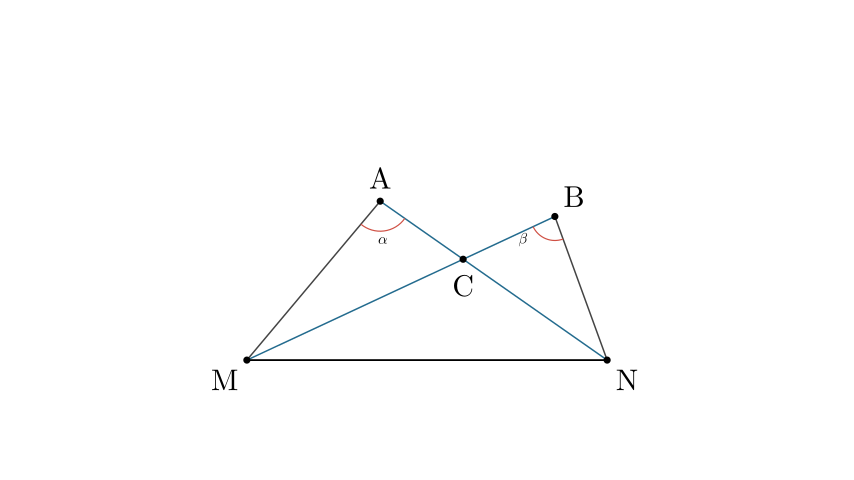
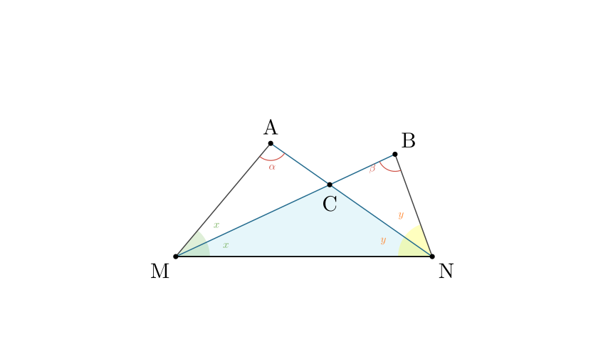
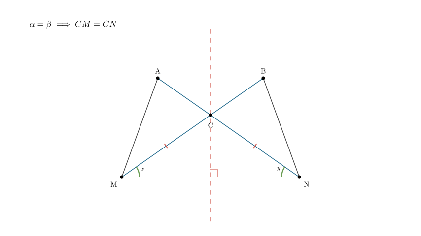
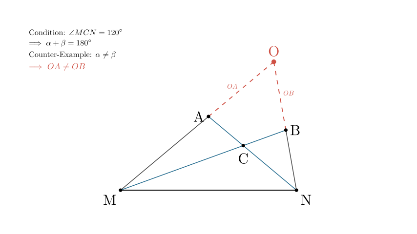

# problem_108_math_g9

**Problem Statement:**
As shown in the figure, triangles $\triangle AMN$ and $\triangle BMN$ are constructed on the same side of $MN$. $BM$ bisects $\angle AMN$, and $AN$ bisects $\angle BNM$. $AN$ intersects $BM$ at point $C$. Let $\angle A = \alpha^\circ$ and $\angle B = \beta^\circ$. Which of the following conclusions is **incorrect**?

A. If $\alpha = \beta$, then point $C$ lies on the perpendicular bisector of $MN$.
B. If $\alpha + \beta = 180^\circ$, then $\angle AMB = \angle NMB$.
C. $\angle MCN = \left(\frac{\alpha+\beta}{3}+60\right)^\circ$.
D. When $\angle MCN = 120^\circ$, if $MA$ and $NB$ are extended to intersect at point $O$, then $OA = OB$.

**Solution Approach:**
1. Define the angle measures in terms of variables derived from the bisector conditions.
2. Set up a system of linear equations using the sum of angles in $\triangle AMN$ and $\triangle BMN$.
3. Solve for the base angles of $\triangle MCN$.
4. Verify each option (A, B, C, D) against the derived relationships to identify the incorrect conclusion.

**Step 1: Define Angle Variables**
Let's denote the angles created by the bisectors.
Since $BM$ bisects $\angle AMN$:
$$ \angle AMB = \angle BMN = x $$
$$ \implies \angle AMN = 2x $$

Since $AN$ bisects $\angle BNM$:
$$ \angle BNA = \angle ANM = y $$
$$ \implies \angle BNM = 2y $$

**Step 2: Formulate Equations**
We use the property that the sum of angles in a triangle is $180^\circ$.

In $\triangle AMN$:
$$ \angle A + \angle AMN + \angle ANM = 180^\circ $$
$$ \alpha + 2x + y = 180^\circ \quad \text{--- (Eq. 1)} $$

In $\triangle BMN$:
$$ \angle B + \angle BMN + \angle BNM = 180^\circ $$
$$ \beta + x + 2y = 180^\circ \quad \text{--- (Eq. 2)} $$

We now have a system of two equations with two unknowns ($x$ and $y$).

**Step 3: Solve for $x$ and $y$**
To solve the system, we can express $x$ and $y$ in terms of $\alpha$ and $\beta$.

Multiply (Eq. 2) by 2:
$$ 2\beta + 2x + 4y = 360^\circ $$
Subtract (Eq. 1) from this result:
$$ (2x + 4y) - (2x + y) = (360 - 2\beta) - (180 - \alpha) $$
$$ 3y = 180 + \alpha - 2\beta $$
$$ y = 60 + \frac{\alpha - 2\beta}{3} $$

Similarly, solving for $x$:
$$ x = 60 + \frac{\beta - 2\alpha}{3} $$

**Step 4: Verify Option C**
Calculate $\angle MCN$ in $\triangle MCN$:
$$ \angle MCN = 180^\circ - (x + y) $$
First, find $x+y$ by adding (Eq. 1) and (Eq. 2):
$$ (\alpha + 2x + y) + (\beta + x + 2y) = 360^\circ $$
$$ \alpha + \beta + 3(x + y) = 360^\circ $$
$$ 3(x + y) = 360 - (\alpha + \beta) $$
$$ x + y = 120 - \frac{\alpha + \beta}{3} $$

Substitute this back into the expression for $\angle MCN$:
$$ \angle MCN = 180 - \left(120 - \frac{\alpha + \beta}{3}\right) $$
$$ \angle MCN = 60 + \frac{\alpha + \beta}{3} $$
Therefore, **Option C is correct**.

**Step 5: Verify Option A**
If $\alpha = \beta$:
From our sum equation, $x + y = 120 - \frac{2\alpha}{3}$.
From the difference of equations, $x - y = \frac{1}{3}(\beta - \alpha) = 0 \implies x = y$.
Since $x = y$, $\triangle MCN$ has equal base angles ($\angle CMN = \angle CNM$).
This makes $\triangle MCN$ an isosceles triangle, so $CM = CN$.
Any point equidistant from the endpoints of a segment lies on its perpendicular bisector.
Therefore, **Option A is correct**.

**Step 6: Verify Option B**
Statement: "If $\alpha + \beta = 180^\circ$, then $\angle AMB = \angle NMB$."
Recall that $BM$ is the angle bisector of $\angle AMN$. By definition, an angle bisector divides the angle into two equal parts.
Therefore, $\angle AMB = \angle NMB$ is **always true**, regardless of the values of $\alpha$ and $\beta$.
Since the conclusion is always true, the conditional statement is logically valid.
Therefore, **Option B is correct**.

**Step 7: Verify Option D**
Condition: $\angle MCN = 120^\circ$.
Using the formula from Option C:
$$ 120 = 60 + \frac{\alpha + \beta}{3} \implies 60 = \frac{\alpha + \beta}{3} \implies \alpha + \beta = 180^\circ $$
We extend $MA$ and $NB$ to meet at $O$.
In $\triangle MON$, the sum of angles is $180^\circ$.
$$ \angle O = 180^\circ - (\angle OMN + \angle ONM) $$
$$ \angle O = 180^\circ - (2x + 2y) = 180^\circ - 2(x+y) $$
Since $\alpha + \beta = 180^\circ$, we know $x+y = 120 - 60 = 60^\circ$.
$$ \angle O = 180^\circ - 120^\circ = 60^\circ $$
So $\triangle MON$ has a $60^\circ$ apex angle.

For $OA = OB$ to be true, $\triangle MON$ would typically need to be isosceles (implying $OM = ON$) and the cut-offs $AM$ and $BN$ would need to be equal.
$OM = ON$ requires $\angle ONM = \angle OMN \implies 2y = 2x \implies y = x$.
As seen in Option A, $x = y$ only if $\alpha = \beta$.
However, the condition is only $\alpha + \beta = 180^\circ$. We can have $\alpha = 100^\circ$ and $\beta = 80^\circ$.
In that case, $\alpha \neq \beta \implies x \neq y \implies OM \neq ON$.
Consequently, $OA$ is generally not equal to $OB$.
Therefore, **Option D is incorrect**.

**Final Conclusion:**
The incorrect conclusion is D.

