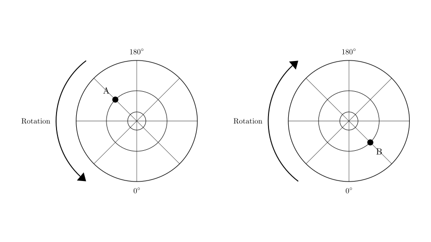
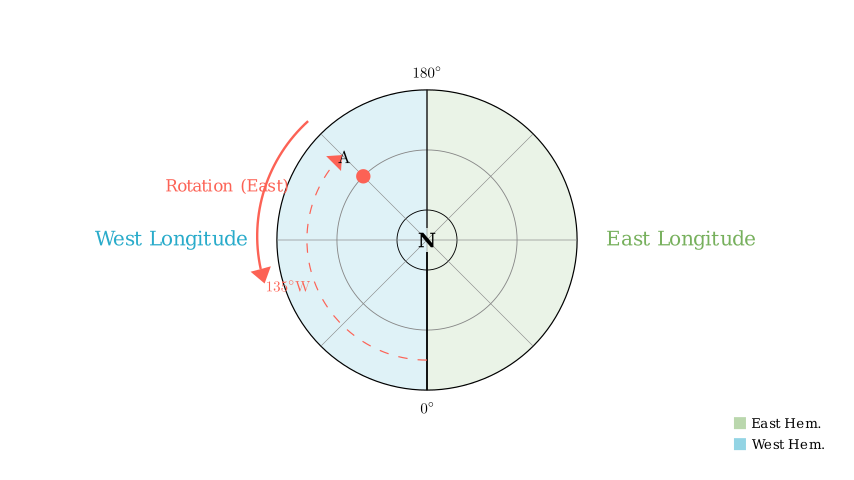
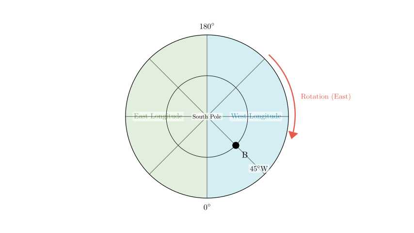

# problem_114_geography_g9

**Problem Statement:**

Read the diagrams and complete the following question.
Based on the diagrams, which of the following statements is correct?

A. Point A experiences direct sunlight only once a year.
B. Point B may experience direct sunlight twice a year.
C. From the perspective of North/South hemispheres, Point B is in the Southern Hemisphere.
D. From the perspective of East/West hemispheres, Point A is in the Eastern Hemisphere and Point B is in the Western Hemisphere.

**Solution Approach:**

To solve this problem, we need to interpret the polar projection maps. The key steps are:
1.  Determine the hemisphere (North or South) for each map based on the direction of Earth's rotation.
2.  Determine the longitude of points A and B by establishing the East/West direction relative to the 0° and 180° meridians.
3.  Evaluate the latitude implications for direct sunlight (solar zenith).
4.  Verify each option against these findings.

**Step 1: Determine the Hemispheres**

The direction of Earth's rotation is the primary indicator for identifying the pole shown in a polar projection.

*   **Earth rotates from West to East.**
*   When viewed from above the **North Pole**, this rotation appears **Counter-Clockwise**.
*   When viewed from above the **South Pole**, this rotation appears **Clockwise**.

**Analyzing the Left Map (Point A):**
The rotation arrow indicates a **Counter-Clockwise** direction. Therefore, the center of this map is the **North Pole**, and it depicts the **Northern Hemisphere**.

**Analyzing the Right Map (Point B):**
The rotation arrow indicates a **Clockwise** direction. Therefore, the center of this map is the **South Pole**, and it depicts the **Southern Hemisphere**.

*Immediate Check:* This finding directly supports **Option C**: "From the perspective of North/South hemispheres, Point B is in the Southern Hemisphere." Let's continue to verify the other details to ensure this is the only correct answer.

**Step 2: Determine Longitudes and East/West Hemispheres**

**For Point A (Left Map - North Pole):**
*   The rotation is Counter-Clockwise, which points **East**.
*   Starting from the 0° meridian (bottom) and moving East (Counter-Clockwise), we cover the Eastern Hemisphere (Right half of the map).
*   Starting from the 0° meridian and moving West (Clockwise), we cover the Western Hemisphere (Left half of the map).
*   **Point A** is located in the top-left quadrant. To reach A from the 180° line, we move clockwise (West). Alternatively, tracing from 0° clockwise (West), A is past 90°W.
*   Specifically, A is halfway between 90°W and 180°, placing it at approximately **135°W**.
*   **Conclusion for A:** Point A is in the **Western Hemisphere**.

**For Point B (Right Map - South Pole):**
*   The rotation is Clockwise, which points **East**.
*   Starting from the 0° meridian (bottom) and moving East (Clockwise), we cover the Eastern Hemisphere (Left half of the map).
*   Moving West (Counter-Clockwise) from 0° covers the Western Hemisphere (Right half of the map).
*   **Point B** is located in the lower-right quadrant. This is in the direction of 'West' from 0°.
*   Specifically, B is at a 45° angle from the 0° line.
*   **Conclusion for B:** Point B is at **45°W**, which is in the **Western Hemisphere**.

*Check against Option D:* Option D claims A is in the Eastern Hemisphere and B is in the Western Hemisphere. Since A is actually in the *Western* Hemisphere, **Option D is incorrect**.

**Step 3: Analyze Latitude and Solar Directness (Options A and B)**

*   **Option A:** "Point A experiences direct sunlight only once a year."
Direct sunlight occurs between the Tropic of Cancer (23.5°N) and Tropic of Capricorn (23.5°S).
*   On the Tropics: Once a year.
*   Between the Tropics: Twice a year.
*   Outside the Tropics: Never.
In polar projections like this, the concentric circles usually represent major latitudes (e.g., Equator, Tropics, Polar Circles) or standard intervals (30°, 60°). Point A is on a middle circle in the Northern Hemisphere. Without explicit labels, we cannot confirm if it is exactly on the Tropic of Cancer. Usually, mid-latitude points like this (often 45° or 60°) receive **no** direct sunlight. Thus, Option A is likely incorrect or at least unprovable compared to Option C.

*   **Option B:** "Point B may experience direct sunlight twice a year."
Point B is in the Southern Hemisphere. Similar to A, it lies on a mid-latitude circle. If this circle represents 30°S or 45°S, it never receives direct sunlight. The term "may" suggests possibility, but visually B appears to be well outside the tropical zone (which would be very close to the outer edge if the outer edge is the Equator). Thus, Option B is unlikely.

**Final Verification**

*   **A:** Incorrect (Likely mid-latitude, 0 times).
*   **B:** Incorrect (Likely mid-latitude, 0 times).
*   **C:** **Correct.** The clockwise rotation definitively identifies the map as the Southern Hemisphere view.
*   **D:** Incorrect. Point A is in the Western Hemisphere (135°W), not Eastern.

**Final Answer:**
The correct option is **C**.

