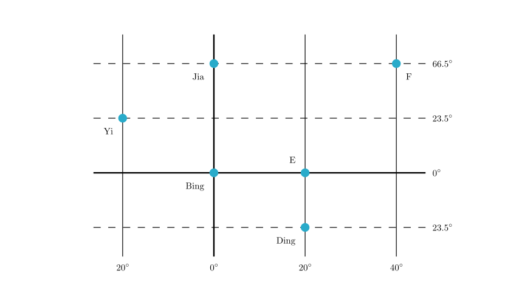
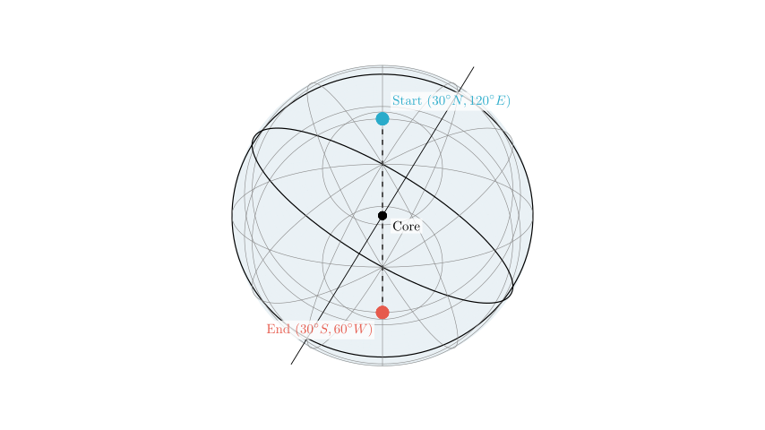
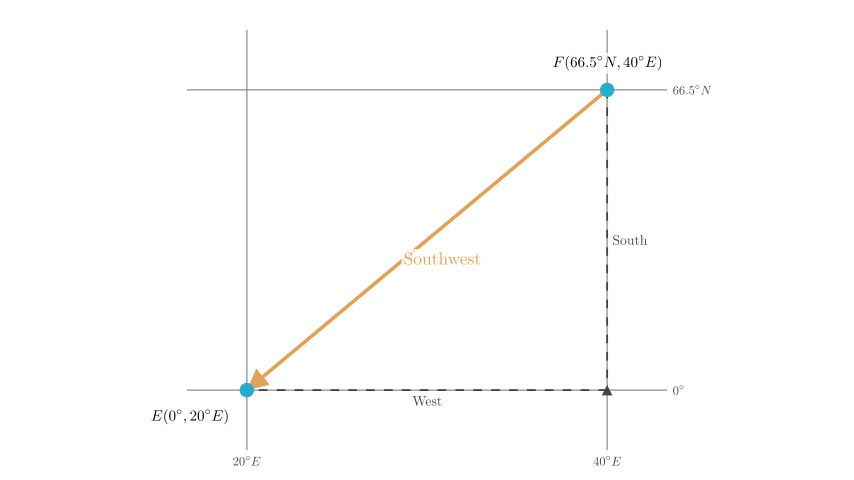
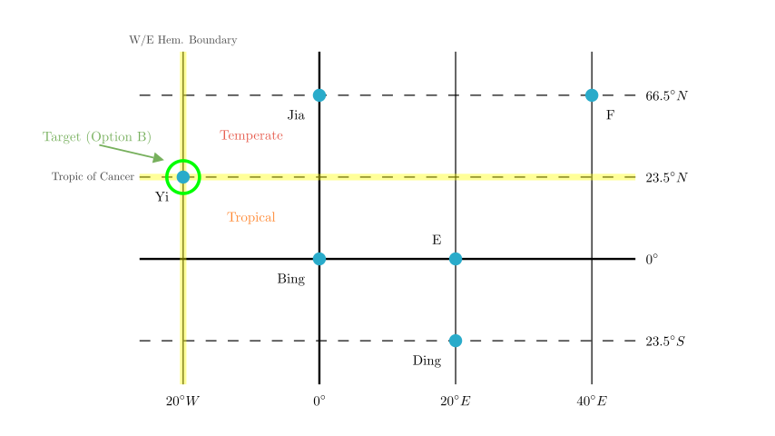

# problem_115_geography_g9

**Problem Statement:**
Read the diagram and answer questions 1-4.

1. Ultraman lives at ($30^\circ N, 120^\circ E$). One day he wants to visit Anpanman, who lives on the other end of the Earth. He decides to "burrow" there, entering the ground from his home and traveling in a straight line through the Earth's center to Anpanman's home. Determine the specific location of Anpanman's home ( ).
2. Which statement regarding Ultraman and Anpanman's homes is correct ( )?
3. Determine the direction of point E relative to point F in the diagram ( ).
4. Which point in the diagram meets the following conditions: Its east side is the Eastern Hemisphere, its west side is the Western Hemisphere, its northern side has distinct seasonal changes, and its southern side experiences direct sunlight phenomena?
A. Point Jia (甲)
B. Point Yi (乙)
C. Point Bing (丙)
D. Point Ding (丁)

**Solution Approach:**
We will analyze the geographic coordinate system provided in the image.
1.  **Antipodal Points:** We will calculate the coordinates opposite to Ultraman's location by inverting the latitude and adjusting the longitude by $180^\circ$.
2.  **Relative Direction:** We will compare the coordinates of points E and F to determine the cardinal direction.
3.  **Hemispheres and Zones:** We will identify the specific point based on the definitions of the Eastern/Western hemisphere boundaries ($20^\circ W$ and $160^\circ E$) and the solar thermal zones (Tropics vs. Temperate zones).

First, let's visualize the grid provided in the problem to establish the coordinates of all marked points.

**Step 1: Analyzing the Grid Coordinates**

Based on the diagram and standard map conventions (North is up, East is right):
*   The central vertical line is the Prime Meridian ($0^\circ$).
*   Longitude increases to the right, so the lines are: $20^\circ W$, $0^\circ$, $20^\circ E$, $40^\circ E$.
*   The central horizontal line is the Equator ($0^\circ$).
*   Latitude increases upwards (North) and downwards (South).

The coordinates for the points are:
*   **Yi (乙):** ($23.5^\circ N, 20^\circ W$)
*   **Jia (甲):** ($66.5^\circ N, 0^\circ$)
*   **Bing (丙):** ($0^\circ, 0^\circ$)
*   **E:** ($0^\circ, 20^\circ E$)
*   **Ding (丁):** ($23.5^\circ S, 20^\circ E$)
*   **F:** ($66.5^\circ N, 40^\circ E$)

**Step 2: Solving Question 1 (Antipodal Point)**

Ultraman travels from ($30^\circ N, 120^\circ E$) through the center of the Earth. The exit point is the **antipodal point**.
*   **Latitude:** Changes from North to South (same magnitude). $30^\circ N \rightarrow 30^\circ S$.
*   **Longitude:** Changes by $180^\circ$ (supplementary angle to 180, opposite East/West).
*   $180^\circ - 120^\circ = 60^\circ$.
*   East becomes West.
*   Result: $60^\circ W$.

**Answer to Q1:** Anpanman lives at ($30^\circ S, 60^\circ W$).

**Step 3: Solving Question 3 (Direction of E relative to F)**

We need to find the direction *from* F *to* E.
*   **Point F:** ($66.5^\circ N, 40^\circ E$)
*   **Point E:** ($0^\circ, 20^\circ E$)

**Latitude Comparison:**
E is at $0^\circ$ and F is at $66.5^\circ N$. Since $0^\circ$ is south of $66.5^\circ N$, E is **South** of F.

**Longitude Comparison:**
E is at $20^\circ E$ and F is at $40^\circ E$. Since $20^\circ$ is smaller than $40^\circ$ (and both are East), E is to the left of F. Therefore, E is **West** of F.

**Answer to Q3:** E is located to the **Southwest** of F.

**Step 4: Solving Question 4 (Identifying the specific point)**

We need to find a point satisfying four conditions:
1.  **East side is Eastern Hemisphere:** The boundary between the Western and Eastern Hemispheres is located at **$20^\circ W$** (moving East from here enters the East Hemisphere) and $160^\circ E$.
2.  **West side is Western Hemisphere:** This confirms the longitude must be exactly **$20^\circ W$**. (Anything West of $20^\circ W$ is the Western Hemisphere).
3.  **North side has distinct seasons:** Distinct seasons occur in the **Temperate Zones** (between the Tropics and Polar Circles). This implies the area North of the point is Temperate.
4.  **South side has direct sunlight:** Direct sunlight occurs in the **Tropical Zone** (between the Tropic of Cancer and Tropic of Capricorn). This implies the area South of the point is Tropical.

**Conclusion:**
The line separating the Temperate Zone (North) and the Tropical Zone (South) in the Northern Hemisphere is the **Tropic of Cancer ($23.5^\circ N$)**.

**Target Coordinates:**
Longitude: $20^\circ W$
Latitude: $23.5^\circ N$

Looking at our grid from Scene 1:
*   Point **Yi (乙)** is located at intersection of the first vertical line ($20^\circ W$) and the second horizontal line ($23.5^\circ N$).

**Answer to Q4:** The correct point is **B (Point Yi/乙)**.

**Final Recap and Answers:**

1.  **Anpanman's Location:** ($30^\circ S, 60^\circ W$). This is calculated using the antipodal rule (same latitude opposite hemisphere, supplementary longitude).
2.  *(Note: Specific options for Q2 were not provided, but generally, antipodal points share the same rotational angular velocity and experience opposite seasons).*
3.  **Direction:** E is to the **Southwest** of F.
4.  **Point Identification:** **Option B (Point Yi/乙)**. It sits on the boundary of the hemispheres ($20^\circ W$) and the boundary of the thermal zones ($23.5^\circ N$).

