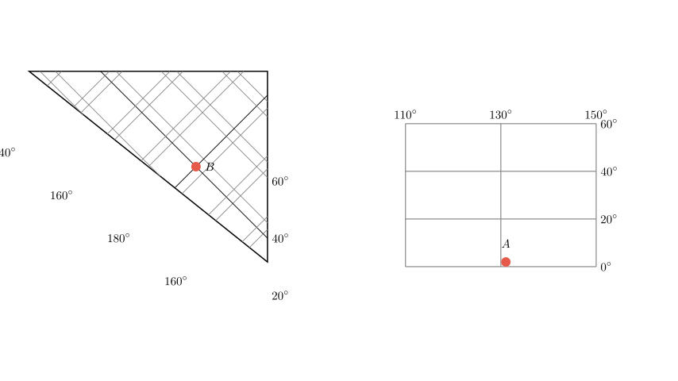
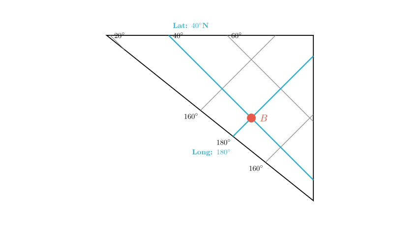
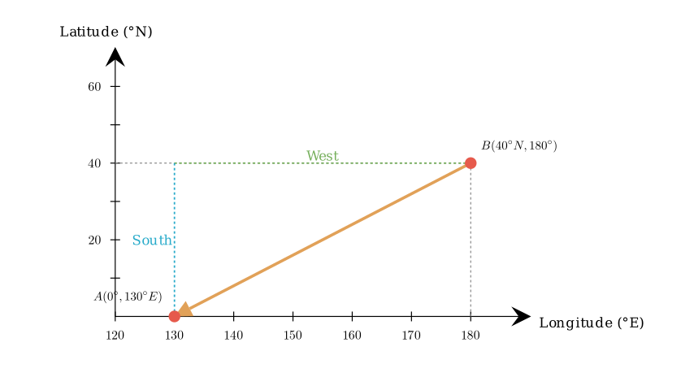

# problem_116_geography_g9

**Problem Statement:**
Based on the diagrams, determine the direction of point A relative to point B is (  )
A. Northwest
B. Southwest
C. Northeast
D. Southeast

**Solution Approach:**
To solve this problem, we need to determine the geographical coordinates (Latitude and Longitude) of both point A and point B from the provided grids. Once we have the coordinates:
1. Compare the latitudes to determine the North-South direction.
2. Compare the longitudes to determine the East-West direction.
3. Combine these to find the final relative direction.

**Step 1: Determine the coordinates of Point A**

Let's look at the right-hand diagram first, as it uses a standard rectangular grid.

*   **Latitude:** The horizontal lines are labeled 0, 20, 40, 60. The numbers increase upwards, indicating North Latitude. Point A is located on the bottom line, which is labeled **0°**. This means Point A is on the Equator.
*   **Longitude:** The vertical lines are labeled 110, 130, 150. The numbers increase to the right. In geography, longitude increasing to the right indicates East Longitude. Point A is on the line labeled **130°**.

So, the coordinates of Point A are **(0°, 130° E)**.

**Step 2: Determine the coordinates of Point B**

Now, let's analyze the left-hand diagram.

*   **Latitude:** The vertical axis on the right side is labeled 20, 40, 60, increasing upwards. This indicates North Latitude. Point B aligns with the line labeled **40°**. So, the latitude is 40° N.
*   **Longitude:** The numbers along the diagonal edge are 140, 160, 180, 160, 140. Point B lies on the line that connects directly to the label **180°**. This represents the 180th meridian (International Date Line).

So, the coordinates of Point B are **(40° N, 180°)**.

**Step 3: Determine the direction of A relative to B**

We need to find the direction *from* B *to* A.

*   **North-South Direction:**
*   Point B is at 40° N.
*   Point A is at 0° (Equator).
*   Since 0° is south of 40° N, Point A is to the **South** of Point B.

*   **East-West Direction:**
*   Point B is at 180° longitude.
*   Point A is at 130° E longitude.
*   To go from 180° to 130° E, we move westward (180° -> 170° E -> ... -> 130° E). The difference is 50°, which is the shortest path (minor arc).
*   Therefore, Point A is to the **West** of Point B.

**Conclusion:**
Combining the two directions (South and West), Point A is located to the **Southwest** of Point B.

Comparing this with the given options:
A. Northwest
B. Southwest
C. Northeast
D. Southeast

The correct option is **B**.

