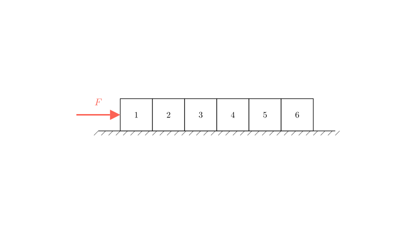
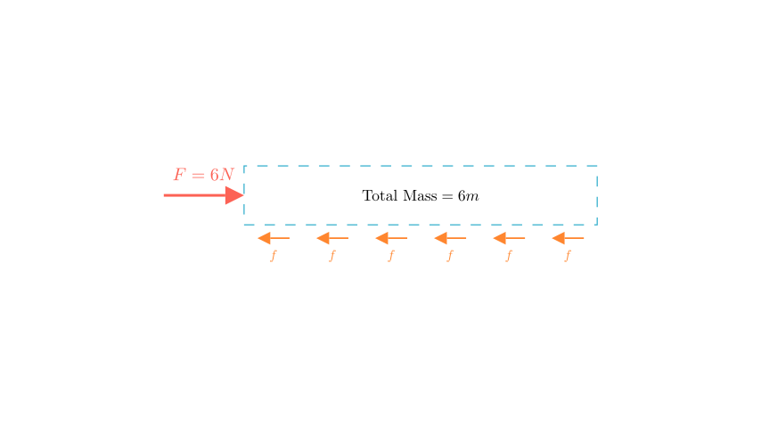
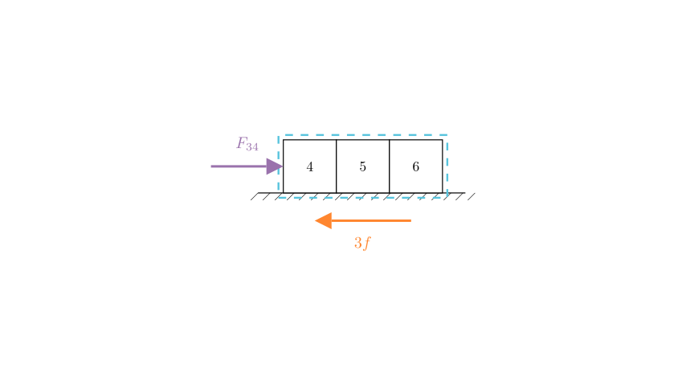

# problem_121_physics_g9

**Problem Statement:**

*Translated from Chinese:*
As shown in the figure, six identical blocks are placed flat on a rough horizontal surface. Under the action of a force $F = 6\text{ N}$, they move to the right in a uniform rectilinear motion (constant velocity). What is the compressive force between block 3 and block 4?

A. 2N
B. 3N
C. 4N
D. 5N

**Solution Approach:**
To solve this, we will use Newton's First and Second Laws of Motion. 
1. First, we will analyze the entire system of six blocks to find the total kinetic friction acting on the system. Since the blocks are identical, we can determine the friction acting on each individual block.
2. Next, we will use the "isolation method" by treating a subset of the blocks (specifically blocks 4, 5, and 6) as a new distinct system. By balancing the forces on this subsystem, we can easily find the internal force exerted by block 3 on block 4.

### Step 1: Analyze the Entire System

The problem states that all six identical blocks move to the right with **uniform rectilinear motion** (constant velocity). According to Newton's First Law, if an object is moving at a constant velocity, its acceleration is zero ($a = 0$), which means the net force acting on it must be zero ($\Sigma F = 0$).

Let's look at the horizontal forces acting on the entire 6-block system:
* **Applied Force ($F$):** Pushing to the right with a magnitude of $6\text{ N}$.
* **Total Friction ($f_{\text{total}}$):** Pushing to the left opposing the motion.

Because the net force is zero:
$$F - f_{\text{total}} = 0$$
$$f_{\text{total}} = F = 6\text{ N}$$

Since there are 6 identical blocks, each block contributes equally to the total friction. Let $f$ be the friction force on a single block.
$$f = \frac{f_{\text{total}}}{6} = \frac{6\text{ N}}{6} = 1\text{ N}$$

Each block experiences exactly $1\text{ N}$ of kinetic friction opposing its motion.

### Step 2: Analyze the Subsystem (Blocks 4, 5, and 6)

To find the force between block 3 and block 4, we can isolate blocks 4, 5, and 6 and treat them as a single rigid body. 

Let's identify the horizontal forces acting on this 3-block subsystem:
1.  **Force from Block 3 ($F_{34}$):** Block 3 pushes block 4 to the right. This is the force we want to find.
2.  **Friction on Blocks 4, 5, and 6 ($f_{456}$):** The rough surface exerts a friction force to the left on these three blocks. 

Since the entire train of blocks is moving at a constant velocity, this subsystem is also moving at a constant velocity. Therefore, the net force on this subsystem must also be zero.

First, calculate the total friction on this subsystem. Since there are 3 blocks in this system, and each experiences $1\text{ N}$ of friction:
$$f_{456} = 3 \times f = 3 \times 1\text{ N} = 3\text{ N}$$

Now, apply Newton's First Law to the subsystem:
$$F_{34} - f_{456} = 0$$
$$F_{34} = f_{456} = 3\text{ N}$$

### Conclusion and Verification

We found that the force exerted by block 3 on block 4 is $3\text{ N}$. 

*Alternative Verification:* We can verify this by looking at the *other* subsystem (blocks 1, 2, and 3). 
* Forces pushing right: The main applied force $F = 6\text{ N}$.
* Forces pushing left: The friction on the three blocks ($3 \times 1\text{ N} = 3\text{ N}$) PLUS the reaction force from block 4 pushing back on block 3 ($F_{43}$).
* Net force equation: $6\text{ N} - 3\text{ N} - F_{43} = 0 \implies F_{43} = 3\text{ N}$.
* According to Newton's Third Law, the force block 3 exerts on 4 is equal and opposite to the force block 4 exerts on 3 ($F_{34} = F_{43}$). The math holds perfectly.

**Final Answer:**
The compressive force between block 3 and block 4 is **3N**. 

Therefore, the correct option is **B**.

