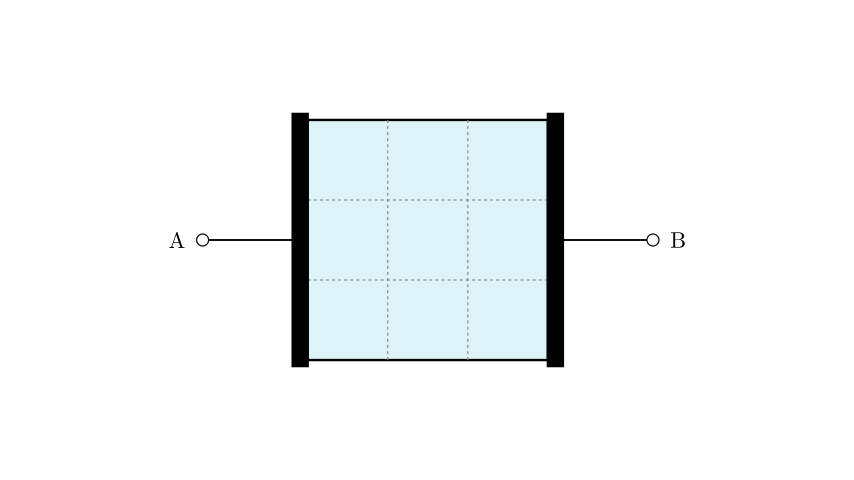
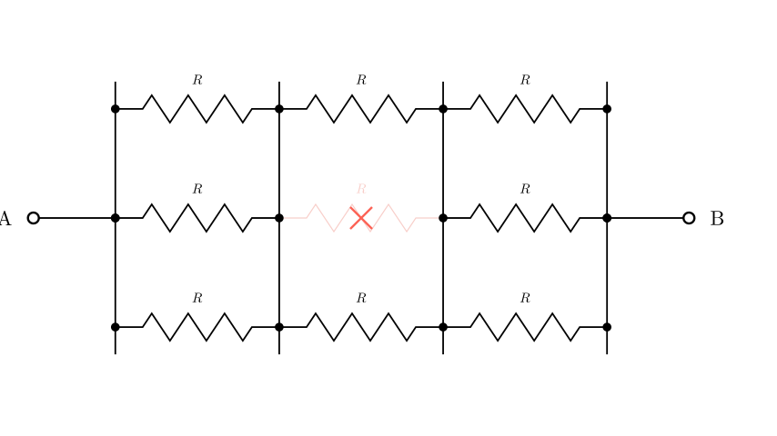

# problem_122_physics_g9

**Problem Statement:**

The figure shows a uniform thin metal plate. The measured resistance between terminals A and B is $R$. If this resistance plate is evenly divided into 9 pieces (a $3 \times 3$ grid), and one small piece is removed, what does the resistance between A and B become?

A) $8R/9$
B) $7R/6$
C) $9R/8$
D) $6R/7$

**Solution Approach:**

To solve this problem, we can model the continuous metal plate using an equivalent circuit. Because the terminals A and B span the entire left and right edges, current flows from left to right. By treating the vertical dashed lines as equipotential lines (a standard and valid approximation for this level of physics problem), we can break the plate down into an interconnected grid of smaller resistors. We will first determine the resistance of a single small square, construct the initial equivalent circuit, and then calculate the new total resistance after one of the small squares is removed.

**Step 1: Determine the resistance of a single small square**

Let's assume the entire metal plate is a square. The resistance of any square sheet of uniform thickness $t$ and resistivity $\rho$ is given by the formula:
$$R_{square} = \rho \frac{L}{A} = \rho \frac{L}{t \cdot L} = \frac{\rho}{t}$$
Notice that the side length $L$ cancels out! This means that the resistance of a square sheet depends only on its material and thickness, not on its size. Therefore, the resistance of one of the small 9 squares (let's call it $R_0$) is exactly equal to the resistance of the entire large square plate $R$. So, $R_0 = R$.

**Step 2: Construct the equivalent circuit model**

We can slice the $3 \times 3$ grid into 3 vertical columns. 
* Because the current flows horizontally from A to B, the columns are arranged in **series**.
* Within each column, there are 3 small squares. Since the current splits to pass through them simultaneously, these 3 squares are in **parallel**.

Let's visualize this as a circuit.

**[Scene 2 rendering failed - diagram unavailable]**

Let's verify our model by calculating the total resistance of the intact plate.
* The resistance of one column (3 resistors in parallel) is: 
$$R_{column} = \frac{1}{\frac{1}{R} + \frac{1}{R} + \frac{1}{R}} = \frac{R}{3}$$
* Since there are 3 such columns in series, the total resistance is:
$$R_{total} = \frac{R}{3} + \frac{R}{3} + \frac{R}{3} = R$$
This perfectly matches the problem statement, confirming our model is correct.

**Step 3: Analyze the modified circuit**

Now, the problem states that one small piece is removed. It doesn't matter which specific piece is removed due to the symmetry of the parallel branches. Let's assume a piece is removed from the middle column.

This means one of the parallel groups will now only have 2 resistors instead of 3.

**Step 4: Calculate the final resistance**

Let's calculate the resistance of each column in the new setup:
* **Column 1 (intact):** 3 resistors in parallel. Resistance $= \frac{R}{3}$
* **Column 2 (one piece missing):** 2 resistors in parallel. Resistance $= \frac{R}{2}$
* **Column 3 (intact):** 3 resistors in parallel. Resistance $= \frac{R}{3}$

To find the new total resistance $R_{new}$ between A and B, we simply add the series resistances together:
$$R_{new} = \frac{R}{3} + \frac{R}{2} + \frac{R}{3}$$
$$R_{new} = \frac{2R}{3} + \frac{R}{2}$$

Find a common denominator, which is 6:
$$R_{new} = \frac{4R}{6} + \frac{3R}{6}$$
$$R_{new} = \frac{7R}{6}$$

**Conclusion:**

By modeling the plate as a network of parallel and series resistors, we determined that removing one piece changes the resistance of that specific column from $R/3$ to $R/2$, resulting in a new total resistance of $7R/6$.

The correct option is **B**.

Would you like to explore how the resistance would change if we removed a piece from the corner versus the center using a more advanced continuous field model, or is this simplified circuit equivalent clear?

