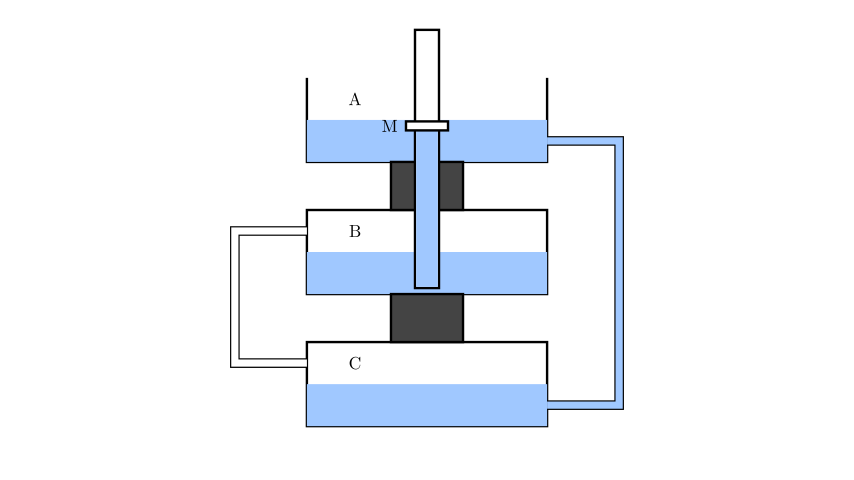
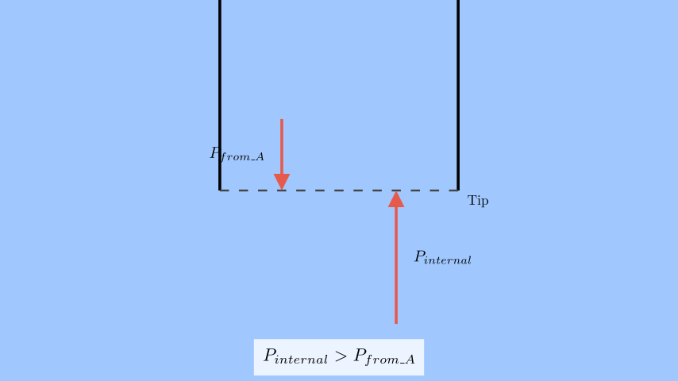
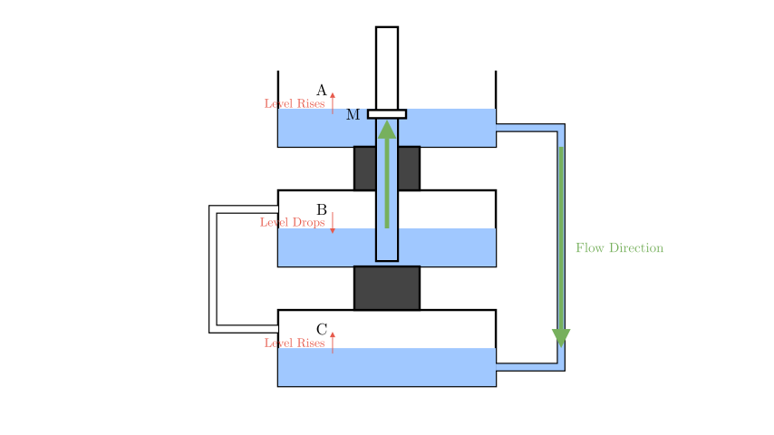

# problem_123_physics_g9

**Problem Statement:**
As shown in the figure, three identical containers, A (top), B (middle), and C (bottom), partially filled with water, are placed vertically one above the other. The water in container A and container C is connected by a thin glass tube. Another thin glass tube, open at both ends, passes through the bottom of container A and is inserted into the water in container B. There is a rotary switch M near the water surface in container A, and the tube below the switch is filled with water. The gas above the water surface in containers B and C is connected by a thin glass tube. The top of container A is open to the atmosphere. If the rotary switch M is opened, after re-establishing equilibrium, compare the gas volumes in containers B and C to the initial state (  )

A. $V_B$ increases, $V_C$ decreases, and $\Delta V_B > \Delta V_C$
B. $V_B$ decreases, $V_C$ increases, and $\Delta V_B > \Delta V_C$
C. $V_B$ increases, $V_C$ decreases, and $\Delta V_B = \Delta V_C$
D. $V_B$ decreases, $V_C$ increases, and $\Delta V_B < \Delta V_C$

*(Note: In the translation, "甲" is A, "乙" is B, and "丙" is C.)*

**Solution Approach:**
We will analyze the hydrostatic pressure at the connections to determine the direction of water flow when the valve opens. Based on the flow, we will determine the change in water levels and consequent gas volume changes, applying the principle of conservation of total water volume.

**Step 1: Analyzing Initial Pressures**

Before the valve M is opened, the system is in equilibrium.

1.  **A-C Connection:** The water in container A is connected to the water in container C. Since A is open to the atmosphere ($P_{atm}$), the pressure in the gas trapped in B and C ($P_{gas}$) is determined by the hydrostatic balance between A and C.
$$P_{gas} = P_{atm} + \rho g (h_{A} - h_{C})$$
Where $h_A$ and $h_C$ are the heights of the water surfaces in A and C.

2.  **B-C Connection:** The gas in B is connected to the gas in C, so they share the same pressure $P_{gas}$.

Now, consider the pressure at the tip of the vertical tube submerged in container B (let's call the tip's depth $d$ below B's surface).
*   **Pressure from the tube side (A):** The tube is filled with water from A. The pressure it exerts at the tip is $P_{tube} = P_{atm} + \rho g (\text{Height of A surface} - \text{Height of tip})$.
*   **Pressure from the container side (B):** The pressure in the water at the tip is $P_{B,internal} = P_{gas} + \rho g (\text{Height of B surface} - \text{Height of tip})$.

**Step 2: Determining Flow Direction**

Substituting the expression for $P_{gas}$ into the pressure equation for B:
$$P_{B,internal} = [P_{atm} + \rho g (h_A - h_C)] + \rho g (h_B - \text{tip height})$$

Comparing this to the pressure from the tube ($P_{tube} \approx P_{atm} + \rho g (h_A - \text{tip height})$):
The difference is roughly proportional to $\rho g (h_B - h_C)$.

Since container B is physically located **above** container C, the water level in B is higher than in C ($h_B > h_C$). This hydrostatic head means the internal pressure $P_{B,internal}$ pushing up is **greater** than the pressure $P_{tube}$ pushing down.

**Result:** When valve M opens, water flows from **Container B into Container A**.

**Step 3: Analyzing Volume Changes**

As water flows from B to A:
1.  **Container B:** Water leaves. The water level drops. Consequently, the volume available for gas ($V_B$) **increases**.
2.  **Container A & C:** Water enters A. Since A and C are connected communicating vessels, as the level in A rises, it pushes water into C. Thus, the water level in C also rises.
3.  **Container C:** Water level rises. Consequently, the volume available for gas ($V_C$) **decreases**.

**Comparison of Magnitudes ($|\Delta V|$):**
Water is incompressible. The total volume of water lost by B must equal the total volume gained by A and C.
$$|\Delta V_{water, B}| = |\Delta V_{water, A}| + |\Delta V_{water, C}|$$

Since the containers are identical, the change in gas volume is equal to the change in water volume:
*   Change in B's gas: $\Delta V_B = |\Delta V_{water, B}|$ (Increase)
*   Change in C's gas: $\Delta V_C = -|\Delta V_{water, C}|$ (Decrease)

From the conservation equation:
$$\Delta V_B = |\Delta V_{water, A}| + |\Delta V_C|$$

Since $|\Delta V_{water, A}| > 0$ (water definitely enters A to establish the new equilibrium height), it follows that:
$$\Delta V_B > |\Delta V_C|$$

Therefore, the increase in volume of B is strictly greater than the decrease in volume of C.

**Conclusion:**
*   $V_B$ increases.
*   $V_C$ decreases.
*   $\Delta V_B > \Delta V_C$ (Change in B is larger than change in C).

This corresponds to **Option A**.

