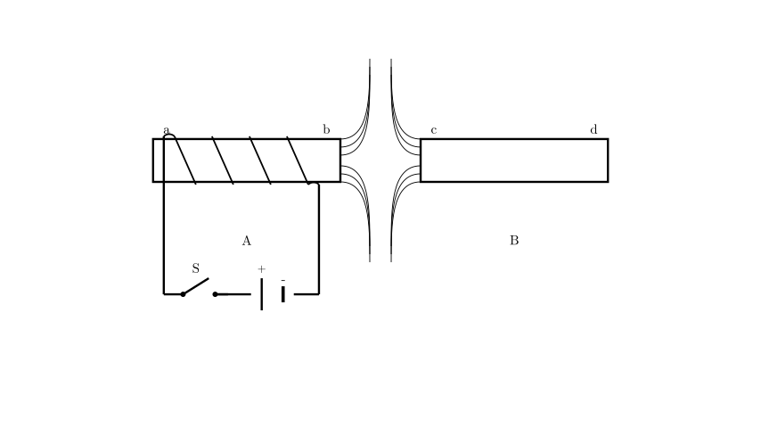
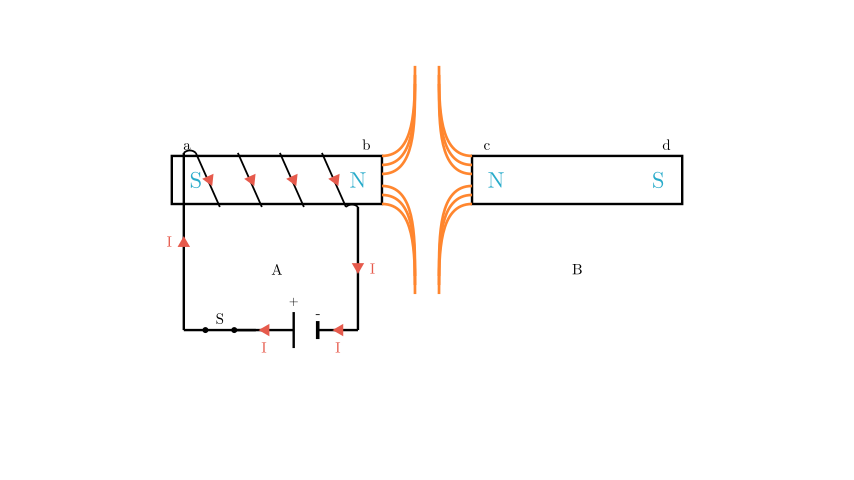

# problem_124_physics_g9

**Problem Statement:**

Electromagnet A (甲) and permanent magnet B (乙) are placed as shown in the figure. After switch S is closed, the magnetic field lines formed between ends b and c are shown as solid lines in the figure. From this, we can conclude that (  )
A. Both ends a and c are N poles
B. Both ends a and d are N poles
C. Both ends b and c are N poles
D. Both ends b and d are N poles

**Solution Approach:**

To solve this problem, we need to break it down into three main steps:
1.  **Determine the direction of the current** flowing through the electromagnet by identifying the positive and negative terminals of the battery.
2.  **Apply Ampere's Rule (the Right-Hand Grip Rule)** to find the magnetic polarity (North and South poles) of the electromagnet (ends a and b).
3.  **Analyze the shape of the magnetic field lines** between the two magnets to determine the polarity of the permanent magnet (ends c and d).

**Step 1: Determine the Current Direction**

First, let's look at the battery symbol in the circuit. In standard circuit diagrams, the longer, thinner line represents the positive terminal (+), and the shorter, thicker line represents the negative terminal (-). Therefore, the left side of the battery is positive.

When the switch S is closed, the current flows out from the positive terminal, travels through the wire on the left, and enters the coil at end 'a'. Looking closely at the winding of the coil, the wire from the circuit connects to the top edge of the iron core and spirals downwards across the front face. This means the current flows **downwards** in the visible front segments of the coil.

**[Scene 2 rendering failed - diagram unavailable]**

**Step 2: Apply Ampere's Rule**

Now we use Ampere's Rule (also known as the Right-Hand Grip Rule) to find the magnetic poles of the electromagnet.

1.  Imagine grasping the electromagnet with your right hand.
2.  Wrap your fingers in the direction of the current flowing through the front of the coils. Since the current flows downwards across the front face, your fingers should point **downwards**.
3.  Extend your thumb. Your thumb will naturally point to the **right**.

According to the rule, the thumb points to the North (N) pole of the electromagnet. Therefore, end **b is the N pole**, and end **a is the S pole**.

**Step 3: Analyze the Magnetic Field Lines**

Next, we look at the interaction between the electromagnet and the permanent magnet. 

The magnetic field lines in the gap between end 'b' and end 'c' do not connect the two ends. Instead, they bend away and diverge from one another. This characteristic pattern indicates a magnetic **repulsion** force. 

Because magnetic repulsion only occurs between like poles (N repels N, and S repels S), and we already determined that end 'b' is an N pole, it must be true that end **c is also an N pole**. Consequently, the opposite end of the permanent magnet, end **d, must be an S pole**.

**Conclusion:**

Let's summarize our findings for all the ends:
* End **a**: S pole
* End **b**: N pole
* End **c**: N pole
* End **d**: S pole

Evaluating the given options:
* A. Both ends a and c are N poles (Incorrect, 'a' is S)
* B. Both ends a and d are N poles (Incorrect, 'a' and 'd' are S)
* C. Both ends b and c are N poles (Correct)
* D. Both ends b and d are N poles (Incorrect, 'd' is S)

Therefore, the correct answer is **C**.

