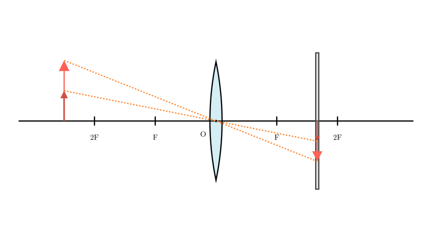

# problem_125_physics_g9

**Problem Statement:**

When Xiaohong was performing the experiment to "explore the imaging rules of convex lenses," a clear image of the candle flame was formed on the screen (as shown in the figure). Which of the following statements is correct?

A. As the candle burns and becomes shorter during the experiment, the image of the candle flame on the screen moves upward.
B. To make the image of the candle flame on the screen smaller, one simply needs to move the candle closer to the convex lens.
C. This imaging principle can be used to make a projector.
D. To easily observe the image on the screen from different directions, a relatively smooth glass plate should be chosen for the screen.

**Solution Approach:**

To solve this problem, we need to analyze the initial state of the optical system shown in the diagram. By comparing the object distance (distance from the candle to the lens) and the image distance (distance from the screen to the lens) with the focal length ($f$), we can determine the characteristics of the image. Then, we will evaluate each of the four options using the principles of optics, particularly the behavior of light rays passing through the optical center and the rules of diffuse reflection.

**[Scene 1 rendering failed - diagram unavailable]**

**Step 1: Analyze the initial imaging state**

Looking at the experimental setup, let's denote the object distance as $u$ and the image distance as $v$.
* The candle (object) is placed outside the $2F$ mark on the left, which means $u > 2f$.
* The screen (where the clear image is formed) is located between the $F$ and $2F$ marks on the right, which means $f < v < 2f$.

According to the imaging rules of convex lenses, when $u > 2f$, the lens forms an **inverted, diminished, real image**. 

This specific configuration is the optical principle used in **cameras**. A projector, on the other hand, requires the object to be placed between $F$ and $2F$ ($f < u < 2f$) to project an enlarged real image. Therefore, statement **C** is incorrect.

**Step 2: Evaluate the effects of candle burning (Option A)**

As the candle burns, its height decreases, effectively moving the light source downwards. A fundamental rule of convex lenses is that a light ray passing through the optical center (O) does not change its direction. 

If we draw a straight line from the tip of the shorter candle through the optical center, the line will strike the screen at a higher position than before. Because the lens forms an inverted image, as the object moves *downward*, its image on the screen moves *upward*. Thus, statement **A** is **correct**.

**Step 3: Evaluate image resizing (Option B)**

A helpful mnemonic for real images formed by convex lenses is: "As the object moves closer, the image moves farther, and the image becomes larger." 
If we want to make the image on the screen *smaller*, we must do the opposite: move the object *farther away* from the lens (increase $u$), which will cause the image to move closer to the lens (decrease $v$) and become smaller. Moving the candle closer would actually enlarge the image. Therefore, statement **B** is incorrect.

**Step 4: Evaluate the screen material (Option D)**

To observe the image on the screen from various directions, the light hitting the screen must be scattered in all directions. This requires **diffuse reflection**, which occurs on rough surfaces. A smooth glass plate would cause specular reflection (reflecting light in predominantly one direction), making it difficult to see the image unless you are at a specific angle. Therefore, a frosted or rough glass plate should be used, making statement **D** incorrect.

**Final Conclusion:**

* **A is Correct:** The inverted nature of the real image means a downward shift of the object (candle burning) results in an upward shift of the image.
* **B is Incorrect:** Making the image smaller requires moving the object further away.
* **C is Incorrect:** $u > 2f$ is the principle of a camera, not a projector.
* **D is Incorrect:** A rough surface is needed for diffuse reflection, allowing observation from multiple angles.

The correct statement is **A**.

