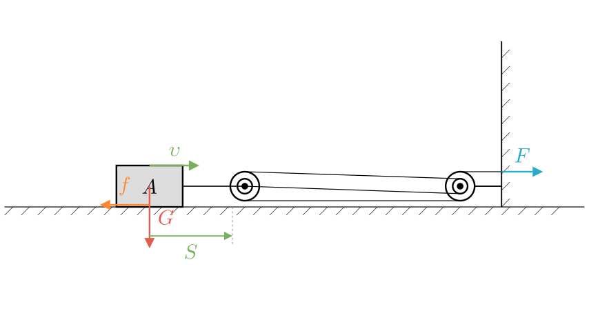
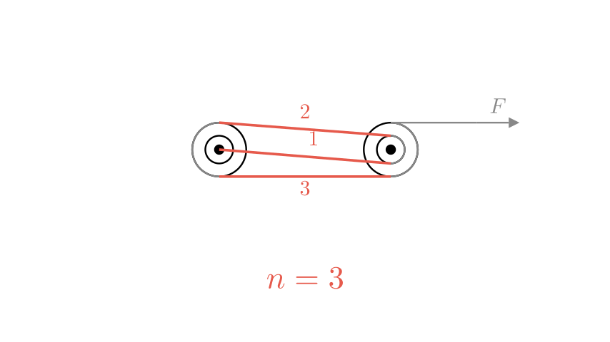

# problem_126_physics_g9

**Problem Statement:**
As shown in the figure, under the action of a pulling force $F$, object A moves to the right at a constant velocity $v$ for a distance $S$ on a horizontal table. The gravity acting on A is $G$, and the friction force from the table on A is $f$ (the weight of the pulleys and ropes is ignored). Which of the following statements is INCORRECT?

A. The useful work is $GS$
B. The work done by the pulling force is $3FS$
C. The power of the work done by the pulling force is $3Fv$
D. The mechanical efficiency of the device is $\frac{f}{3F}$

**Solution Approach:**
To solve this problem, we need to analyze the horizontal pulley system. We will first determine the number of rope segments ($n$) pulling the movable pulley. Then, we will evaluate the useful work (work done against friction), the total work (work done by the pulling force), the power of the pulling force, and finally, the mechanical efficiency. By comparing our formulas with the given options, we can identify the incorrect statement.

**Step 1: Analyze the Pulley System**
Let's look at the movable pulley attached to object A. By tracing the rope, we can count the number of rope segments pulling the movable pulley to the right. There are **3** segments of rope connected to the movable pulley assembly. Therefore, $n = 3$. 

Because $n = 3$, the relationship between the movement of object A and the movement of the free end of the rope is:
* Distance moved by the rope: $s_{rope} = 3S$
* Velocity of the rope: $v_{rope} = 3v$

**Step 2: Evaluate Useful Work (Option A)**
The purpose of this horizontal pulley system is to move object A across the table. The resistance it must overcome to achieve this is the friction force $f$, not gravity. Gravity acts vertically downward, perpendicular to the horizontal displacement, meaning gravity does **zero** work. 

The useful work is calculated by multiplying the force we want to overcome by the distance the object moves:
$$W_{useful} = f \cdot S$$

Option A states the useful work is $GS$. Since gravity ($G$) does no work in horizontal motion, Option A is **incorrect**.

**Step 3: Evaluate Total Work and Power (Options B & C)**
The total work is the work done by the pulling force $F$ over the distance the rope is pulled. 
$$W_{total} = F \cdot s_{rope} = F \cdot (3S) = 3FS$$
This confirms that Option B is correct.

Power is the rate at which work is done. We can calculate the power of the pulling force using the force and the velocity of the rope:
$$P = F \cdot v_{rope} = F \cdot (3v) = 3Fv$$
This confirms that Option C is correct.

**Step 4: Evaluate Mechanical Efficiency (Option D)**
Mechanical efficiency ($\eta$) is the ratio of useful work to total work. Using our previous derivations:
$$\eta = \frac{W_{useful}}{W_{total}}$$
$$\eta = \frac{f \cdot S}{3FS}$$
The $S$ cancels out, leaving:
$$\eta = \frac{f}{3F}$$
This confirms that Option D is correct.

**Final Answer:**
Since we verified that statements B, C, and D are correct physical interpretations of the system, and statement A uses the wrong force for horizontal work, the incorrect statement is **A**.

