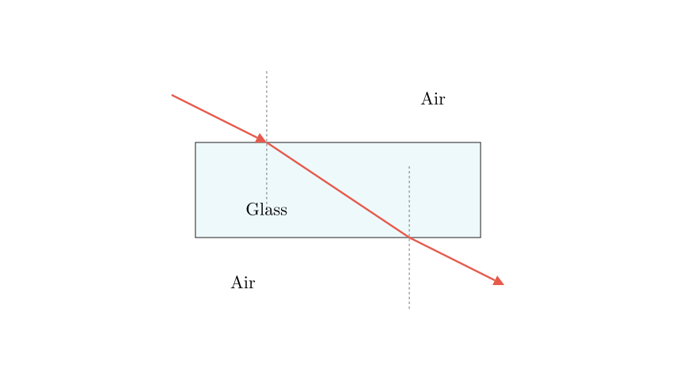
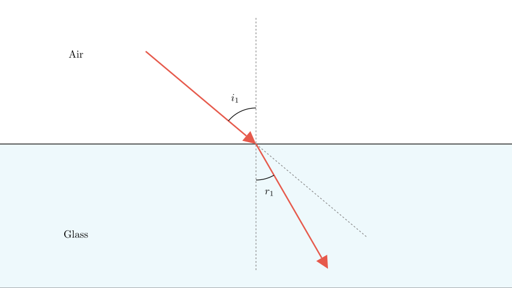
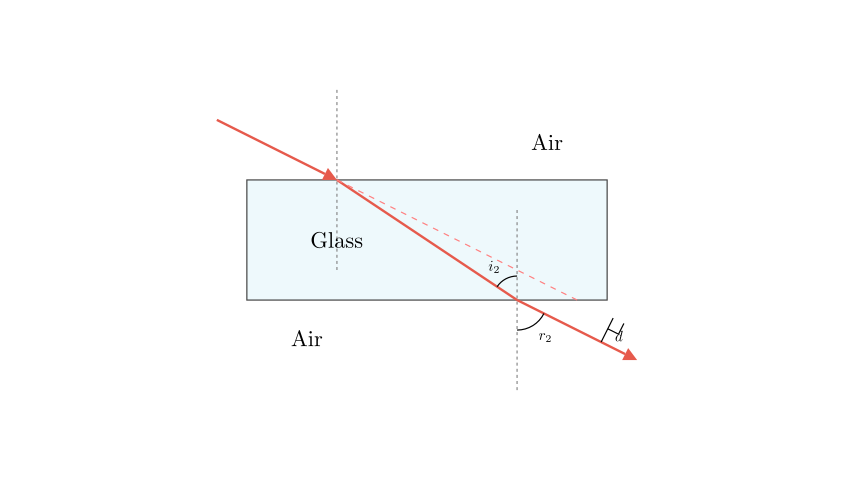

# problem_127_physics_g9

**Problem Statement:**
When a beam of light obliquely enters a glass block, which of the following is the correct path of the light as it enters and exits the glass? (Refer to options A, B, C, and D in the original image).

**Solution Approach:**
To determine the correct light path, we need to analyze the refraction of light at two distinct interfaces:
1. The air-to-glass interface (where light enters the block).
2. The glass-to-air interface (where light exits the block).

We will use the principles of optical density and Snell's Law to determine whether the light bends towards or away from the normal line at each boundary. Finally, we will use the geometric properties of parallel boundaries to determine the relationship between the initial incident ray and the final emergent ray.

**Step 1: The First Refraction (Air to Glass)**

When the light ray travels from air into glass, it is moving from an optically less dense medium (lower refractive index) into an optically denser medium (higher refractive index). 

According to the laws of refraction, when light enters a denser medium obliquely, its speed decreases, and the ray bends **towards the normal**. This means the angle of refraction inside the glass ($r_1$) must be smaller than the angle of incidence in the air ($i_1$). 

Looking at the given options, we can immediately eliminate Option A because it shows the light bending *away* from the normal (the angle gets larger) at the first interface. Option D is also incorrect because it shows the light traveling in a straight line with no refraction at all, which only happens if the light enters perpendicular to the surface (along the normal).

**Step 2: The Second Refraction (Glass to Air)**

Now, let's look at what happens when the light reaches the bottom of the glass block and exits back into the air. Here, the light is traveling from an optically denser medium (glass) to an optically less dense medium (air). 

In this case, the light speeds up and bends **away from the normal**. The new angle of refraction ($r_2$) will be greater than the new angle of incidence inside the glass ($i_2$).

Let's evaluate the remaining options (B and C):
* In **Option C**, the ray bends *towards* the normal again at the second interface. This contradicts the principle of moving from a denser to a less dense medium.
* In **Option B**, the ray correctly bends *away* from the normal as it exits the glass.

**Conclusion and Verification:**

Because the top and bottom surfaces of the glass block are parallel, the two normal lines are also parallel. This geometry means that the angle of refraction at the first boundary is equal to the angle of incidence at the second boundary ($r_1 = i_2$, by alternate interior angles). 

By applying Snell's law at both interfaces, it can be mathematically proven that the final angle of emergence ($r_2$) is exactly equal to the initial angle of incidence ($i_1$). Therefore, the emergent ray traveling through the air must be **strictly parallel** to the original incident ray, only shifted to the side (this shift is called lateral displacement).

Option B is the only diagram that accurately depicts the ray bending towards the normal upon entering, bending away from the normal upon exiting, and resulting in an emergent ray that is parallel to the incident ray.

**Final Answer:**
The correct light path is shown in **B**.

