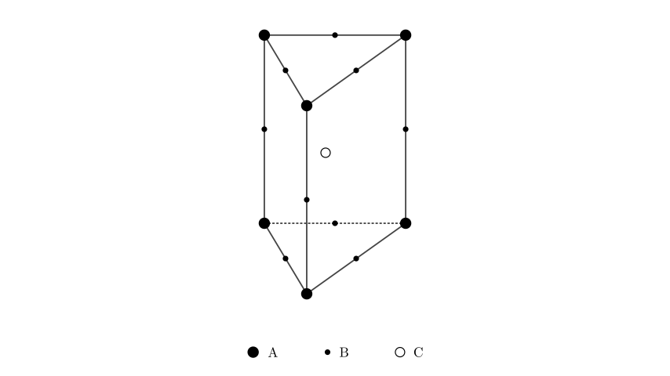
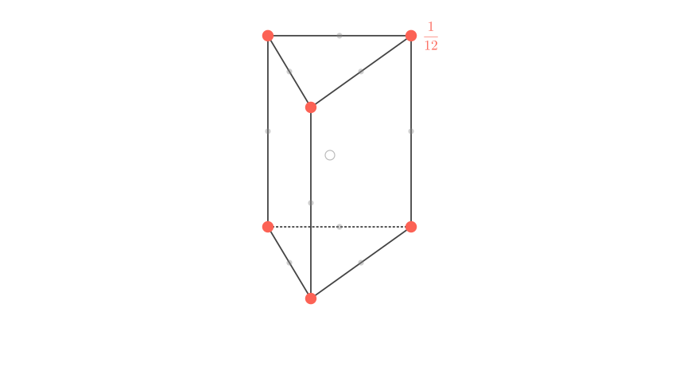
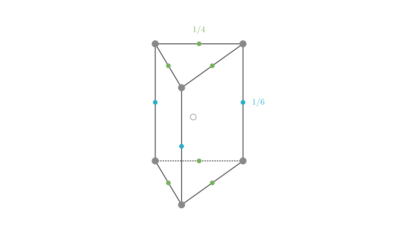

# problem_128_chemistry_g12

**Problem Statement:**
Part of the structure of a certain crystal is a right triangular prism (as shown in the figure). What is the ratio of the number of particles A, B, and C in this crystal?

A. 3:9:4
B. 1:4:2
C. 2:9:4
D. 3:8:4

**Solution Approach:**
To solve this, we must determine the number of atoms effectively belonging to this specific unit cell using the "Sharing Method" (or Averaging Method). Atoms at different positions (vertices, edges, faces, interior) are shared by a different number of adjacent unit cells.

The effective number of atoms ($N$) is calculated as:
$$N = \text{Count} \times \frac{1}{\text{Sharing Factor}}$$

**Step 1: Analyzing Particle A (Vertices)**

Particle A is located at the vertices of the triangular prism. In a crystal lattice composed of stacked triangular prisms:
1.  Each vertex in a horizontal plane is shared by **6** triangles meeting at that point.
2.  Since the lattice extends vertically (stacked layers), the vertex is shared between the layer below and the layer above.

Therefore, each vertex is shared by $6 \times 2 = 12$ unit cells.

**Calculation for A:**
- There are **6** vertices in total.
- Sharing factor for a vertex in this geometry is $1/12$.

$$N(A) = 6 \times \frac{1}{12} = 0.5$$

**Step 2: Analyzing Particle B (Edges)**

Particle B is located on the edges. We must distinguish between vertical and horizontal edges:

*   **Vertical Edges:** A vertical line in this lattice is the intersection of **6** triangular prisms (forming a hexagon around the edge). Sharing factor = $1/6$.
*   **Horizontal Edges:** An edge on the triangular base is shared by **2** triangles in the same plane. Including the vertical stacking (shared with the prism above or below), it is shared by a total of $2 \times 2 = 4$ unit cells. Sharing factor = $1/4$.

**Calculation for B:**
- Vertical edges: 3 atoms. Contribution: $3 \times \frac{1}{6} = 0.5$
- Horizontal edges: 6 atoms. Contribution: $6 \times \frac{1}{4} = 1.5$

$$N(B) = 0.5 + 1.5 = 2.0$$

**Step 3: Analyzing Particle C (Body Center)**

Particle C is located inside the body of the prism. It is not shared with any other unit cell.

$$N(C) = 1 \times 1 = 1.0$$

**[Scene 4 rendering failed - diagram unavailable]**

**Final Calculation and Verification:**

We now have the effective number of particles per unit cell:
- **A:** 0.5
- **B:** 2.0
- **C:** 1.0

The ratio $A : B : C$ is $0.5 : 2 : 1$.

To convert this to whole numbers, we multiply the entire ratio by 2:
$$1 : 4 : 2$$

**Answer:**
The ratio of particles A, B, and C is **1:4:2**, which corresponds to option **B**.

