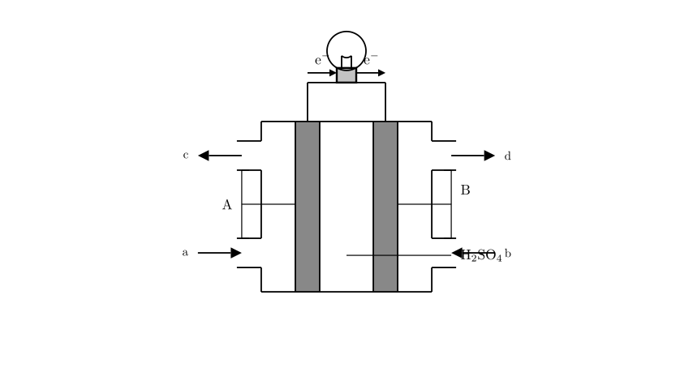
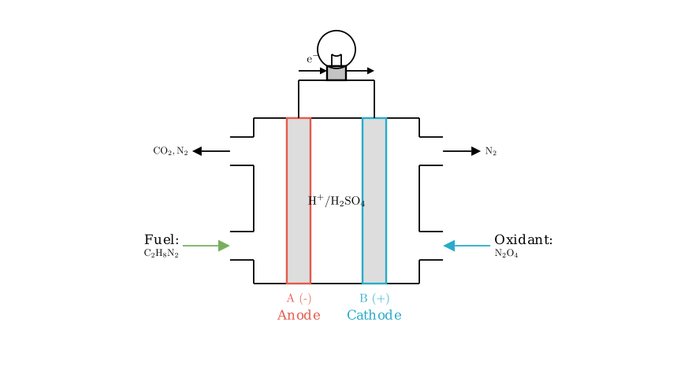

# problem_129_chemistry_g12

**Problem Statement:**

The fuel used in the launch of the "Long March" rocket is unsymmetrical dimethylhydrazine (UDMH, $\text{C}_2\text{H}_8\text{N}_2$), and dinitrogen tetroxide ($\text{N}_2\text{O}_4$) is used as the oxidant. The two main advantages of this combination are that it can generate immense energy in a short time to send the rocket into space, and the products do not pollute the air (the products are all components of air). An extracurricular research study group intends to design this principle into a primary battery (fuel cell), as shown in the figure. Analyzing their design scheme combined with the learned electrochemical principles, which of the following statements is correct?

A. B is the positive electrode.
B. Dinitrogen tetroxide gas is introduced from port a.
C. $\text{NO}$ gas is discharged from port d.
D. The electrode reaction equation occurring at electrode A is: $\text{C}_2\text{H}_8\text{N}_2 - 16\text{e}^- + 8\text{H}_2\text{O} \rightarrow \text{CO}_2 + \text{N}_2 + 16\text{H}^+$

**Solution Approach:**
To solve this problem, we need to analyze the provided electrochemical cell diagram step-by-step:
1.  **Determine Electrodes:** Use the direction of electron flow in the external circuit to identify the anode (negative electrode) and cathode (positive electrode).
2.  **Assign Reactants:** Based on the oxidation and reduction processes, determine which port receives the fuel (reducing agent) and which receives the oxidant.
3.  **Identify Products:** Use the problem's constraint ("products do not pollute the air") to deduce the exhaust gases.
4.  **Verify Electrode Reactions:** Balance the half-reaction for the oxidation of the fuel to check the validity of the given chemical equation.

**Analyzing Statement A: Electrode Polarity**

In any galvanic cell (or fuel cell), electrons flow through the external circuit from the negative electrode (anode), where oxidation occurs, to the positive electrode (cathode), where reduction occurs. 

Looking at the provided diagram, the arrows on the external wire clearly indicate that electrons ($\text{e}^-$) are flowing from electrode **A** to electrode **B**. 
* Since electrode **A** is losing electrons, it is the anode, which serves as the **negative electrode**.
* Since electrode **B** is receiving electrons, it is the cathode, which serves as the **positive electrode**.

Therefore, statement **A** ("B is the positive electrode") is **correct**.

**Analyzing Statements B and C: Reactant Inputs and Products**

Now we assign the fuel and oxidant to their respective ports. 
* **Fuel (UDMH, $\text{C}_2\text{H}_8\text{N}_2$)** is the reducing agent. It undergoes oxidation (loses electrons). Oxidation always happens at the anode. Since electrode A is the anode, the fuel must be introduced at **port a**. 
* **Oxidant ($\text{N}_2\text{O}_4$)** undergoes reduction (gains electrons). Reduction always happens at the cathode. Since electrode B is the cathode, the oxidant must be introduced at **port b**. 
Thus, statement **B** ("Dinitrogen tetroxide gas is introduced from port a") is **incorrect**.

For the exhaust products, the problem explicitly states: *"the products do not pollute the air (the products are all components of air)."* * Nitric oxide ($\text{NO}$) is a well-known toxic air pollutant. 
* The reduction of $\text{N}_2\text{O}_4$ at the cathode yields nitrogen gas ($\text{N}_2$), which makes up about 78% of the Earth's atmosphere and is completely harmless. 
Therefore, harmless $\text{N}_2$ gas is discharged from port d, not polluting $\text{NO}$. Statement **C** is **incorrect**.

**Analyzing Statement D: The Anode Half-Reaction**

Let's derive the correct oxidation half-reaction occurring at electrode A (the anode). The fuel $\text{C}_2\text{H}_8\text{N}_2$ is oxidized to form $\text{CO}_2$ and $\text{N}_2$ (safe air components). The electrolyte is $\text{H}_2\text{SO}_4$, providing an acidic environment.

1.  **Write the skeletal equation:** $\text{C}_2\text{H}_8\text{N}_2 \rightarrow \text{CO}_2 + \text{N}_2$
2.  **Balance Carbon and Nitrogen:** We need 2 carbons on the right: $\text{C}_2\text{H}_8\text{N}_2 \rightarrow 2\text{CO}_2 + \text{N}_2$
3.  **Balance Oxygen:** There are 4 oxygen atoms on the right (in $2\text{CO}_2$). In an acidic solution, we add $\text{H}_2\text{O}$ to balance oxygen. Add 4 $\text{H}_2\text{O}$ to the left side:
$\text{C}_2\text{H}_8\text{N}_2 + 4\text{H}_2\text{O} \rightarrow 2\text{CO}_2 + \text{N}_2$
4.  **Balance Hydrogen:** The left side has $8 + 4(2) = 16$ hydrogen atoms. We add 16 $\text{H}^+$ to the right side:
$\text{C}_2\text{H}_8\text{N}_2 + 4\text{H}_2\text{O} \rightarrow 2\text{CO}_2 + \text{N}_2 + 16\text{H}^+$
5.  **Balance Charge:** The right side has a charge of $+16$. To balance the neutral left side, we add 16 electrons to the right side:
$\text{C}_2\text{H}_8\text{N}_2 + 4\text{H}_2\text{O} \rightarrow 2\text{CO}_2 + \text{N}_2 + 16\text{H}^+ + 16\text{e}^-$

This can be rearranged to match the format of the options:
$\text{C}_2\text{H}_8\text{N}_2 - 16\text{e}^- + 4\text{H}_2\text{O} \rightarrow 2\text{CO}_2 + \text{N}_2 + 16\text{H}^+$

Comparing our derived reaction with Statement D ($\text{C}_2\text{H}_8\text{N}_2 - 16\text{e}^- + 8\text{H}_2\text{O} \rightarrow \text{CO}_2 + \text{N}_2 + 16\text{H}^+$), we can see the stoichiometry in Statement D is unbalanced and incorrect (e.g., it lists $8\text{H}_2\text{O}$ and only one $\text{CO}_2$). Thus, statement **D** is **incorrect**.

**Conclusion:**

Based on the flow of electrons, Electrode A is the anode (negative) and Electrode B is the cathode (positive). 
* A is true.
* B is false (oxidant goes to the cathode).
* C is false (products are non-polluting $\text{N}_2$).
* D is false (reaction is unbalanced).

**Correct Answer:** **A**

