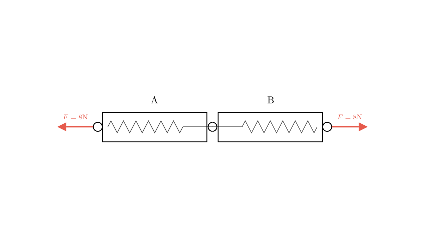
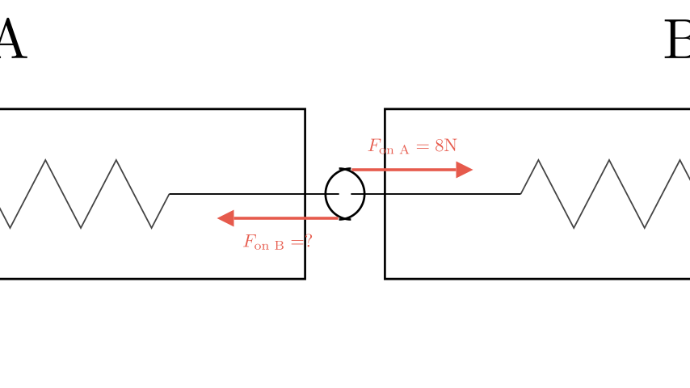
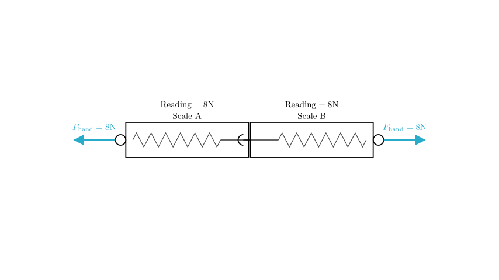

# problem_12_physics_g9

**Problem Statement:**
As shown in the figure, the hooks of two spring dynamometers A and B are hooked together. The rings of the dynamometers are pulled horizontally to the left and right by hand. When the reading of the left spring dynamometer A is 8N, determine the reading of the right spring dynamometer B and the pulling force of the hand on the spring dynamometer.

The options are:
A. 8N, 8N
B. 8N, 16N
C. 0N, 16N
D. 16N, 8N

**Solution Approach:**
To solve this, we will apply **Newton's Third Law of Motion** (action and reaction forces) and the concept of **equilibrium**. We will analyze the forces acting on the connection point between the two scales and the external forces applied by the hands.

**Step 1: Analyzing the Reading on Scale A**

A spring dynamometer (scale) measures the magnitude of the tensile force applied to its hook. The problem states that Scale A reads **8N**.

This means the spring in Scale A is being stretched by a force of 8N. Since the hook of Scale A is connected to Scale B, this force is being exerted by Scale B pulling on Scale A.

**Step 2: Determining the Reading on Scale B**

According to **Newton's Third Law**, for every action, there is an equal and opposite reaction. 

- **Action:** Scale B pulls Scale A to the right with a force of 8N (causing Scale A to read 8N).
- **Reaction:** Scale A must pull Scale B to the left with a force of equal magnitude.

Therefore, the force pulling on the hook of Scale B is also **8N**. Since a spring scale reads the tension applied to its hook, the reading on Scale B will be **8N**.

**Step 3: Determining the Hand's Pulling Force**

For the system to be in equilibrium (stationary or moving at constant velocity), the forces on any part of the system must balance.

- Looking at Scale A: The hook is pulled right with 8N. To keep Scale A from flying to the right, the hand must pull the ring to the left with an equal force of **8N**.
- Looking at Scale B: Similarly, the hand must pull the right ring with **8N**.

**Common Misconception:**
It is incorrect to add the two forces (8N + 8N = 16N). Tension is not additive in this way. Think of a single rope: if you pull both ends with 8N, the tension throughout the rope is 8N, not 16N. The "pulling force" refers to the magnitude of the force applied at one end to create that tension.

**Conclusion:**
1. Reading on Scale B: **8N**
2. Pulling force of the hand: **8N**

Comparing this to the options:
A. 8N, 8N
B. 8N, 16N
C. 0N, 16N
D. 16N, 8N

The correct option is **A**.

