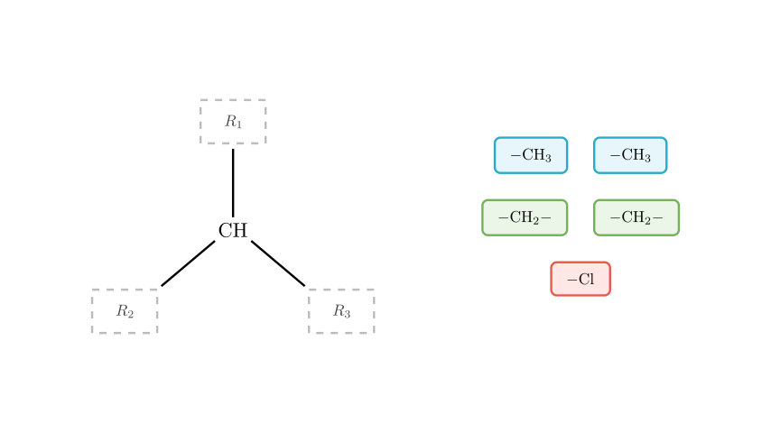
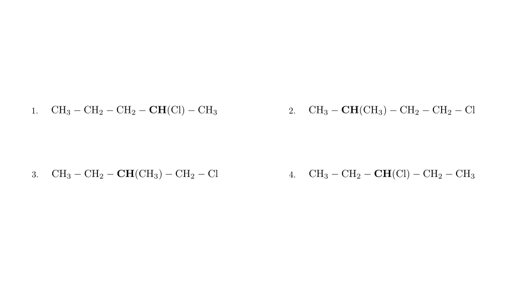

# problem_130_chemistry_g12

**Problem Statement:**

A haloalkane with the molecular formula C$_{5}$H$_{11}$Cl contains two —CH$_{3}$ groups, two —CH$_{2}$— groups, one >CH— group (a methine group bonded to three other atoms), and one —Cl atom in its molecule. The possible number of structures for this compound is (  )
A. 2
B. 3
C. 4
D. 5

**Solution Approach:**

To find the number of possible structural isomers, we need to assemble these specific molecular fragments like puzzle pieces. The key is the `>CH—` group. Because it has three open bonds, it must act as a branching point in the carbon skeleton. We have exactly three terminal groups available (two `—CH3` groups and one `—Cl` atom) to cap the ends of these three branches. The remaining pieces are two `—CH2—` groups, which act as "links" in the chain. Our task is to find all the unique ways to distribute these two `—CH2—` links among the three branches.

As visualized, the central `>CH—` group provides exactly three attachment points ($R_1$, $R_2$, $R_3$). Since a chain cannot end with a `—CH2—` group (it requires two bonds), the three ends of our branches must be capped by our three terminal pieces: the two `—CH3` groups and the one `—Cl` atom. 

Therefore, the base structure of our molecule is a central `CH` connected to two branches that will eventually end in `CH3`, and one branch that will eventually end in `Cl`. 

Now, we simply need to distribute our two remaining `—CH2—` groups into these three branches. Let's systematically go through the mathematical combinations:

Let's break down the four unique structures we just built by placing the two `—CH2—` groups:

**Case 1: Both `—CH2—` groups are placed on one of the `—CH3` branches.**
This creates a longer propyl chain on one side, a methyl group on the other, and the chlorine attached directly to the central carbon. 
Structure: $CH_3-CH_2-CH_2-CH(Cl)-CH_3$ (2-chloropentane)

**Case 2: Both `—CH2—` groups are placed on the `—Cl` branch.**
This creates a longer chloroethyl chain, with the two methyl groups attached directly to the central carbon.
Structure: $CH_3-CH(CH_3)-CH_2-CH_2-Cl$ (1-chloro-3-methylbutane)

**Case 3: One `—CH2—` group is on a `—CH3` branch, and the other is on the `—Cl` branch.**
This gives us an ethyl group, a methyl group, and a chloromethyl group all attached to the central carbon.
Structure: $CH_3-CH_2-CH(CH_3)-CH_2-Cl$ (1-chloro-2-methylbutane)

**Case 4: One `—CH2—` group is placed on each of the two `—CH3` branches.**
This creates two symmetrical ethyl branches with the chlorine attached directly to the central carbon.
Structure: $CH_3-CH_2-CH(Cl)-CH_2-CH_3$ (3-chloropentane)

Because the two `—CH3` branches are functionally identical starting points, placing both `—CH2—` groups on "Branch 1" is the exact same molecule as placing them both on "Branch 2". Therefore, there are only these 4 unique combinations.

**Conclusion:**

By systematically distributing the two `—CH2—` fragments among the three branches originating from the central `>CH—` group, we successfully identified exactly 4 unique structural isomers that satisfy all the conditions of the prompt. 

The correct option is **C**.

Would you like me to walk through how to systematically name these 4 isomers using IUPAC rules?

