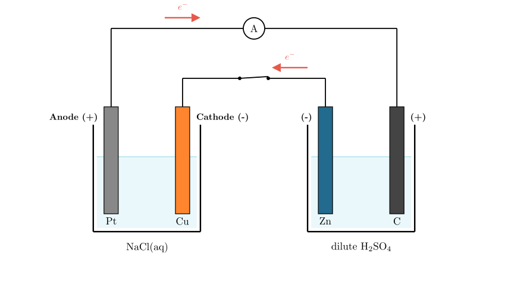
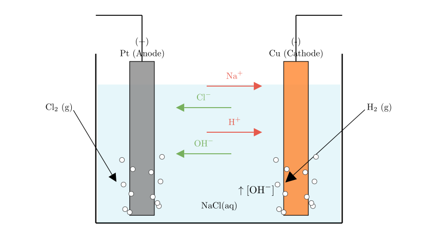

# problem_131_chemistry_g12

**Problem Statement:**

As shown in the figure, two beakers are connected by a wire. Pt, Cu, Zn, and C are the four electrodes. After the switch is closed, which of the following statements is correct?

* A. The C electrode is the anode of the electrolytic cell.
* * B. The concentration of $OH^-$ near the Cu electrode increases.
* * C. $Na^+$ moves towards the Pt electrode.
* * D. $O_2$ is generated on the Pt electrode.

**Solution Approach:**

To solve this electrochemistry problem, we need to systematically analyze the system by following these steps:
1.  **Identify the Cell Types:** Determine which beaker acts as the power source (Galvanic/Voltaic cell) and which acts as the load (Electrolytic cell).
2.  **Determine Polarity:** Assign the positive and negative poles for the Galvanic cell, and subsequently determine the anode and cathode for the Electrolytic cell.
3.  **Analyze Half-Reactions:** Write down the specific oxidation and reduction reactions occurring at each of the four electrodes based on the electrolytes present.
4.  **Evaluate Options:** Check each given statement against our chemical analysis to find the correct one.

**[Scene 1 rendering failed - diagram unavailable]**

**Step 1 & 2: Identifying Cell Types and Electrode Polarity**

Let's look at the right beaker containing the Zn and C electrodes in a dilute $H_2SO_4$ solution. Zinc (Zn) is an active metal, while Carbon (C) is inert. A spontaneous redox reaction can occur here between the zinc and the acid. Therefore, the **right beaker acts as a Galvanic cell** (the power source).
* **Zn electrode:** Zinc is oxidized ($Zn \rightarrow Zn^{2+} + 2e^-$). It loses electrons, making it the **negative pole** (anode of the Galvanic cell).
* **C electrode:** Hydrogen ions from the acid are reduced ($2H^+ + 2e^- \rightarrow H_2$). It gains electrons, making it the **positive pole** (cathode of the Galvanic cell).

Now, let's analyze the left beaker containing Pt and Cu in an NaCl solution. Because it is driven by the Galvanic cell on the right, the **left beaker acts as an Electrolytic cell**.
* **Cu electrode:** It is directly connected to the Zn electrode (the negative pole). Therefore, Cu is the **cathode** (negative electrode) of the electrolytic cell.
* **Pt electrode:** It is directly connected to the C electrode (the positive pole). Therefore, Pt is the **anode** (positive electrode) of the electrolytic cell.

**Step 3: Analyzing Reactions in the Electrolytic Cell (Left Beaker)**

With the polarities established, we can determine what happens inside the NaCl solution at the Pt and Cu electrodes.

* **At the Cu Cathode (-):** Cations in the solution ($Na^+$ and $H^+$ from water) migrate here. $H^+$ is much easier to reduce than $Na^+$. The reduction half-reaction is:
$$2H_2O + 2e^- \rightarrow H_2 \uparrow + 2OH^-$$
As hydrogen gas is produced, the local concentration of $OH^-$ ions increases.

* **At the Pt Anode (+):** Anions in the solution ($Cl^-$ and $OH^-$) migrate here. Pt is an inert electrode. $Cl^-$ is easier to oxidize than $OH^-$. The oxidation half-reaction is:
$$2Cl^- \rightarrow Cl_2 \uparrow + 2e^-$$
Chlorine gas is generated at this electrode.

**Step 4: Evaluating the Options**

Now let's check the given statements based on our analysis:

* **A. The C electrode is the anode of the electrolytic cell:** Incorrect. The right beaker is a Galvanic cell, not an electrolytic cell. Furthermore, C is the positive pole (cathode) of that Galvanic cell.
* **B. The concentration of $OH^-$ near the Cu electrode increases:** **Correct.** As we established, $H^+$ is reduced at the Cu cathode, leaving $OH^-$ behind, which increases its local concentration.
* **C. $Na^+$ moves towards the Pt electrode:** Incorrect. $Na^+$ is a cation (positive) and will migrate towards the negative electrode, which is the Cu cathode, not the Pt anode.
* **D. $O_2$ is generated on the Pt electrode:** Incorrect. Because the solution contains a high concentration of chloride ions, $Cl_2$ gas is generated at the Pt anode, not $O_2$.

**Final Answer:**
The correct statement is **B**.

