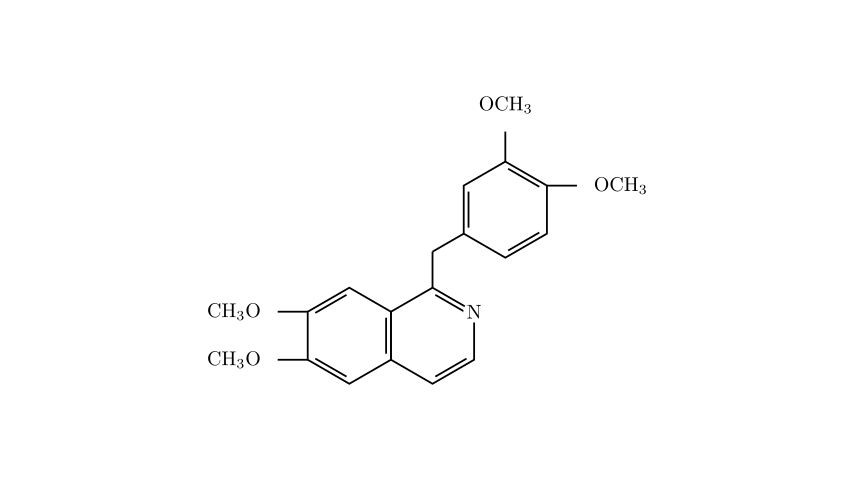

# problem_132_chemistry_g12

**Problem Statement:**

Opium has a complex composition, and the molecular structure of papaverine, one of its components, is shown below. Opium was originally used as a medication (having analgesic, anti-diarrheal, and cough-suppressant effects). Long-term use can lead to addiction, physical deterioration, and mental apathy. It is known that the combustion products of this substance are CO$_2$, H$_2$O, and N$_2$. What are the amount of substance (in moles) of O$_2$ consumed by the complete combustion of 1 mol of this compound, and the number of monobromo-substituted isomers formed by a substitution reaction on its benzene rings with Br$_2$ under certain conditions, respectively?

A. 23.25 mol; 5
B. 24.5 mol; 7
C. 24.5 mol; 8
D. 26.5 mol; 6

**Solution Approach:**
To solve this problem, we need to break it down into two main chemical analyses:
1.  **Determine the Molecular Formula and Combustion Stoichiometry:** We will carefully count the atoms in the given skeletal structure to find the empirical formula. Then, we will balance the combustion reaction equation to find the moles of oxygen consumed.
2.  **Analyze the Molecular Structure for Isomers:** We will identify the specific "benzene rings" in the molecule and analyze their symmetry to determine the number of distinct hydrogen positions available for electrophilic aromatic substitution by bromine.

**Step 1: Determining the Molecular Formula and Oxygen Consumption**

Let's deduce the molecular formula of papaverine by counting the atoms in its structure:
* **Carbon (C) atoms:** * Isoquinoline core: 9 carbons
* Linkage (-CH$_2$-): 1 carbon
* Isolated benzene ring: 6 carbons
* Methoxy groups (-OCH$_3$): 4 groups $\times$ 1 carbon = 4 carbons
* Total C = 9 + 1 + 6 + 4 = **20**
* **Hydrogen (H) atoms:** * Isoquinoline core: 2 hydrogens on the fused benzene ring + 2 hydrogens on the pyridine ring = 4 hydrogens
* Linkage (-CH$_2$-): 2 hydrogens
* Isolated benzene ring: 3 hydrogens (it has 3 substituents)
* Methoxy groups (-OCH$_3$): 4 groups $\times$ 3 hydrogens = 12 hydrogens
* Total H = 4 + 2 + 3 + 12 = **21**
* **Nitrogen (N) atoms:** There is **1** nitrogen atom in the pyridine ring.
* **Oxygen (O) atoms:** There are **4** oxygen atoms from the four methoxy groups.

The molecular formula of papaverine is **C$_{20}$H$_{21}$NO$_4$**.

Now, let's write the balanced chemical equation for the complete combustion of 1 mole of this compound. The products are given as CO$_2$, H$_2$O, and N$_2$:

$$C_{20}H_{21}NO_4 + x O_2 \rightarrow 20 CO_2 + \frac{21}{2} H_2O + \frac{1}{2} N_2$$

To find $x$ (the moles of O$_2$), we balance the oxygen atoms on both sides:
$$4 + 2x = (20 \times 2) + \left(\frac{21}{2} \times 1\right)$$
$$4 + 2x = 40 + 10.5$$
$$4 + 2x = 50.5$$
$$2x = 46.5$$
$$x = 23.25$$

Therefore, 1 mol of papaverine consumes **23.25 mol** of O$_2$ during complete combustion. This immediately points us to Option A, but let's verify the number of isomers to be absolutely sure.

**[Missing diagram for Scene 2]**

**Step 2: Counting the Monobromo-substituted Isomers**

The problem specifically asks for the number of monobromo-substituted isomers formed by substitution on the **benzene rings** (苯环). The molecule contains two distinct regions with benzene-like rings:

1.  **The isolated benzene ring (top right):**
This is a 1,3,4-trisubstituted benzene ring. The three substituents attached to it are all different from the ring's perspective (-CH$_2$R, -OCH$_3$, -OCH$_3$). Because the molecule lacks a plane of symmetry through this ring, the three remaining hydrogen atoms (labeled $p_1$, $p_2$, and $p_3$ in our diagram) are in chemically non-equivalent environments. 
Substituting any of these three positions with a bromine atom will yield a different isomer. 
* Number of isomers from this ring = **3**

2.  **The fused benzene ring (bottom left, part of isoquinoline):**
The isoquinoline core consists of a benzene ring fused to a pyridine ring. The question specifies substitution on the *benzene rings*, so we only look at the fused benzene portion. 
This ring has two methoxy groups, leaving two open hydrogen positions (labeled $p_4$ and $p_5$). We must check if these two positions are equivalent. Because the fused pyridine ring is asymmetric (it has a nitrogen atom on one side and a bulky benzyl substituent on the other), the top half and bottom half of the entire isoquinoline structure are different. Therefore, positions $p_4$ and $p_5$ are chemically non-equivalent.
* Number of isomers from this ring = **2**

Adding these together, the total number of possible monobromo-substituted isomers on the benzene rings is $3 + 2 =$ **5**.

**Conclusion:**
- Moles of O$_2$ consumed: 23.25 mol
- Number of isomers: 5

These results perfectly match Option A.

**Correct Answer: A**

