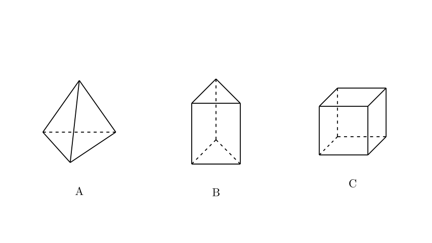
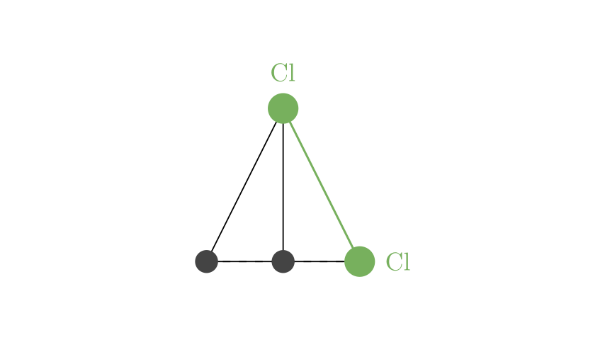
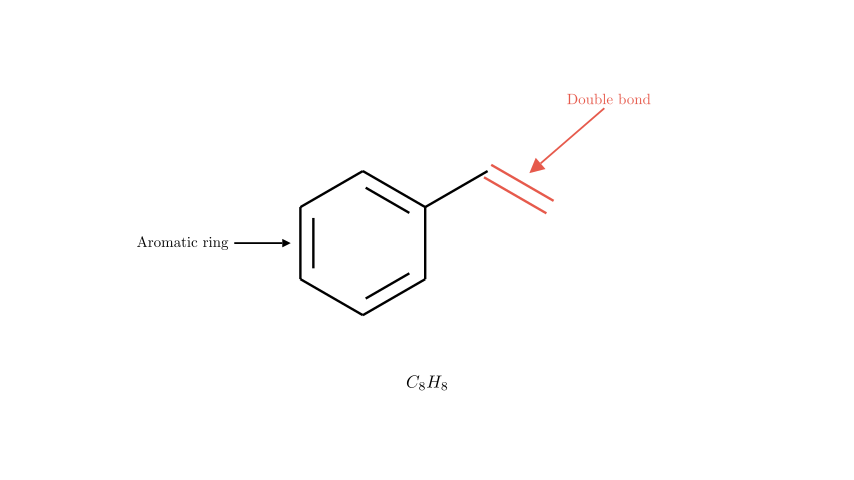

# problem_134_chemistry_g12

**Problem Statement:**

The structures of the organic hydrocarbons A, B, and C are shown in the figure below. Which of the following statements is correct?

* **A.** The dichloro-substituted derivative of A has two structural isomers.
* **B.** The molecular formula of B is $C_6H_{12}$.
* **C.** An organic compound that is an isomer of C and belongs to aromatic hydrocarbons may decolorize acidic potassium permanganate solution.
* **D.** Among A, B, and C, only C has the empirical formula of CH.

**Solution Approach:**
To solve this problem, we need to systematically analyze the 3D molecular structures of the given hydrocarbons (which represent tetrahedrane, prismane, and cubane). We will determine their molecular formulas, empirical formulas, structural symmetry (to evaluate isomers), and the chemical properties of their potential aromatic isomers.

**Analyzing Option A and D (Symmetry and Formulas):**

Let's look at the vertices of each structure. In these skeletal structures, each vertex represents a carbon atom.

* **Structure A (Tetrahedrane):** It has 4 vertices. Since each carbon in a stable hydrocarbon forms 4 bonds, and each carbon here is bonded to 3 other carbons, it must have 1 bond to a hydrogen atom. Thus, its molecular formula is $C_4H_4$. 
* **Structure B (Prismane):** It has 6 vertices. Similar to A, each carbon is bonded to 3 other carbons, leaving 1 bond for a hydrogen atom. Its molecular formula is $C_6H_6$.
* **Structure C (Cubane):** It has 8 vertices. Each carbon is bonded to 3 other carbons, leaving 1 bond for a hydrogen atom. Its molecular formula is $C_8H_8$.

From this, we can immediately evaluate **Option D**. The empirical formula is the simplest integer ratio of atoms. 
- A: $C_4H_4 \rightarrow CH$
- B: $C_6H_6 \rightarrow CH$
- C: $C_8H_8 \rightarrow CH$
All three compounds have the empirical formula CH. Therefore, Option D is **incorrect**.

Now let's evaluate **Option A**. A regular tetrahedron is highly symmetrical. All 4 vertices are equivalent, and all 6 edges are equivalent. If we replace two hydrogen atoms with chlorine atoms, the two chlorines must be placed on adjacent vertices (connected by an edge). Because every pair of vertices in a tetrahedron is connected by an identical edge, there is only **one** possible relative arrangement for a dichloro-derivative. Therefore, Option A is **incorrect**.

**Analyzing Option B:**

As we determined in the previous step, structure B (prismane) has 6 carbon atoms. Because each carbon is bonded to 3 other carbons, it forms 1 bond with hydrogen. This makes the molecular formula $C_6H_6$, not $C_6H_{12}$ (which would be cyclohexane or an isomer like a hexene, where carbons are bonded to fewer other carbons). 

Therefore, Option B is **incorrect**.

**Analyzing Option C:**

Structure C (cubane) has the molecular formula $C_8H_8$. The option asks about an isomer of C that is an aromatic hydrocarbon. 

An aromatic hydrocarbon must contain a benzene ring ($C_6H_5-$ group or similar). If we take a benzene ring (which accounts for 6 carbons) and attach the remaining 2 carbons, we can form styrene (vinylbenzene).

The chemical formula for styrene is $C_6H_5-CH=CH_2$. Let's count the atoms: 6 (ring) + 2 (side chain) = 8 Carbons. 5 (ring) + 3 (side chain) = 8 Hydrogens. It perfectly matches $C_8H_8$.

Styrene contains a carbon-carbon double bond (alkene group) in its side chain. Alkenes are readily oxidized by acidic potassium permanganate ($KMnO_4$) solution, causing the characteristic purple color of the solution to fade (decolorize).

Therefore, this statement is **correct**.

**Conclusion:**

Based on our step-by-step analysis:
* A is incorrect because the symmetry of tetrahedrane allows for only 1 dichloro isomer.
* B is incorrect because the molecular formula of prismane is $C_6H_6$.
* D is incorrect because all three molecules share the empirical formula CH.
* C is correct because styrene ($C_8H_8$) is an aromatic isomer of cubane that contains an oxidizable double bond, allowing it to decolorize acidic $KMnO_4$.

**Final Answer:**
The correct statement is **C**.

