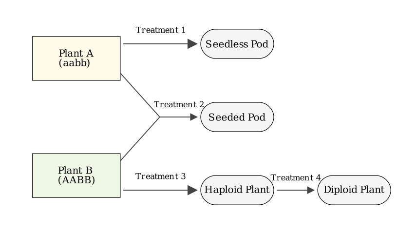
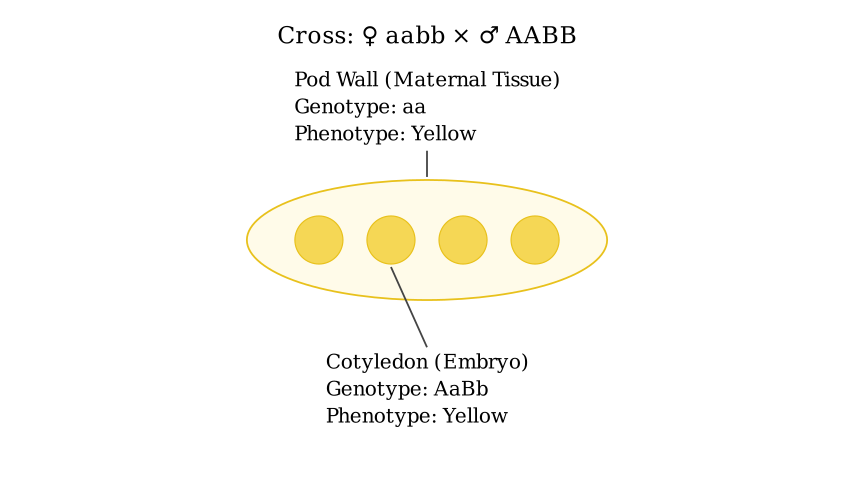
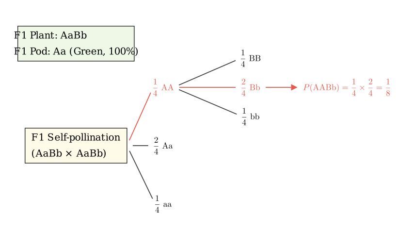
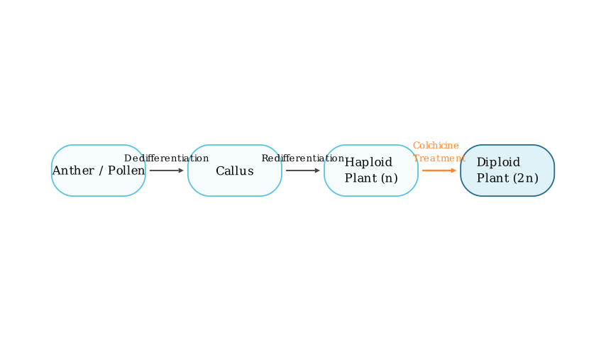

# problem_138_biology_g12

**Problem Statement:**
In the figure below, Plant A is a purebred pea with yellow pods (aa) and green cotyledons (bb), and Plant B is a purebred pea with green pods (AA) and yellow cotyledons (BB). These two pairs of genes are inherited independently. Plant A and Plant B are subjected to certain treatments, and the results are shown in the figure.

(1) The method of treatment ① is __________________________.
(2) After treatment ②, Plant A forms pods with seeds. The color of its pod is __________ color, and the color of the cotyledon of the seed is __________ color. The next year, all the seeds formed by treatment ② are sown. Under natural conditions, the proportion of plants grown that produce yellow pods is _________; among their seeds, the proportion of embryos with genotype AABb is _________.
(3) The biotechnology applied in treatment ③, its process and life activities can be briefly represented by text and arrows as _____________________.
(4) The principle of treatment ④ is __________________________.
(5) If the green gene (b) of the pea cotyledon is extracted and integrated into the DNA of a cauliflower cell, so that the inflorescence axis, pedicel, and flower of the cauliflower plant are all green to increase its economic value. The most commonly used transport tool (vector) to deliver the green gene (b) of the pea cotyledon into the somatic cell of the cauliflower is ______________.

**Solution Approach:**
This problem comprehensively covers plant physiology (hormones), genetics (Mendelian inheritance, distinguishing maternal vs. embryonic tissues), plant tissue culture, chromosome variation, and basic genetic engineering. 
- **Treatment 1** involves producing seedless fruits using plant hormones.
- **Treatment 2** is a genetic cross where we must carefully separate the traits of the maternal tissue (the pod) from the traits of the offspring embryo (the cotyledon).
- **Treatments 3 and 4** depict the standard process of haploid breeding.
- **Treatment 5** tests the basic tools of recombinant DNA technology.
We will break down each treatment step-by-step.

**Step 1: Analyzing Treatment ①**
Treatment ① results in Plant A producing a "seedless pod". In nature, seed development is usually required to provide the auxin necessary for ovary expansion into a fruit (pod). However, we can artificially induce parthenocarpy (fruit development without fertilization). By emasculating the flower (removing male parts to prevent pollination) and applying an appropriate concentration of auxin or an auxin analog to the stigma, the ovary is stimulated to develop into a pod without seeds. 

*Answer for (1):* Applying a certain concentration of auxin (or auxin analog) to the unpollinated stigma.

**Step 2: Analyzing Treatment ② (First Year)**
Treatment ② is a cross between Plant A (aabb) and Plant B (AABB). Because Plant A is the one forming the pods, it acts as the maternal parent (♀), while Plant B provides the pollen (♂).

- **Pod Color:** The pod (pericarp) develops directly from the ovary wall of the maternal plant. Therefore, its genotype is identical to the maternal Plant A, which is **aa**. Since 'aa' codes for yellow pods, the pod color is **yellow**.
- **Cotyledon Color:** The cotyledon is part of the embryo, which is formed by the fertilization of an ovule (ab) from Plant A by pollen (AB) from Plant B. The resulting F1 embryo has the genotype **AaBb**. Because 'B' (yellow cotyledon) is dominant over 'b' (green cotyledon), the cotyledon color is **yellow**.

*Answer for (2) Part 1:* Yellow; Yellow.

**Step 3: Analyzing Treatment ② (Second Year)**
The next year, the F1 seeds (AaBb) are planted. These seeds grow into mature F1 plants.

- **Proportion of Yellow Pods:** The pods produced by these F1 plants are the maternal tissue of the F1 generation. Thus, the pod genotype is **Aa**. Since 'A' (green pod) is dominant over 'a' (yellow pod), 100% of the pods will be green. The proportion of yellow pods is therefore **0**.
- **Genotype of Next-Generation Embryos:** Under natural conditions, peas self-pollinate. The F1 plant (AaBb) undergoes a self-cross (AaBb × AaBb). Because the genes assort independently, we can calculate the probability of the F2 embryo genotype **AABb** by multiplying the probabilities of each gene pair:
- For Gene A: Aa × Aa → 1/4 AA
- For Gene B: Bb × Bb → 2/4 Bb (or 1/2)
- Total Probability = (1/4) × (2/4) = **1/8**.

*Answer for (2) Part 2:* 0; 1/8.

**Step 4: Analyzing Treatments ③ and ④**
- **Treatment ③** represents the production of a haploid plant from Plant B. This is achieved through **anther (or pollen) culture**, a type of plant tissue culture. The biological process involves the pollen cells undergoing **dedifferentiation** to form an undifferentiated mass of cells called a **callus**, which then undergoes **redifferentiation** to form a complete haploid plantlet.
- **Treatment ④** converts the sterile haploid plant into a fertile diploid plant. This is done by treating the seedlings with **colchicine**. The principle of colchicine is that it inhibits the formation of the spindle fibers during cell division (mitosis). Without a spindle, sister chromatids cannot be pulled to opposite poles, resulting in a single cell with double the normal chromosome number.

*Answer for (3):* Anther (or pollen) $\xrightarrow{\text{dedifferentiation}}$ Callus $\xrightarrow{\text{redifferentiation}}$ Haploid plant.
*Answer for (4):* Colchicine inhibits the formation of the spindle during cell division, leading to chromosome doubling.

**Step 5: Analyzing Treatment ⑤**
This part tests the basic tools of genetic engineering. To transfer a target gene (the green cotyledon gene 'b') from a pea plant into a cauliflower cell, a delivery mechanism is required. In genetic engineering, the "transport tool" used to carry foreign DNA into a host cell is called a **vector**. For introducing genes into plant cells (especially dicots like cauliflower), the most commonly used vector is a **plasmid** (specifically, the Ti plasmid from *Agrobacterium tumefaciens*).

*Answer for (5):* Plasmid (or Ti plasmid).

**Final Answer Summary:**
(1) Applying a certain concentration of auxin (or auxin analog) to the unpollinated stigma.
(2) Yellow; Yellow; 0; 1/8.
(3) Anther (or pollen) $\xrightarrow{\text{dedifferentiation}}$ Callus $\xrightarrow{\text{redifferentiation}}$ Haploid plant.
(4) Colchicine inhibits the formation of the spindle during cell division, leading to chromosome doubling.
(5) Plasmid (or Ti plasmid).

