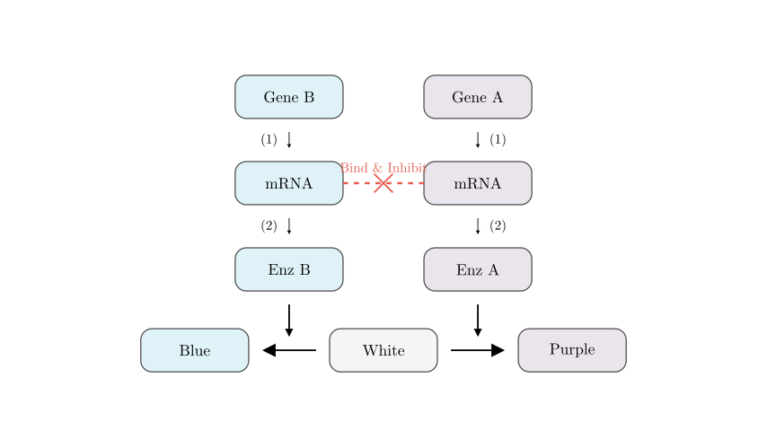
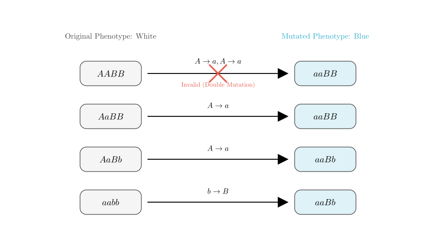

# problem_139_biology_g12

**Translated Problem Statement:**
The flower color of a certain plant is controlled by two pairs of independently inherited alleles, A/a and B/b. A is completely dominant over a, and B is completely dominant over b. The biochemical mechanism by which genes A and B control flower color is shown in the figure. Answer the following questions:
(1) Processes ① and ② in the figure are collectively called _____________. The figure reflects that the relationship between genes and biological traits is ____________.
(2) Pure-breeding purple-flowered and pure-breeding blue-flowered plants are crossed as parents to obtain $F_1$. $F_1$ is self-crossed to obtain $F_2$. After harvesting the white-flowered individuals in $F_2$, all seeds from each plant are planted separately to obtain a line. Among all the lines, the proportion of lines whose offspring show a phenotypic ratio of purple : blue : white = 3 : 3 : 10 is ______. If all the purple-flowered plants in the offspring are test-crossed, the phenotypic ratio of their progeny will be ______________________.
(3) There is a white-flowered plant. During its growth, it is found that due to a gene mutation, a blue spot appears on a white petal. The possible genotype(s) of this plant is/are __________________.

**Solution Approach:**
To tackle this, we first need to establish the mapping between genotypes and phenotypes by analyzing the provided biochemical pathway. Once we know which genotype produces which color, we can apply standard Mendelian dihybrid cross principles (the 9:3:3:1 ratio modifications) to track the inheritance patterns and calculate the requested probabilities and mutation scenarios.

### Part 1: Gene Expression and Pathway Analysis

First, let's look at processes ① and ②. 
* Process ① represents DNA being used as a template to create mRNA, which is **transcription**.
* Process ② represents mRNA being used to synthesize an enzyme (protein), which is **translation**.
* Collectively, transcription and translation are known as **gene expression**.

The diagram illustrates a fundamental biological concept: genes do not directly act as pigments. Instead, they carry the code to build enzymes. These enzymes then catalyze metabolic reactions (turning a white precursor into a blue or purple pigment). Therefore, the relationship is: **Genes control traits by controlling the synthesis of enzymes to regulate metabolic processes.**

**Genotype-Phenotype Mapping:**
Based on the "Bind & Inhibit" mechanism shown in the diagram, if *both* dominant alleles A and B are present, their mRNAs bind together, preventing translation. No enzymes are made, leaving the flower **White**.
* **$A\_B\_$** $\rightarrow$ Both mRNAs produced, translation blocked $\rightarrow$ **White**
* **$A\_bb$** $\rightarrow$ Only Enzyme A is produced $\rightarrow$ **Purple**
* **$aaB\_$** $\rightarrow$ Only Enzyme B is produced $\rightarrow$ **Blue**
* **$aabb$** $\rightarrow$ Neither enzyme is produced $\rightarrow$ **White**

**[Scene 2 rendering failed - diagram unavailable]**

### Part 2: Mendelian Crosses and Proportions

The parents are pure purple ($AAbb$) and pure blue ($aaBB$).
* **$F_1$ generation:** All offspring are $AaBb$. Because both A and B are present, the $F_1$ plants are **White**.
* **$F_2$ generation:** Self-crossing $F_1$ ($AaBb \times AaBb$) yields the standard 9:3:3:1 Mendelian genotype ratio. Applying our mapping:
* 9 $A\_B\_$ (White)
* 3 $A\_bb$ (Purple)
* 3 $aaB\_$ (Blue)
* 1 $aabb$ (White)

Notice that the total ratio of phenotypes in $F_2$ is 3 Purple : 3 Blue : 10 White (9 + 1). 

The problem states we harvest all **white** individuals from $F_2$. The white pool consists of 10 parts:
1 $AABB$ : 2 $AABb$ : 2 $AaBB$ : 4 $AaBb$ : 1 $aabb$

We want to find the proportion of these white plants that, when self-crossed, yield a progeny ratio of 3 Purple : 3 Blue : 10 White. This ratio is specifically the result of a double heterozygote self-cross ($AaBb \times AaBb$). 
Looking at our pool of white $F_2$ plants, the $AaBb$ genotype makes up 4 out of the 10 parts. 
Therefore, the proportion is **$4/10$**, which simplifies to **$2/5$**.

**Test-crossing the Purple Progeny:**
The problem then asks: "If all the purple-flowered plants in the offspring are test-crossed..." 
The purple plants in the offspring of that specific line ($AaBb$ self-crossed) have genotypes:
* $1/3$ $AAbb$
* $2/3$ $Aabb$

A test-cross means crossing them with the fully recessive genotype ($aabb$). Let's calculate the gametes produced by the purple plant population:
* The $AAbb$ plants produce only $Ab$ gametes ($1/3$ total).
* The $Aabb$ plants produce $Ab$ and $ab$ gametes equally (each $1/2 \times 2/3 = 1/3$ total).
* Total gametes from the purple population: $2/3$ $Ab$ and $1/3$ $ab$.

When fertilized by $ab$ gametes from the test-cross parent:
* $2/3$ $Ab \times ab \rightarrow 2/3$ $Aabb$ (**Purple**)
* $1/3$ $ab \times ab \rightarrow 1/3$ $aabb$ (**White**)

The resulting phenotypic ratio is **Purple : White = 2 : 1**.

### Part 3: Mutation Analysis

We have a plant that is originally **White**, meaning its starting genotype must be either $A\_B\_$ or $aabb$.
Due to a single-gene mutation in a somatic cell (petal), a spot turns **Blue**. The blue phenotype requires the genotype **$aaB\_$** (specifically $aaBB$ or $aaBb$).

Since point mutations are exceptionally rare, we assume only a **single allele** mutated. Let's test the possibilities:
1.  **If the original plant was $A\_B\_$**: To become $aaB\_$, an 'A' allele must mutate into an 'a' allele. For a single mutation to result in 'aa', the original plant must have already carried one recessive 'a'. Thus, the original plant must have been heterozygous for gene A: **$AaBB$** or **$AaBb$**. (A single mutation changes $Aa$ to $aa$).
2.  **If the original plant was $aabb$**: To become $aaB\_$, a 'b' allele must mutate into a dominant 'B' allele. A single mutation changes $bb$ to $Bb$, resulting in the genotype $aaBb$, which is blue. Thus, the original plant could have been **$aabb$**.

Genotypes like $AABB$ are impossible here because turning $AABB$ into $aaB\_$ would require *two* simultaneous mutations ($A \rightarrow a$ and $A \rightarrow a$), which is statistically negligible for a single cell event.

Therefore, the possible genotypes of the original white plant are **$AaBB$, $AaBb$, or $aabb$**.

---
### Final Answers Summary:
**(1)** Gene expression (or transcription and translation); Genes control traits by controlling the synthesis of enzymes to regulate metabolic processes.
**(2)** $2/5$ ; Purple : White = 2 : 1
**(3)** $AaBB$, $AaBb$, $aabb$

Would you like to explore more examples of epistasis or practice predicting ratios for other types of gene interactions?

