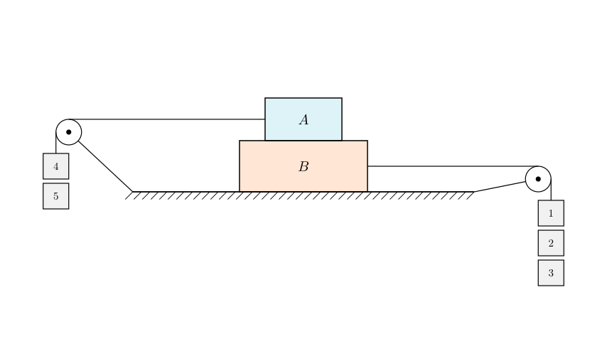
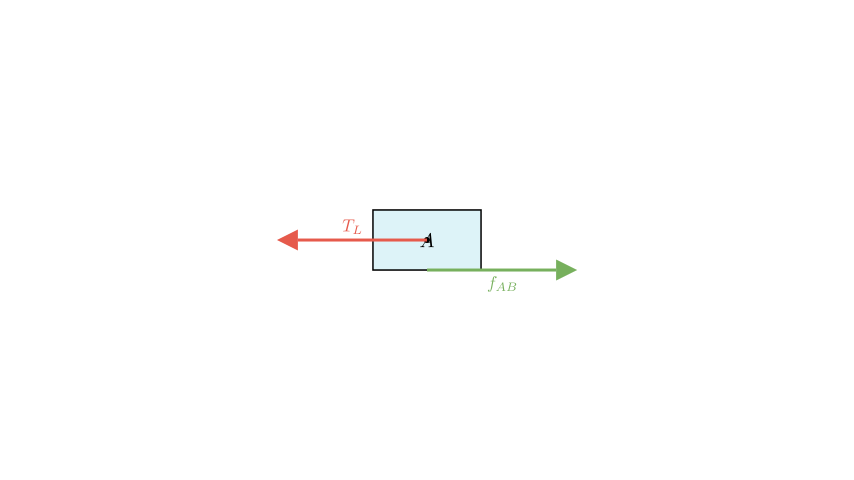
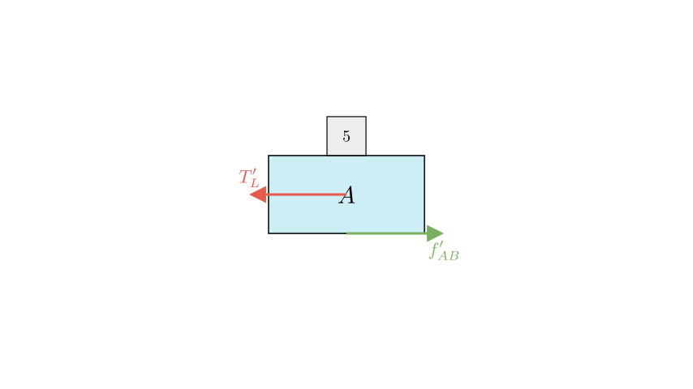
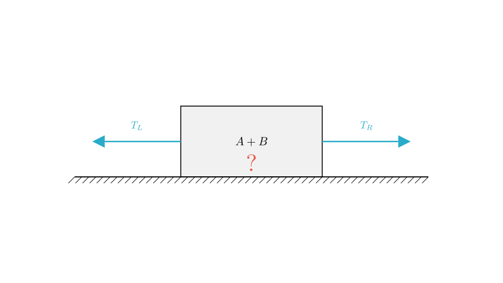

# problem_13_physics_g9

**Problem Statement:**
Rectangular wooden blocks A and B are stacked on a horizontal experimental table. They are connected to hook weights via light strings passing over fixed pulleys, as shown in the figure. Neglecting the mass of the strings and friction between strings and pulleys, blocks A and B remain stationary on the table. If hook weight number 5 is removed from the diagram and placed on block A, and blocks A and B still remain stationary on the table, which of the following statements is correct?

A. The static friction between the table and block B decreases.
B. The static friction between the table and block B increases.
C. The static friction between the table and block B remains unchanged.
D. The static friction between blocks A and B decreases.

**Solution Approach:**
To solve this problem, we will use the method of isolation (Free Body Diagrams). We will analyze the forces acting on Block A separately before and after moving the weight. Since the system is in static equilibrium (stationary), the net force on any object in the system is zero. By comparing the horizontal forces required to maintain equilibrium in both scenarios, we can determine how the friction forces change.

First, let's analyze the forces acting on **Block A** in the initial state. 

Block A is connected to the left string. The tension in this string is created by the weight of hooks 4 and 5. Let's call this tension $T_{left}$. Because Block A is stationary, there must be a force balancing this tension. This balancing force is the static friction ($f_{AB}$) exerted by Block B on Block A.

According to Newton's First Law for the horizontal direction:
$$f_{AB} = T_{left}$$

Since the tension equals the weight of the hooks:
$$f_{AB} = G_4 + G_5$$

Now, consider the change described in the problem. Hook weight number 5 is removed from the string and placed on top of Block A. 

This results in two changes:
1. The weight hanging on the left string decreases. It is now just the weight of hook 4.
2. The vertical normal force on Block A increases (because hook 5 is now resting on it).

However, the **horizontal** equilibrium is what determines the static friction force required to keep the block still. The new tension in the left string, $T'_{left}$, is now equal only to the weight of hook 4 ($G_4$).

$$T'_{left} = G_4$$

Since $G_4 < G_4 + G_5$, the tension pulling A to the left has **decreased**.

Because Block A remains stationary, the new static friction force $f'_{AB}$ must still balance the new tension.

$$f'_{AB} = T'_{left} = G_4$$

Comparing the initial and final states:
- Initial Friction: $f_{AB} = G_4 + G_5$
- Final Friction: $f'_{AB} = G_4$

It is clear that the static friction force between Block A and Block B has **decreased**. This confirms that statement D is correct.

**Why are A, B, and C incorrect?**
The friction between the table and Block B depends on the net horizontal force on the entire system (A + B). The system is pulled left by $T_{left}$ and right by $T_{right}$ (weights 1, 2, 3). The table friction balances the difference: $f_{table} = |T_{right} - T_{left}|$.

Since we do not know the specific weights of hooks 1, 2, 3 versus 4, 5, we don't know the direction of the net pull initially. Therefore, we cannot determine if the magnitude of the difference $|T_{right} - T_{left}|$ increases or decreases when $T_{left}$ decreases. Thus, the change in table friction is indeterminate.

**Final Conclusion:**

By isolating Block A, we observed that the horizontal force pulling it to the left (tension) decreased when weight 5 was removed from the string. Consequently, the static friction force required to balance this pull and keep Block A stationary must also decrease.

Therefore, the correct statement is:
**D. The static friction between blocks A and B decreases.**

