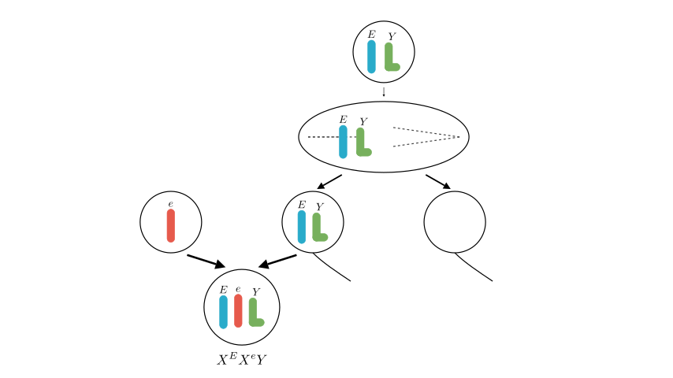
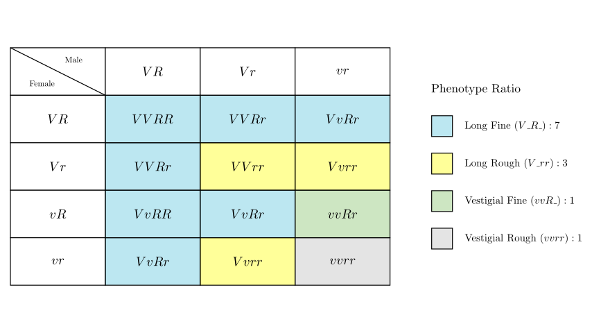

# problem_140_biology_g12

Hello! I can certainly help you break down this genetics problem. As an instructional designer, I've structured this explanation to visualize the chromosomal mechanics and inheritance patterns step-by-step.

**Problem Statement:**
Fruit flies are experimental materials for genetics research. Among their four pairs of relative traits, red eye (E) is dominant to white eye (e), gray body (B) is dominant to black body (b), long wing (V) is dominant to vestigial wing (v), and fine eye (R) is dominant to rough eye (r). The distribution of genes on the chromosomes of a male fruit fly M is shown in the figure.

(1) Morgan's fruit fly experiment verified Sutton's hypothesis, which is _________________________________.
(2) Chromosomes 1 and 2 ______________ (fill in "are" or "are not") a pair of homologous chromosomes.
(3) Fruit fly M is crossed with another white-eyed normal fruit fly, and an individual with the genotype $X^E X^e Y$ appears in the offspring. The inferred reason is ____________.
(4) Male and female fruit flies with long wings, fine eyes and vestigial wings, rough eyes were selected for a cross. The $F_1$ generation all had long wings and fine eyes. After many repeated experiments, it was found that the phenotype and ratio in $F_2$ were close to long wings, fine eyes : long wings, rough eyes : vestigial wings, fine eyes : vestigial wings, rough eyes = 7:3:1:1. They proposed a hypothesis: male or female gametes with the genotype ________________ are lethal.

**Solution Approach:**
We will tackle this problem in four stages, corresponding to the four questions. First, we'll review the fundamental theory of chromosomal inheritance. Next, we will identify the specific chromosomes shown in the karyotype. Then, we will use a meiosis diagram to explain the chromosomal non-disjunction that leads to the abnormal $X^E X^e Y$ offspring. Finally, we will use a modified Punnett square to deduce which gamete is missing to produce a 7:3:1:1 ratio instead of the standard 9:3:3:1 dihybrid ratio.

**[Scene 1 rendering failed - diagram unavailable]**

### Part 1 & 2: Chromosome Theory and Homology

**(1) Morgan and Sutton's Hypothesis**
Walter Sutton originally proposed the chromosome theory of inheritance based on the parallel behavior of chromosomes and Mendelian factors (genes) during meiosis. Thomas Hunt Morgan later provided the experimental proof using fruit flies (*Drosophila melanogaster*). 
* **Answer (1):** Genes are located on chromosomes.

**(2) Chromosomes 1 and 2**
Looking at the diagram, chromosome 1 is rod-shaped and carries the gene E. Chromosome 2 is hook-shaped. These represent the X and Y sex chromosomes of a male fruit fly, respectively. Even though they differ in size and shape, they pair up and segregate during meiosis. 
* **Answer (2):** are (they are a pair of homologous chromosomes).

### Part 3: Aneuploidy and Non-disjunction

**(3) The $X^E X^e Y$ Offspring**
The cross is between Fly M ($X^E Y$) and a white-eyed female ($X^e X^e$). 
A normal fertilization would involve an $X^e$ egg and either an $X^E$ sperm (yielding an $X^E X^e$ female) or a $Y$ sperm (yielding an $X^e Y$ male). 

To get an $X^E X^e Y$ individual, the offspring must have received $X^e$ from the mother and both $X^E$ and $Y$ from the father. For the father to pass on both his X and Y chromosomes in a single sperm cell, these homologous chromosomes must have failed to separate during Anaphase I of meiosis.
* **Answer (3):** During meiosis I in the male parent, the X and Y homologous chromosomes failed to separate and moved to the same pole, producing an abnormal sperm with the genotype $X^E Y$.

### Part 4: Lethal Gametes and Modified Ratios

**(4) The 7:3:1:1 Ratio**
A standard dihybrid cross between two double heterozygotes ($VvRr \times VvRr$) yields a phenotypic ratio of 9:3:3:1. Let's break down how this changes to 7:3:1:1.

The total number of parts in the observed ratio is $7 + 3 + 1 + 1 = 12$. 
Normally, a Punnett square has 16 combinations (4 gametes $\times$ 4 gametes). A total of 12 implies we are looking at a $4 \times 3$ grid, meaning one parent is only producing 3 types of viable gametes instead of 4. One gamete is lethal.

Let's compare the normal and observed phenotypes:
* **Long Fine (V_R_):** Normal is 9. Observed is 7. (Missing 2)
* **Long Rough (V_rr):** Normal is 3. Observed is 3. (Missing 0)
* **Vestigial Fine (vvR_):** Normal is 3. Observed is 1. (Missing 2)
* **Vestigial Rough (vvrr):** Normal is 1. Observed is 1. (Missing 0)

Notice that the missing phenotypes all require a dominant $R$ and at least one recessive $v$. If we remove the $vR$ gamete from one parent, we lose exactly two V_R_ combinations (from crossing with VR and Vr) and two vvR_ combinations (from crossing with vR and vr). This perfectly aligns with our observation.
* **Answer (4):** vR

### Final Recap of Answers:
1.  **Genes are located on chromosomes.**
2.  **are**
3.  **During meiosis I in the male parent, the X and Y homologous chromosomes failed to separate, producing an $X^E Y$ sperm.**
4.  **vR**

Would you like to explore more examples of modified Mendelian ratios, such as epistasis or recessive lethal alleles?

