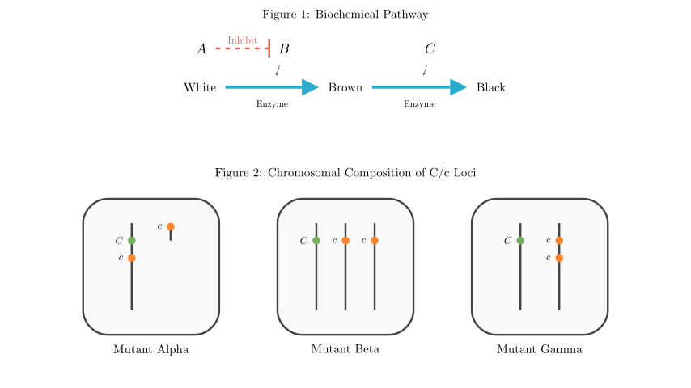
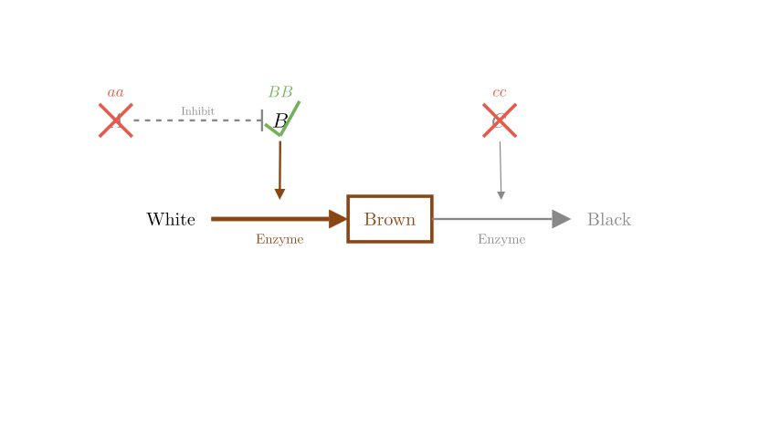
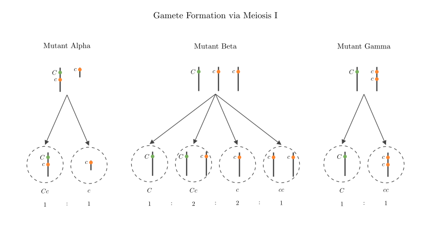

# problem_142_biology_g12

**Problem Statement:**

The hair color of Lincoln Longwool pigs is controlled by three pairs of independently inherited and completely dominant genes: A-a, B-b, and C-c. Research shows that when the number of C genes in a somatic cell is less than the number of c genes, the expression of the C gene is weakened, forming a black-blue mutant. The relationship between genes and traits is shown in Figure 1, and the composition of C and c genes on chromosomes in the somatic cells of black-blue mutants is shown in Figure 2. Please answer:

(1) Based on Figure 1, deduce the genotype of a homozygous brown pig: _____________________________________.

(2) In Figure 1, the cross between certain normal black Lincoln Longwool pigs with the same genotype produced offspring with two phenotypes. The phenotypes and their ratio in the offspring are ____________________ or ______________________.

(3) Currently, there are multiple purebred Lincoln Longwool pigs. Please design a simple hybridization experiment to determine which type of mutant in Figure 2 a Lincoln Longwool pig with the genotype aaBbCcc belongs to (assuming no mutations or chromosomal crossovers occur during the experiment, and all types of gametes are equally viable). 
Experimental steps: ______________________________________________.
Results and conclusions:
I. If in the offspring _____________________________, then the mutant is Mutant Alpha (甲).
II. If in the offspring ____________________________, then the mutant is Mutant Beta (乙).
III. If in the offspring ____________________________, then the mutant is Mutant Gamma (丙).

**Solution Approach:**
We will first analyze the biochemical pathway to map genotypes to phenotypes (White, Brown, Black). Then, we will use standard Mendelian genetics to solve for the specific crosses requested. Finally, we will analyze the chromosomal mutations to determine the types of gametes produced by each mutant and design a test cross to identify them.

**Step 1: Deducing the Genotype of a Homozygous Brown Pig (Question 1)**

Based on the biochemical pathway (Figure 1):
* **Gene A** inhibits Gene B. Therefore, for any color other than white to be produced, the pig must have the recessive genotype **aa**. If a pig has the dominant *A* allele, the pathway is blocked, resulting in a White phenotype.
* **Gene B** is required to convert the White substance to the Brown substance. A brown pig must have at least one dominant *B* allele.
* **Gene C** is required to convert the Brown substance to the Black substance. For the pig to remain brown, this step must be blocked, meaning the pig must have the homozygous recessive genotype **cc**.

Since the question asks for a *homozygous* brown pig, all allele pairs must be homozygous. 
Therefore, the genotype must be **aaBBcc**.

**Step 2: Offspring of Normal Black Pigs (Question 2)**

A normal black pig must have the pathway fully active: no inhibition from A (**aa**), active B (**B_**), and active C (**C_**). The normal black genotype is **aaB_C_** (with $C \ge c$ to avoid the black-blue mutation).

We are told two pigs with the *same genotype* are crossed and produce exactly *two* phenotypes. Let's test the possible heterozygous genotypes for normal black pigs:

1.  **aaBbCC × aaBbCC**: 
* Offspring: 3/4 aaB_CC (Black) and 1/4 aabbCC (White). 
* Phenotypes: **Black : White = 3 : 1**. (This yields exactly two phenotypes).

2.  **aaBBCc × aaBBCc**: 
* Offspring: 3/4 aaBBC_ (Black) and 1/4 aaBBcc (Brown). 
* Phenotypes: **Black : Brown = 3 : 1**. (This also yields exactly two phenotypes).

3.  **aaBbCc × aaBbCc**: 
* Offspring will have Black (aaB_C_), Brown (aaB_cc), and White (aabb__) phenotypes. This yields *three* phenotypes, which contradicts the problem.

Therefore, the phenotypes and their ratios are **Black : White = 3 : 1** OR **Black : Brown = 3 : 1**.

**Step 3: Designing the Test Cross (Question 3)**

We need to determine which mutation a black-blue pig of genotype **aaBbCcc** has. The best way to reveal the gametes produced by the mutant is to perform a test cross with a homozygous recessive tester for the relevant traits. 

Since we want to observe the effects of the C/c alleles, we should cross it with a **purebred brown pig (aaBBcc)**. (Using a purebred white pig would introduce the epistatic `bb` allele, complicating the phenotypic ratios).

**Experimental Step:** Cross the black-blue mutant pig (aaBbCcc) with a purebred brown pig (aaBBcc), and observe the phenotypes of the offspring.

Let's analyze the expected gametes for the C locus from each mutant type and the resulting offspring when fertilized by a *c* gamete from the brown tester:

* **Mutant Alpha (甲)**: Chromosomes are (Cc) and (c).
* Gametes: 1/2 (Cc), 1/2 (c)
* Offspring genotypes (adding c): 1/2 Ccc (Black-blue, because $C < c$), 1/2 cc (Brown).
* **Conclusion I**: Black-blue : Brown = 1 : 1.

* **Mutant Beta (乙)**: Chromosomes are (C), (c), and (c).
* Gametes: 1/6 (C), 2/6 (Cc), 2/6 (c), 1/6 (cc)
* Offspring genotypes (adding c): 1/6 Cc (Normal Black, $C = c$), 2/6 Ccc (Black-blue), 2/6 cc (Brown), 1/6 ccc (Brown). 
* Note that `cc` and `ccc` both result in the brown phenotype.
* **Conclusion II**: Normal Black : Black-blue : Brown = 1 : 2 : 3.

* **Mutant Gamma (丙)**: Chromosomes are (C) and (cc).
* Gametes: 1/2 (C), 1/2 (cc)
* Offspring genotypes (adding c): 1/2 Cc (Normal Black), 1/2 ccc (Brown).
* **Conclusion III**: Normal Black : Brown = 1 : 1.

**Final Answer Recap:**
(1) aaBBcc
(2) Black : White = 3 : 1  OR  Black : Brown = 3 : 1
(3) Experimental step: Cross the mutant pig with a purebred brown pig (aaBBcc) and observe the offspring phenotypes.
I. Black-blue : Brown = 1 : 1
II. Normal Black : Black-blue : Brown = 1 : 2 : 3
III. Normal Black : Brown = 1 : 1

