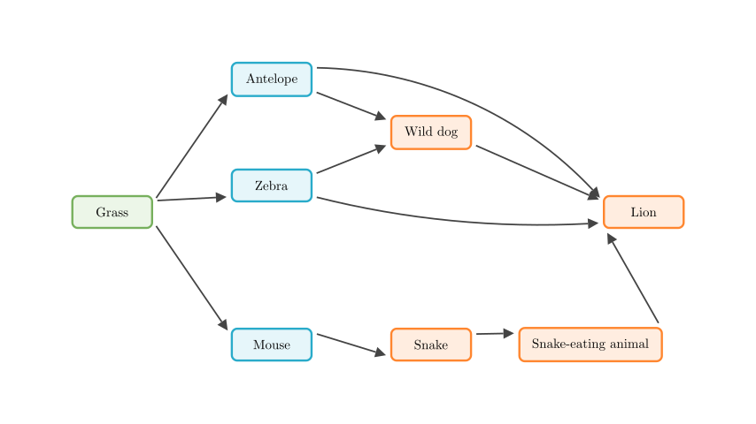
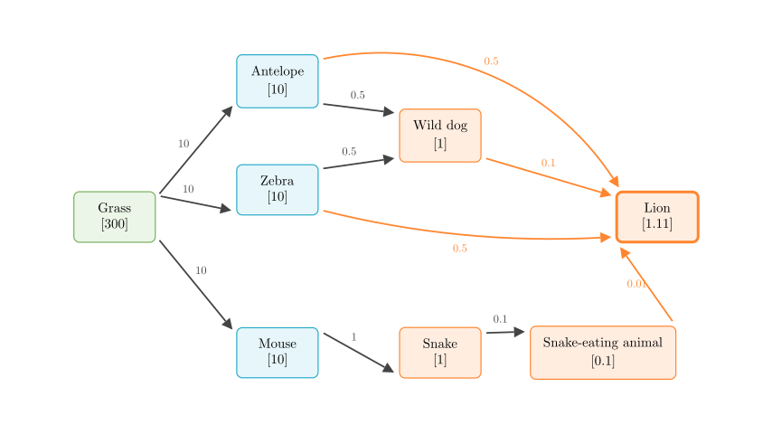
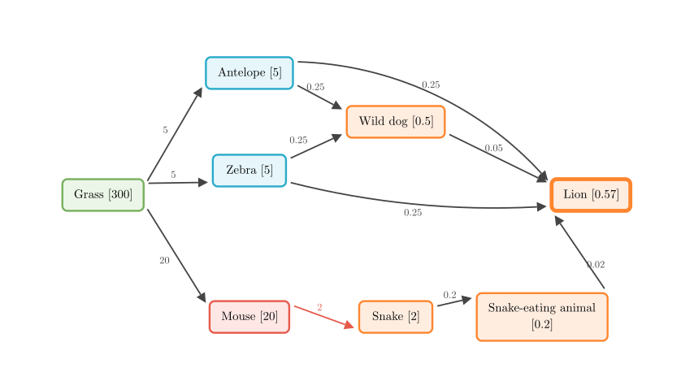

# problem_143_biology_g12

**Problem Statement:**
An African savanna ecosystem has the following food web:
*(See diagram below)*

(1) When this savanna ecosystem is in a state of equilibrium, the energy input into the system is ________ the energy output from the system; the form of energy output from the ecosystem is ________.
(2) It is known that before human intervention, this savanna ecosystem was in a state of equilibrium. At this time, the solar energy fixed by the producers of this savanna was 3,000,000 kJ (300 ten-thousand kJ). Assuming energy flows at a transfer efficiency of 10%, and that a species is equally consumed by various species in the next trophic level, the energy obtained by the lion population at this time exactly maintains the survival of one population. The energy obtained by the lion population at this time is ________ ten-thousand kJ.
(3) Later, due to human interference, the mouse population multiplied massively, and its population density greatly increased. At this time, the energy consumed by mice accounts for 2/3 of its trophic level. The energy flow still occurs at 10%, and the remaining biomass is equally consumed by various species in the next trophic level. Calculate the energy the lion population can obtain after human intervention as ________ ten-thousand kJ. If the lion population maintains its original population size to continue surviving, the area of the lion's predation region should be ________ times the original. If the area of the savanna is limited, predict that the density of the lion population will ________.

**Solution Approach:**
We will solve this problem in three parts. First, we will analyze the fundamental energy balance of an ecosystem in equilibrium. Second, we will trace the flow of energy step-by-step through the food web before human intervention, applying the 10% transfer efficiency and the equal distribution rules to find the total energy reaching the lions. Finally, we will recalculate the energy flow under the new conditions caused by human interference, which will allow us to determine the required hunting area and the impact on the lion population density.

**Part (1): Ecosystem Equilibrium**
In any ecosystem, energy flows directionally and is gradually lost. When an ecosystem reaches a stable equilibrium, the total energy entering the system must exactly balance the total energy leaving it.
- **Energy Input:** The primary source of energy is solar energy, which is fixed by producers (like grass) through photosynthesis.
- **Energy Output:** As energy flows through the trophic levels, organisms use it for cellular respiration, which ultimately dissipates as heat into the environment.

Therefore, the energy input is **equal to** the energy output, and the output is in the form of **heat energy**.

**Part (2): Energy Flow Before Intervention**
Let's calculate the energy obtained by the lion population. We will use "units" where 1 unit = 10,000 kJ to match the requested answer format.
- Initial energy at the 1st trophic level (Grass) = 300 units.
- Transfer efficiency = 10%.
- Energy is equally divided among all consumer species in the next trophic level.

**Step-by-step calculation:**
1. **2nd Trophic Level:** The total energy transferred from Grass is $300 \times 10\% = 30$. Since Grass is eaten by 3 species (Antelope, Zebra, Mouse), each receives an equal share:
- Antelope: $30 \div 3 = 10$
- Zebra: $30 \div 3 = 10$
- Mouse: $30 \div 3 = 10$

2. **3rd Trophic Level:**
- **From Antelope (10):** Total transferred is $10 \times 10\% = 1$. It is eaten by Wild dog and Lion. Each gets $1 \div 2 = 0.5$.
- **From Zebra (10):** Total transferred is $10 \times 10\% = 1$. It is eaten by Wild dog and Lion. Each gets $1 \div 2 = 0.5$.
- **From Mouse (10):** Total transferred is $10 \times 10\% = 1$. It is eaten only by Snake. Snake gets 1.

*Note on Wild dog:* The Wild dog receives 0.5 from Antelope and 0.5 from Zebra, giving it a total energy of 1.

Continuing the calculation for the higher trophic levels based on the diagram above:

3. **4th Trophic Level:**
- **From Wild dog (1):** Total transferred is $1 \times 10\% = 0.1$. It is eaten only by Lion. Lion gets 0.1.
- **From Snake (1):** Total transferred is $1 \times 10\% = 0.1$. It is eaten only by Snake-eating animal. Snake-eating animal gets 0.1.

4. **5th Trophic Level:**
- **From Snake-eating animal (0.1):** Total transferred is $0.1 \times 10\% = 0.01$. It is eaten only by Lion. Lion gets 0.01.

**Total Energy for Lion:**
The lion receives energy from multiple sources across different trophic levels:
- From Antelope: 0.5
- From Zebra: 0.5
- From Wild dog: 0.1
- From Snake-eating animal: 0.01

Total = $0.5 + 0.5 + 0.1 + 0.01 = 1.11$.
Thus, the energy obtained by the lion population is **1.11** (ten-thousand kJ).

**Part (3): Energy Flow After Human Interference**
Now, the mouse population has massively increased and consumes 2/3 of the energy available to the 2nd trophic level. Let's recalculate the energy flow.

1. **2nd Trophic Level:** The total energy transferred from Grass is still 30.
- Mouse gets $\frac{2}{3}$ of this energy: $30 \times \frac{2}{3} = 20$.
- The remaining energy (10) is equally divided among the other species in this level (Antelope and Zebra):
- Antelope: $10 \div 2 = 5$
- Zebra: $10 \div 2 = 5$

2. **3rd Trophic Level:**
- **From Antelope (5):** Transfers $5 \times 10\% = 0.5$. Wild dog and Lion each get 0.25.
- **From Zebra (5):** Transfers $5 \times 10\% = 0.5$. Wild dog and Lion each get 0.25.
- **From Mouse (20):** Transfers $20 \times 10\% = 2$. Snake gets 2.

*Wild dog total:* $0.25 + 0.25 = 0.5$.

Continuing the calculation for the new scenario:

3. **4th Trophic Level:**
- **From Wild dog (0.5):** Transfers $0.5 \times 10\% = 0.05$. Lion gets 0.05.
- **From Snake (2):** Transfers $2 \times 10\% = 0.2$. Snake-eating animal gets 0.2.

4. **5th Trophic Level:**
- **From Snake-eating animal (0.2):** Transfers $0.2 \times 10\% = 0.02$. Lion gets 0.02.

**New Total Energy for Lion:**
- From Antelope: 0.25
- From Zebra: 0.25
- From Wild dog: 0.05
- From Snake-eating animal: 0.02

Total = $0.25 + 0.25 + 0.05 + 0.02 = 0.57$.
The lion population now obtains **0.57** (ten-thousand kJ).

**Area and Density Impact:**
- To maintain its original population size, the lion population still requires 1.11 units of energy. Since the same area now only provides 0.57 units, the required hunting area must increase by a factor of $\frac{1.11}{0.57} = \frac{111}{57} = \frac{37}{19}$ times.
- If the savanna area is limited and cannot be expanded, the available energy (0.57) is insufficient to support the original population. Consequently, the carrying capacity drops, and the density of the lion population will **decrease**.

**Final Answers:**
(1) **equal to** ; **heat energy**
(2) **1.11**
(3) **0.57** ; **37/19** ; **decrease**

**Recap:**
By meticulously tracing the energy flow through each path of the food web—applying the 10% transfer efficiency and the equal distribution rules—we can accurately determine the energy available to apex predators. Changes in lower trophic levels, such as a surge in the mouse population, drastically alter energy distribution. This ultimately reduces the energy reaching the top of the food chain, forcing predators to expand their hunting grounds or face a decline in population density.

