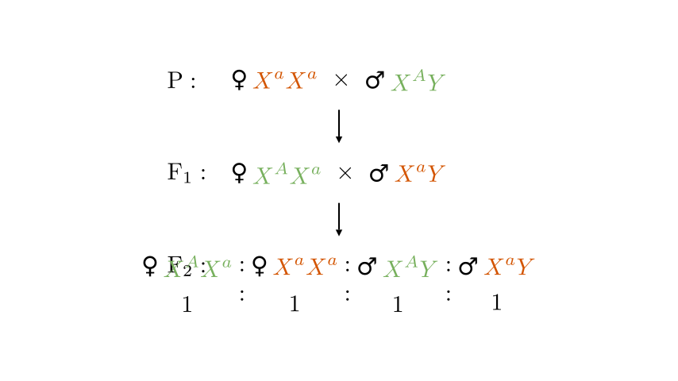
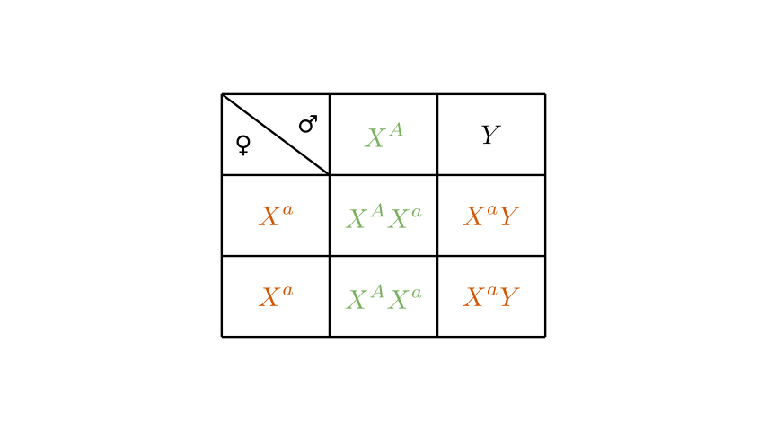
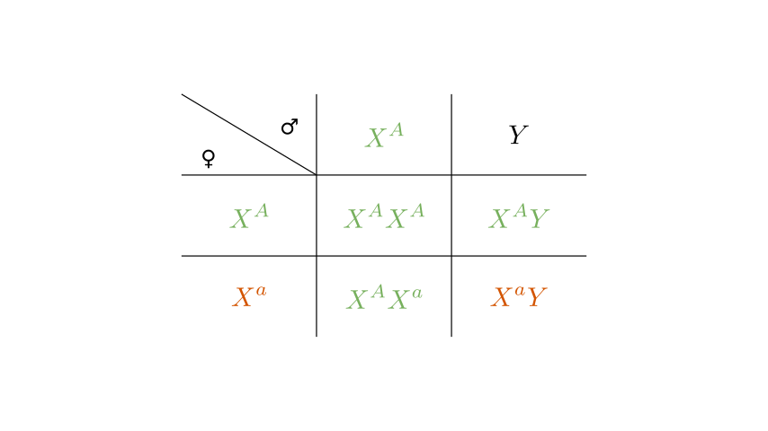

# problem_144_biology_g12

**Problem Statement:**
It is known that round eyes and bar eyes in *Drosophila* are controlled by a pair of alleles, but the dominant-recessive relationship of these relative traits and the chromosome on which the alleles are located are unknown. There are several purebred male and female *Drosophila* with round eyes and bar eyes. A research group selected parents from them and conducted a cross-breeding experiment. The results are shown below:

P: ♀ Bar eye × ♂ Round eye
↓
F₁: ____ eye (♀ ♂)
↓ F₁ males and females interbreed
F₂: ♀ Round eye : ♀ Bar eye : ♂ Round eye : ♂ Bar eye = 1 : 1 : 1 : 1

(1) Based solely on the experimental results, can it be deduced whether the gene controlling eye shape is located only on the X chromosome or on an autosome? Explain the reason.
______________________________________________________________________.
(2) Based on the experimental results, deduce whether bar eye is a __________ (fill in "dominant" or "recessive") trait compared to round eye.
(3) To verify the above deductions, members of the research group selected materials from F₂ *Drosophila* and designed two different hybridization experiments, both of which can independently prove the above deductions. Please write down the hybridization combinations supporting the above deductions and the corresponding expected experimental results. (Requirement: Only 1 hybridization combination is used for each experiment) __________.

**Solution Approach:**
1. Analyze the F₂ phenotypic ratio (1:1:1:1) to determine if the trait is autosomal or X-linked.
2. Deduce the dominant-recessive relationship based on the parental (P) and F₁ genotypes required to produce the observed F₂ ratio.
3. Design two specific verification crosses using F₂ individuals (Punnett squares will be used) to independently confirm the inheritance pattern.

First, let's analyze whether the gene is on an autosome or the X chromosome. (Note: In the diagrams, green denotes the round eye phenotype and orange denotes the bar eye phenotype).

If the trait were **autosomal**, crossing purebred parents (homozygous dominant `AA` and homozygous recessive `aa`) would yield an F₁ generation that is entirely heterozygous (`Aa`). When F₁ individuals interbreed (`Aa × Aa`), the F₂ generation would follow standard Mendelian segregation, resulting in a 3:1 phenotypic ratio. However, the experimental results show an F₂ ratio of 1:1:1:1. This completely contradicts autosomal inheritance.

For the F₂ generation to have a 1:1:1:1 ratio (Female Round : Female Bar : Male Round : Male Bar) with equal distribution across sexes, the F₁ generation must consist of a heterozygous female and a hemizygous recessive male. Since the P generation consists of purebreds, this scenario perfectly aligns with **X-linked inheritance** where the purebred female parent is homozygous recessive (`X^aX^a`, Bar eye) and the purebred male parent is hemizygous dominant (`X^AY`, Round eye). 

Therefore, the gene is located **only on the X chromosome**.

Furthermore, this cross produces F₁ females that are heterozygous (`X^AX^a`) and F₁ males that are hemizygous recessive (`X^aY`). Since the F₁ females inherit the `X^A` allele from their round-eyed father and the `X^a` allele from their bar-eyed mother, and we know `X^AX^a` crossed with `X^aY` yields the 1:1:1:1 F₂ ratio, the `X^A` allele must dictate the round eye trait. Thus, **round eye is dominant** and **bar eye is recessive**.

To verify these deductions (X-linked inheritance and bar eye being recessive), we must select crosses from the F₂ generation that yield unambiguous, sex-dependent results.

**Verification Experiment 1:**
Cross F₂ bar-eyed females (`X^aX^a`) with F₂ round-eyed males (`X^AY`).

As shown in the Punnett square above, all female offspring will inherit the dominant `X^A` allele from the father, resulting in the heterozygous genotype `X^AX^a` (round eyes). All male offspring will inherit the recessive `X^a` allele from the mother and the Y chromosome from the father, resulting in the hemizygous genotype `X^aY` (bar eyes).

**Expected Result:** All female offspring have round eyes, and all male offspring have bar eyes. This "criss-cross" inheritance pattern is a classic hallmark of X-linked traits and independently proves our deductions.

**Verification Experiment 2:**
Cross F₂ round-eyed females (`X^AX^a`) with F₂ round-eyed males (`X^AY`).

In this cross, all female offspring receive the dominant `X^A` allele from the father, meaning 100% of the females will have round eyes (`X^AX^A` or `X^AX^a`). The male offspring, however, receive their Y chromosome from the father and their X chromosome from the heterozygous mother. Thus, half will receive `X^A` (round eyes) and half will receive `X^a` (bar eyes).

**Expected Result:** All female offspring have round eyes, while the male offspring segregate into round eyes and bar eyes in a 1:1 ratio. The appearance of the recessive bar eye trait *only* in males from two dominant-phenotype parents confirms both the dominance of the round eye and its location on the X chromosome.

### Final Answers

**(1)** **Yes, it can be deduced that the gene is located only on the X chromosome.** 
*Reason:* If the gene were on an autosome, crossing purebred parents would result in an entirely heterozygous F₁ generation, which upon interbreeding would yield a 3:1 phenotypic ratio in F₂. The observed 1:1:1:1 ratio is only mathematically possible if the F₁ generation is a cross between a heterozygote and a hemizygous recessive, which implies X-linked inheritance originating from a homozygous recessive female and a hemizygous dominant male parent.

**(2)** **Recessive**

**(3)** 
*Experiment 1:* Cross F₂ bar-eyed females with F₂ round-eyed males. **Expected result:** All female offspring are round-eyed; all male offspring are bar-eyed.
*Experiment 2:* Cross F₂ round-eyed females with F₂ round-eyed males. **Expected result:** All female offspring are round-eyed; male offspring are half round-eyed and half bar-eyed.
*(Note: Either of these two experiments is a valid answer).*

