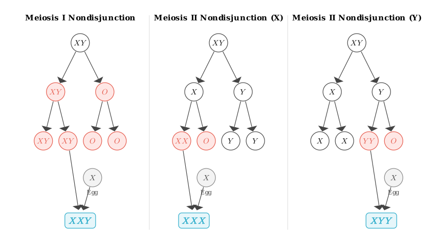

# problem_145_biology_g12

Here is the complete translation of the problem statement and a brief outline of how we will solve it.

**Problem Statement:**
A family has two types of genetic diseases, A (甲) and B (乙). One of them is a dominant genetic disease with an incidence rate of 19% in the natural population, and the other is a sex-linked genetic disease. The figure below is the pedigree chart of this family. The sex chromosome of II-5 is monosomic (has only one sex chromosome), while the chromosomes of other members are normal. Answer the following questions:
(1) The inheritance patterns of genetic diseases A and B are __________ and ____________, respectively.
(2) The cause of the sex chromosome abnormality in II-5 is that ______ produced abnormal gametes. If another abnormal gamete produced simultaneously by this individual combines with a normal gamete from their spouse, the possible sex chromosome composition of the developing individual (assuming all survive) could be ____________________.
(3) If II-3 and II-4 marry, the probability of them having a child with both diseases is _____________________.

**Solution Approach:**
1.  **Determine Inheritance Patterns:** Analyze the pedigree to find which disease is dominant and which is recessive. Use the constraints provided (one is dominant, one is sex-linked) to lock down the exact mode of inheritance for Diseases A and B.
2.  **Analyze Chromosomal Nondisjunction:** Trace the origin of II-5's single sex chromosome to determine which parent contributed the abnormal gamete, and deduce the possible reciprocal abnormal gametes.
3.  **Calculate Probabilities:** Use the Hardy-Weinberg principle (based on the 19% incidence rate) to find the genotype probabilities for II-3. Then, use a standard genetic cross to find the probability of II-4 passing on Disease B. Multiply the independent probabilities to find the final answer.

**[Missing diagram for Scene 1]**

### Step 1: Determining the Inheritance Patterns

Let's look at **Disease B** first. Individuals I-1 and I-2 do not have Disease B, but they have a daughter, II-5, who is affected by Disease B. In genetics, unaffected parents having an affected offspring indicates that the trait is **recessive**. 

The problem states that one disease is dominant and the other is sex-linked. Since Disease B is recessive, it cannot be the dominant one. Therefore, **Disease B must be the sex-linked disease**, specifically **X-linked recessive**.

By elimination, **Disease A must be the dominant disease**. We can also confirm whether it is autosomal or X-linked. Individual I-1 is a male affected by Disease A. If Disease A were X-linked dominant, he would pass his affected X chromosome to *all* of his daughters, making them all affected. However, his daughters II-4 and II-6 are completely normal. This proves that **Disease A is an Autosomal Dominant** trait.

**Answer for (1):** * Disease A: Autosomal Dominant
* Disease B: X-linked Recessive

### Step 2: Analyzing the Chromosome Abnormality of II-5

We established that Disease B is X-linked recessive. Let's represent the normal allele as $X^B$ and the disease allele as $X^b$.
Since II-5 has Disease B and only one sex chromosome, her genotype must be $X^b O$. 

Where did she get this $X^b$ chromosome? 
Her father (I-1) is unaffected by Disease B, so his genotype is $X^B Y$. Her mother (I-2) is also unaffected but must be a carrier ($X^B X^b$) to pass on the disease allele. II-5 must have received the $X^b$ chromosome from her mother. This means she received **no sex chromosome (an "O" gamete)** from her father. 

Therefore, the abnormality was caused by **I-1 (the father)** producing an abnormal gamete.

If a gamete with zero sex chromosomes ("O") is produced, what does the *other* gamete produced in that same nondisjunction event look like?
* **If nondisjunction happened in Meiosis I:** The homologous X and Y chromosomes failed to separate, going into the same cell. This produces an $XY$ gamete and an $O$ gamete. If the $XY$ gamete fertilizes a normal egg ($X$), the offspring is **XXY**.
* **If nondisjunction happened in Meiosis II (X chromosome):** The sister chromatids of the X chromosome failed to separate, producing an $XX$ gamete and an $O$ gamete. If the $XX$ gamete fertilizes a normal egg ($X$), the offspring is **XXX**.
* **If nondisjunction happened in Meiosis II (Y chromosome):** The sister chromatids of the Y chromosome failed to separate, producing a $YY$ gamete and an $O$ gamete. If the $YY$ gamete fertilizes a normal egg ($X$), the offspring is **XYY**.

**Answer for (2):** * Parent: **I-1 (or father)**
* Possible sex chromosome compositions: **XXY, XXX, XYY**

### Step 3: Calculating Probabilities for Disease A

Disease A is Autosomal Dominant (let's use alleles $A$ and $a$). The incidence rate in the population is 19%. 
This means the frequency of normal individuals ($aa$) in the population is:
$$100\% - 19\% = 81\%$$

Using the Hardy-Weinberg equation ($p^2 + 2pq + q^2 = 1$):
* $q^2 = 0.81$, so the frequency of the recessive allele $a$ is $q = 0.9$.
* The frequency of the dominant allele $A$ is $p = 1 - 0.9 = 0.1$.

The genotype frequencies in the population are:
* $AA = p^2 = 0.01$
* $Aa = 2pq = 2 \times 0.1 \times 0.9 = 0.18$

Individual II-3 is affected by Disease A, so he must be either $AA$ or $Aa$. Out of all affected individuals in the population, the probability of him being a heterozygote ($Aa$) is:
$$P(Aa) = \frac{0.18}{0.01 + 0.18} = \frac{18}{19}$$
The probability of him being homozygous ($AA$) is:
$$P(AA) = \frac{0.01}{0.01 + 0.18} = \frac{1}{19}$$

He marries II-4, who is normal ($aa$). The probability of them having a child with Disease A ($A\_$) is:
$$[P(AA) \times 1] + [P(Aa) \times 0.5] = (\frac{1}{19} \times 1) + (\frac{18}{19} \times \frac{1}{2}) = \frac{1}{19} + \frac{9}{19} = \frac{10}{19}$$

### Step 4: Calculating Probabilities for Disease B & Final Answer

Now let's calculate the probability for Disease B. 
II-3 is normal for Disease B, so his genotype is $X^B Y$.
II-4 is also normal. Her father was $X^B Y$ and her mother was a carrier ($X^B X^b$). Therefore, II-4 has a 1/2 chance of being $X^B X^B$ and a 1/2 chance of being a carrier ($X^B X^b$).

For their child to have Disease B, the child must be a boy ($X^b Y$), because the father (II-3) will only pass on a normal $X^B$ to his daughters.
The probability of having an affected child ($X^b Y$) is:
$$P(\text{II-4 is } X^B X^b) \times P(\text{mother passes } X^b) \times P(\text{father passes } Y)$$
$$\frac{1}{2} \times \frac{1}{2} \times \frac{1}{2} = \frac{1}{8}$$

Finally, we multiply the independent probabilities of having Disease A and Disease B to find the probability of a child having *both* diseases:
$$\frac{10}{19} \times \frac{1}{8} = \frac{10}{152} = \frac{5}{76}$$

**Answer for (3):** 5/76

***
**Final Summary of Answers:**
1. Autosomal Dominant; X-linked Recessive
2. I-1 (or father); XXY, XXX, XYY
3. 5/76

Hopefully, breaking the pedigree chart and the probability math down step-by-step makes this problem much clearer! Let me know if you want to dive deeper into Hardy-Weinberg calculations or other inheritance patterns.

