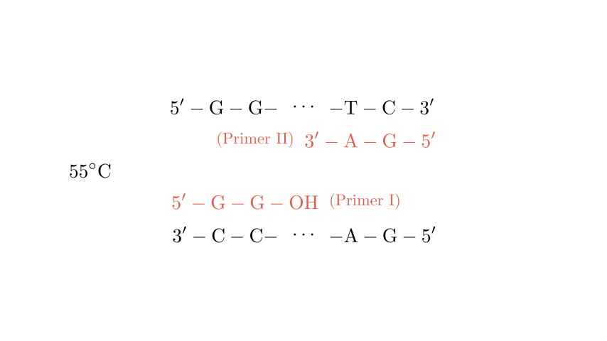
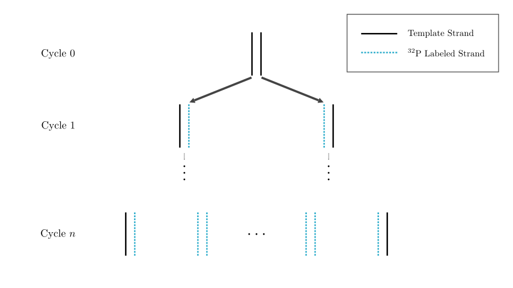

# problem_147_biology_g12

### Problem Statement

In genetic diseases and criminal investigation cases, it is often necessary to analyze sample DNA. PCR (Polymerase Chain Reaction) technology can rapidly amplify DNA fragments, creating millions of copies within a few hours, effectively solving the problem where the DNA content in a sample is too low for analysis. Answer the following questions based on the provided diagram.

1. Write the sequence for **Primer II** on the corresponding line and place Primer II in the correct position during the **annealing** step.
2. Draw or describe the DNA molecules generated after **one cycle** of PCR on the corresponding lines.
3. If the four types of deoxynucleotides used as raw materials are labeled with $^{32}\text{P}$, analyze the characteristics of the DNA molecules generated after **one cycle**. Furthermore, calculate the ratio of **non-radioactive single strands** to the total number of single strands after **$n$ cycles**.
4. A prerequisite for the PCR reaction process is \_\_\_\_\_\_, and PCR technology utilizes the \_\_\_\_\_\_ principle of DNA to solve this problem.
5. During the analysis of sample DNA, it is found that the DNA is mixed with some **histone proteins**. To remove these histones, the substance that can be added is \_\_\_\_\_\_.

---

### Solution Approach
* **Primer Design:** Primers must be complementary to the $3'$ ends of the template strands to allow DNA polymerase to extend in the $5' \to 3'$ direction.
* **PCR Mechanism:** Each cycle consists of denaturation (separation), annealing (primer binding), and extension (synthesis).
* **Semi-conservative Replication:** New strands are synthesized using labeled nucleotides; the original template strands remain unlabeled.
* **Calculation:** We use the formula for exponential growth ($2^n$) to determine the distribution of labeled vs. unlabeled strands.
* **Biochemical Purification:** Proteases are used to degrade proteins (like histones) without damaging the DNA.

### Step 1: Determining Primer II and the Annealing Position

In PCR, DNA polymerase can only add nucleotides to the $3'-\text{OH}$ end of an existing strand. Therefore, primers must bind to the $3'$ end of the template strands.

* **Template Strand a:** $5' \dots \text{T—C } 3'$
* **Primer II:** Must be complementary to the $3'$ end of Strand a. The complement to $3' \text{—CT}$ is $5' \text{—GA}$. Thus, **Primer II is $5' \text{—G—A—OH}$**.
* **Positioning:** In the annealing step ($55^\circ\text{C}$), Primer II binds to the $3'$ end of Strand a (the right side of the top strand in the diagram), while Primer I binds to the $3'$ end of Strand b (the left side of the bottom strand).

### Step 2: Products After One Cycle

During the extension step ($72^\circ\text{C}$), $Taq$ polymerase extends the primers. After one full cycle, the two original strands have served as templates to create two new complementary strands. 
* **DNA Molecule 1:** Consists of template Strand a and a new strand synthesized from Primer II.
* **DNA Molecule 2:** Consists of template Strand b and a new strand synthesized from Primer I.

The resulting sequences at the ends of the new double-stranded DNA molecules will be:
* Left side: $5' \dots \text{G—G} \dots 3'$ paired with $3' \dots \text{C—C} \dots 5'$
* Right side: $5' \dots \text{T—C} \dots 3'$ paired with $3' \dots \text{A—G} \dots 5'$

### Step 3: Analysis of $^{32}\text{P}$ Labeling

**After Cycle 1:**
PCR follows the principle of **semi-conservative replication**. The original template strands are not radioactive. Since the raw materials (dNTPs) are labeled with $^{32}\text{P}$, every newly synthesized strand will be radioactive.
* **Result:** Both DNA molecules produced after the first cycle are "hybrid," meaning each contains **one non-radioactive template strand** and **one radioactive new strand**.

**After $n$ Cycles:**
* **Total DNA molecules:** $2^n$
* **Total single strands:** $2 \times 2^n = 2^{n+1}$
* **Non-radioactive strands:** Only the **2** original template strands from the very beginning remain non-radioactive.
* **Ratio calculation:**
$$\text{Ratio} = \frac{\text{Non-radioactive strands}}{\text{Total strands}} = \frac{2}{2^{n+1}} = \frac{2}{2 \cdot 2^n} = \frac{1}{2^n}$$

### Step 4: PCR Requirements and Principles

* **Prerequisite:** To design specific primers, one must know the **base sequence of the target DNA fragment** (at least the sequences flanking the region to be amplified).
* **Principle:** In a cell, DNA helicase separates the strands. In PCR, this is achieved through **thermal denaturation** (high temperature), utilizing the principle that DNA double strands dissociate into single strands when heated (breaking hydrogen bonds).

### Step 5: Removing Histone Proteins

DNA in eukaryotic cells is wrapped around **histones**. To obtain pure DNA for PCR:
* We use **Protease** (such as Proteinase K). This enzyme catalyzes the hydrolysis of proteins into smaller peptides or amino acids, effectively "digesting" the histones and releasing the DNA.

---

### Final Answers Summary

1.  **Primer II:** $5' \text{—G—A—OH}$. (Placed at the $3'$ end of Strand a).
2.  **DNA molecules after 1 cycle:** Two hybrid DNA molecules, each containing one original template strand and one newly synthesized strand.
3.  **Characteristics:** Each molecule has one radioactive and one non-radioactive strand. **Ratio:** $1/2^n$.
4.  **Prerequisite:** Known DNA base sequence of the target gene; **Thermal denaturation** (or DNA denaturation) principle.
5.  **Substance:** Protease (or Proteinase K).

**Verification:** The primer direction is $5' \to 3'$, which is the only direction DNA polymerase works. The $1/2^n$ ratio is consistent with semi-conservative replication math ($2 \text{ original strands} / 2^{n+1} \text{ total strands}$).

Would you like me to generate a practice problem regarding the number of "target-length" DNA fragments produced after $n$ cycles?

