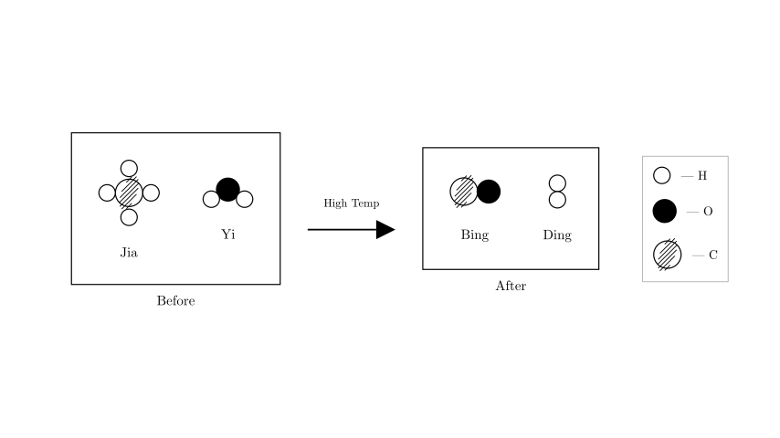
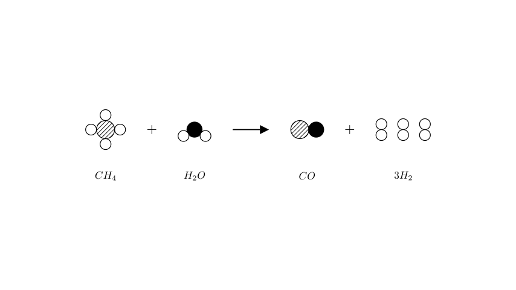

# problem_148_chemistry_g9

**Problem Statement:**

Methane and water react to produce water gas (a mixed gas). The microscopic schematic diagram of the reaction is shown in the figure. Based on the microscopic schematic diagram, which of the following conclusions is correct?

A. The valence of all elements remains unchanged before and after the reaction.
B. There are 3 types of compounds containing hydrogen in this reaction.
C. The mass ratio of reactant Yi (乙) to product Ding (丁) in this reaction is 3:1.
D. The ratio of the number of molecules of product Bing (丙) to product Ding (丁) in this reaction is 1:3.

**Solution Approach:**

To solve this problem, we need to first identify the chemical substances represented by the microscopic models in the diagram. Once we know the reactants and products, we can write down the unbalanced chemical equation. After balancing the equation to satisfy the Law of Conservation of Mass, we can evaluate each option by analyzing valences, compound definitions, stoichiometric mass ratios, and molecular ratios.

**Step 1: Identify the Chemical Substances**

According to the legend provided in the diagram:
* The empty white circle represents a Hydrogen (H) atom.
* The solid black circle represents an Oxygen (O) atom.
* The striped circle represents a Carbon (C) atom.

Now, let's analyze the molecules (Jia, Yi, Bing, Ding) involved in the reaction:
* **Reactant Jia (甲):** Consists of 1 Carbon atom and 4 Hydrogen atoms. Its chemical formula is $CH_4$ (Methane).
* **Reactant Yi (乙):** Consists of 1 Oxygen atom and 2 Hydrogen atoms. Its chemical formula is $H_2O$ (Water).
* **Product Bing (丙):** Consists of 1 Carbon atom and 1 Oxygen atom. Its chemical formula is $CO$ (Carbon Monoxide).
* **Product Ding (丁):** Consists of 2 Hydrogen atoms. Its chemical formula is $H_2$ (Hydrogen gas).

Based on this, the initial, unbalanced chemical equation is:
$$CH_4 + H_2O \xrightarrow{\text{high temp}} CO + H_2$$

**Step 2: Balance the Chemical Equation**

The diagram provided in the problem is a *schematic* showing the *types* of molecules, but it does not represent a balanced chemical reaction. Let's count the atoms on both sides of our unbalanced equation:
* **Reactants:** 1 Carbon, 6 Hydrogen (4 from $CH_4$, 2 from $H_2O$), 1 Oxygen.
* **Products:** 1 Carbon, 2 Hydrogen (from $H_2$), 1 Oxygen.

To balance the 6 Hydrogen atoms from the reactants, we need 3 molecules of $H_2$ on the product side ($3 \times 2 = 6$).
The fully balanced chemical equation is:
$$CH_4 + H_2O \xrightarrow{\text{high temp}} CO + 3H_2$$

**Step 3: Evaluate the Options**

* **A. The valence of all elements remains unchanged.**
Let's check the oxidation states (valences). In Methane ($CH_4$), Hydrogen is +1, so Carbon is -4. In Carbon Monoxide ($CO$), Oxygen is -2, so Carbon is +2. The valence of Carbon changes from -4 to +2. Furthermore, Hydrogen changes from +1 in $CH_4$ and $H_2O$ to 0 in $H_2$.
*Conclusion: Incorrect.*

* **B. There are 3 types of compounds containing hydrogen in this reaction.**
The substances containing hydrogen in this reaction are Methane ($CH_4$), Water ($H_2O$), and Hydrogen gas ($H_2$). A compound is a substance formed by two or more different types of elements. $CH_4$ and $H_2O$ are compounds. However, $H_2$ is composed of only one type of element; it is an elemental substance (simple substance), not a compound. Therefore, there are only 2 compounds containing hydrogen.
*Conclusion: Incorrect.*

* **C. The mass ratio of reactant Yi (乙) to product Ding (丁) in this reaction is 3:1.**
Reactant Yi is $H_2O$ and product Ding is $H_2$. According to the balanced equation, 1 mole of $H_2O$ produces 3 moles of $H_2$. Let's calculate the reacting mass ratio:
Mass of $H_2O$ participating = $1 \times (1 \times 2 + 16) = 18$
Mass of $3H_2$ produced = $3 \times (1 \times 2) = 6$
The mass ratio is $18 : 6$, which simplifies to $3 : 1$.
*Conclusion: Correct.*

* **D. The ratio of the number of molecules of product Bing (丙) to product Ding (丁) in this reaction is 1:3.**
From the balanced equation ($CH_4 + H_2O \rightarrow CO + 3H_2$), for every 1 molecule of $CO$ (Bing) produced, there are 3 molecules of $H_2$ (Ding) produced. The stoichiometric coefficient ratio is exactly 1:3.
*Conclusion: Correct.*

*(Note: In typical multiple-choice exam contexts, occasionally only one answer is intended to be marked correct due to either a typo in the original test's mass ratio—often misprinted as 9:1 to test if students forget to use the balanced coefficients—or a strict focus on direct molecular ratios. However, strictly and chemically speaking based on the balanced equation derived from the provided diagram, both statements C and D are objectively true facts about this reaction.)*

**Final Answer:**
Both **C** and **D** are correct conclusions based on the balanced chemical equation derived from the microscopic schematic. The balanced equation requires 3 molecules of hydrogen gas for every 1 molecule of carbon monoxide, yielding a molecular ratio of 1:3 (Option D), and a corresponding stoichiometric mass ratio of 18:6, or 3:1, between water and hydrogen gas (Option C).

