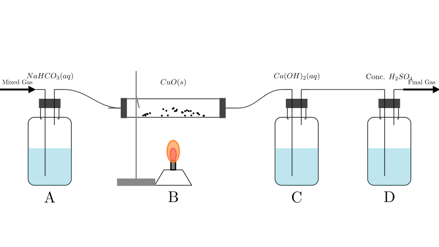
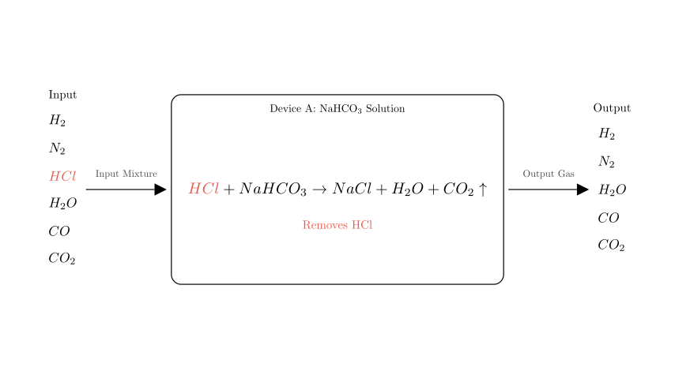
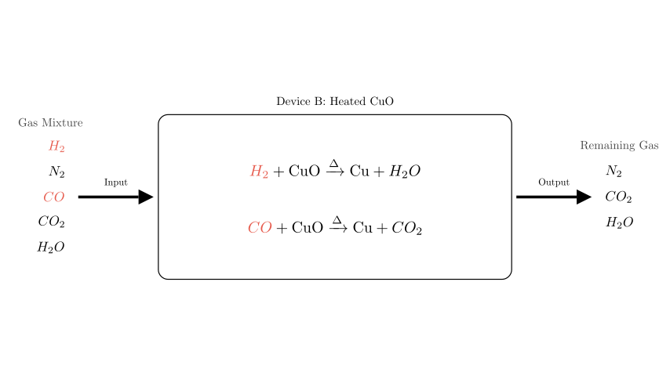
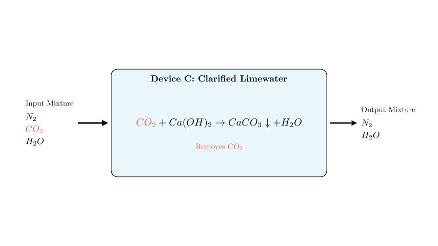
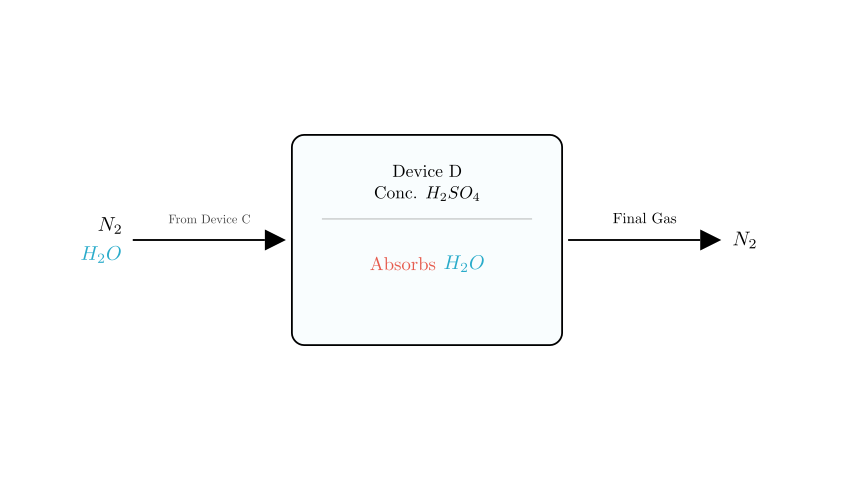

# problem_153_chemistry_g9

**Problem Statement:**
There is a mixed gas consisting of hydrogen ($H_2$), nitrogen ($N_2$), hydrogen chloride ($HCl$), water vapor ($H_2O$), carbon monoxide ($CO$), and carbon dioxide ($CO_2$). The mixture passes sequentially through devices A, B, C, and D shown in the diagram (assuming full reaction at each step). What are the gases removed by each device in order, and what is the final gas obtained?

**Options:**
A. $HCl, CO, H_2, CO_2, H_2O, N_2$
B. $CO_2, CO, H_2, HCl, H_2O, N_2$
C. $HCl, CO, H_2, H_2O, CO_2, N_2$
D. $H_2, CO, CO_2, HCl, N_2, H_2O$

**Solution Approach:**
We will analyze the chemical properties of the reagents in each device (A, B, C, D) and determine which component of the gas mixture reacts or is absorbed at each stage. We will track the composition of the gas stream as it moves from left to right.

**Step 1: Device A (Sodium Bicarbonate Solution)**

The gas mixture first enters Device A, which contains a saturated solution of sodium bicarbonate ($\text{NaHCO}_3$). 

Among the gases in the mixture ($H_2, N_2, HCl, H_2O, CO, CO_2$), hydrogen chloride ($HCl$) is an acidic gas. It reacts with sodium bicarbonate as follows:
$$HCl + \text{NaHCO}_3 \rightarrow \text{NaCl} + H_2O + CO_2 \uparrow$$

This reaction effectively removes **$HCl$** from the mixture. While $CO_2$ is generated, it is already present in the mixture, and $H_2O$ vapor is added as the gas passes through the aqueous solution. The other gases ($H_2, N_2, CO$) do not react with sodium bicarbonate.

**Step 2: Device B (Heated Copper Oxide)**

The remaining gas mixture ($H_2, N_2, CO, CO_2, H_2O$) enters Device B, which contains copper oxide ($\text{CuO}$) and is heated.

Here, the reducing gases—hydrogen ($H_2$) and carbon monoxide ($CO$)—react with the copper oxide:
1.  $$H_2 + \text{CuO} \xrightarrow{\Delta} \text{Cu} + H_2O$$
2.  $$CO + \text{CuO} \xrightarrow{\Delta} \text{Cu} + CO_2$$

Consequently, **$H_2$ and $CO$** are removed (consumed) in this step. These reactions produce more water vapor ($H_2O$) and carbon dioxide ($CO_2$). Nitrogen ($N_2$) and existing $CO_2/H_2O$ pass through unchanged.

**Step 3: Device C (Clarified Limewater)**

The gas stream now largely consists of $N_2$, a significant amount of $CO_2$ (original + generated in A and B), and water vapor. It enters Device C, containing calcium hydroxide solution ($\text{Ca(OH)}_2$).

Carbon dioxide reacts with the limewater to form a precipitate:
$$CO_2 + \text{Ca(OH)}_2 \rightarrow \text{CaCO}_3 \downarrow + H_2O$$

This step removes **$CO_2$**. The gas leaving Device C is now wet nitrogen ($N_2$ mixed with $H_2O$ vapor picked up from the solutions).

**Step 4: Device D (Concentrated Sulfuric Acid)**

Finally, the gas passes through Device D, which contains concentrated sulfuric acid ($\text{H}_2\text{SO}_4$). Concentrated sulfuric acid is a strong desiccant (drying agent).

It absorbs the water vapor (**$H_2O$**) present in the gas stream.

**Final Result:**
After removing $H_2O$, the only remaining gas is nitrogen (**$N_2$**), which is chemically inert and has passed through all devices without reacting.

**Conclusion and Verification**

Let's summarize the gases removed at each step:
1.  **Device A:** Removes **$HCl$**.
2.  **Device B:** Removes **$H_2$** and **$CO$**.
3.  **Device C:** Removes **$CO_2$**.
4.  **Device D:** Removes **$H_2O$**.
5.  **Final Gas:** **$N_2$**.

Comparing this sequence to the given options:
- Option A: $HCl, CO, H_2, CO_2, H_2O, N_2$.

This matches our analysis perfectly (noting that $CO$ and $H_2$ are both removed in step B).

**Correct Answer:** **A**

