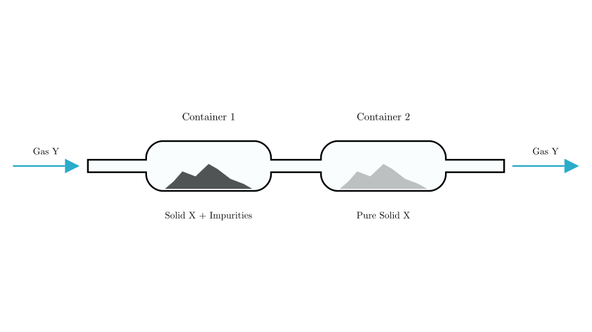
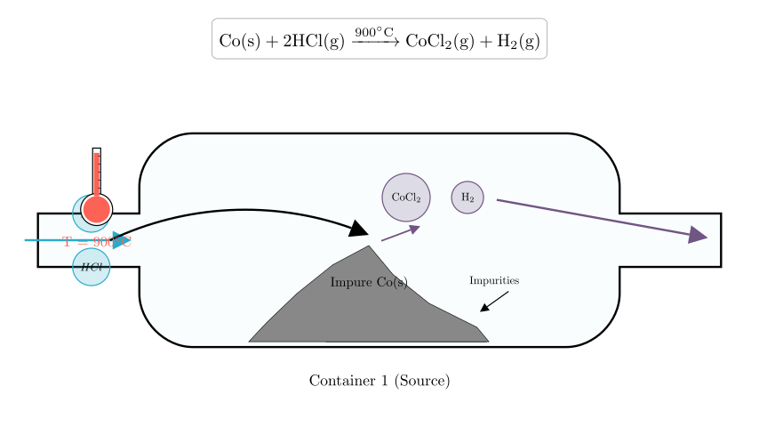
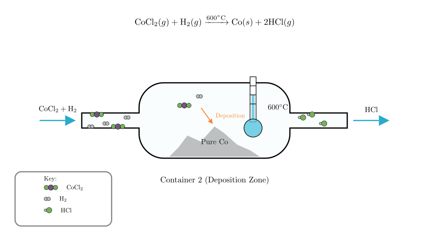

# problem_155_chemistry_g9

**Problem Statement:**

At a certain temperature, in the apparatus shown below, solid X reacts with gas Y to form gaseous products. When the temperature is changed, the gaseous products undergo a reverse reaction, reforming X and Y. The chemical reaction occurring is:

$$\text{Co (solid)} + 2\text{HCl (gas)} \underset{600^\circ\text{C}}{\overset{900^\circ\text{C}}{\rightleftharpoons}} \text{CoCl}_2\text{ (gas)} + \text{H}_2\text{ (gas)}$$

Using the above reaction principle and apparatus, impure solid Co is purified (impurities do not participate in the reaction). Which of the following statements is correct?

A. The process of solid Co moving from Container 1 to Container 2 is a physical change.
B. The solid in Container 2 is pure Co.
C. The gas ultimately exported from the apparatus is $\text{CoCl}_2$ and $\text{H}_2$.
D. The temperature in Container 1 is $900^\circ\text{C}$, and the temperature in Container 2 is $600^\circ\text{C}$.

**Solution Approach:**

This problem involves the principle of **Chemical Vapor Transport**. We need to analyze the reversible chemical equation to determine the conditions required for the forward reaction (gasification) and the reverse reaction (deposition).

1.  **Analyze the Equation:** Identify the temperature required to turn solid Co into gas ($\text{CoCl}_2$).
2.  **Analyze the Process:** Determine which container acts as the "Source" (gasification) and which acts as the "Sink" (deposition).
3.  **Evaluate Options:** Check the validity of each statement against the chemical principles derived.

**Step 1: Analyzing the Reaction Conditions**

The core of this problem lies in interpreting the chemical equation provided:

$$\text{Co} + 2\text{HCl} \underset{600^\circ\text{C}}{\overset{900^\circ\text{C}}{\rightleftharpoons}} \text{CoCl}_2 + \text{H}_2$$

*   **Forward Reaction (Left to Right):**
The arrow pointing to the right is labeled **$900^\circ\text{C}$**.
This means that at $900^\circ\text{C}$, Solid Co reacts with HCl gas to form Gaseous $\text{CoCl}_2$ and $\text{H}_2$.
$$\text{Solid} \rightarrow \text{Gas}$$

*   **Reverse Reaction (Right to Left):**
The arrow pointing to the left is labeled **$600^\circ\text{C}$**.
This means that at $600^\circ\text{C}$, the gaseous products ($\text{CoCl}_2$ and $\text{H}_2$) react to reform Solid Co and HCl gas.
$$\text{Gas} \rightarrow \text{Solid}$$

To purify the Cobalt, we need to move it from Container 1 to Container 2. This requires turning it into a gas in Container 1 and turning it back into a solid in Container 2.

**Step 2: Analyzing Container 1 (The Source)**

In **Container 1**, we place the impure solid Cobalt. The goal is to separate the Cobalt from the impurities.

*   Since the impurities **do not participate** in the reaction, they will remain solid.
*   We want the Cobalt to react with the incoming Gas Y (HCl) to become gaseous $\text{CoCl}_2$.
*   According to our analysis of the equation, the **forward reaction** (Solid $\to$ Gas) occurs at **$900^\circ\text{C}$**.

Therefore, the temperature in Container 1 must be maintained at **$900^\circ\text{C}$**.

**Step 3: Analyzing Container 2 (The Sink)**

The gaseous mixture ($\text{CoCl}_2$ and $\text{H}_2$) flows into **Container 2**. Here, we want to recover the Cobalt.

*   We need the **reverse reaction** to occur: converting the gaseous $\text{CoCl}_2$ back into Solid Co.
*   According to the equation, the reverse reaction (Gas $\to$ Solid) is favored at **$600^\circ\text{C}$**.
*   The reformed HCl gas (Gas Y) then flows out of the outlet.

Therefore, the temperature in Container 2 must be maintained at **$600^\circ\text{C}$**.

**Step 4: Evaluating the Options**

*   **A. Solid Co from Container 1 to 2 is a physical change:**
**Incorrect.** The Co reacts to form $\text{CoCl}_2$ (a new chemical substance) and then reacts back. This involves breaking and forming chemical bonds. It is a chemical change (specifically, chemical transport).

*   **B. The solid in Container 2 is pure Co:**
**Correct statement (in principle).** Since impurities remained in Container 1 and did not turn into gas, the Co that reforms in Container 2 is separated from the impurities.

*   **C. The exported gas is $\text{CoCl}_2$ and $\text{H}_2$:**
**Incorrect.** In Container 2, $\text{CoCl}_2$ and $\text{H}_2$ react to form solid Co and HCl gas. The gas leaving the system is the reformed HCl (Gas Y) and any unreacted $\text{H}_2$. $\text{CoCl}_2$ is consumed to deposit the solid.

*   **D. Container 1 is $900^\circ\text{C}$, Container 2 is $600^\circ\text{C}$:**
**Correct.** As derived above, Container 1 requires the forward reaction ($900^\circ\text{C}$) to gasify the Cobalt, and Container 2 requires the reverse reaction ($600^\circ\text{C}$) to deposit it.

**Conclusion:**
While B describes the *result*, Option D correctly identifies the specific *experimental conditions* required to make the apparatus work based on the provided chemical equation. In the context of such physics/chemistry problems, determining the operating parameters (temperatures) is often the primary objective.

**Final Answer:**
The correct option is **D**.
(Note: Option B is also factually true regarding the outcome, but D is the operational answer derived directly from the equation's conditions).

