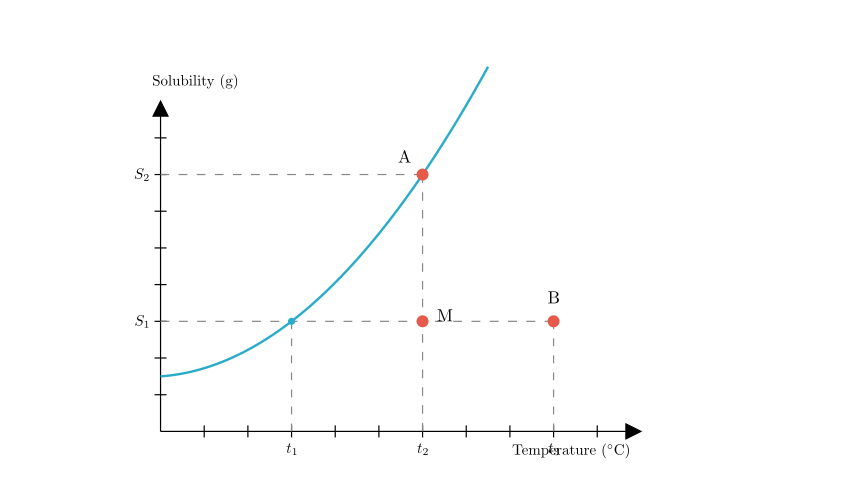
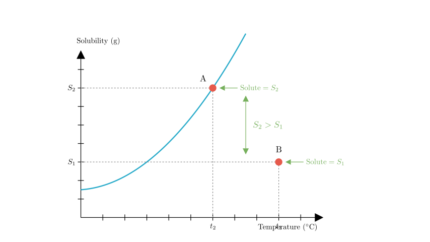
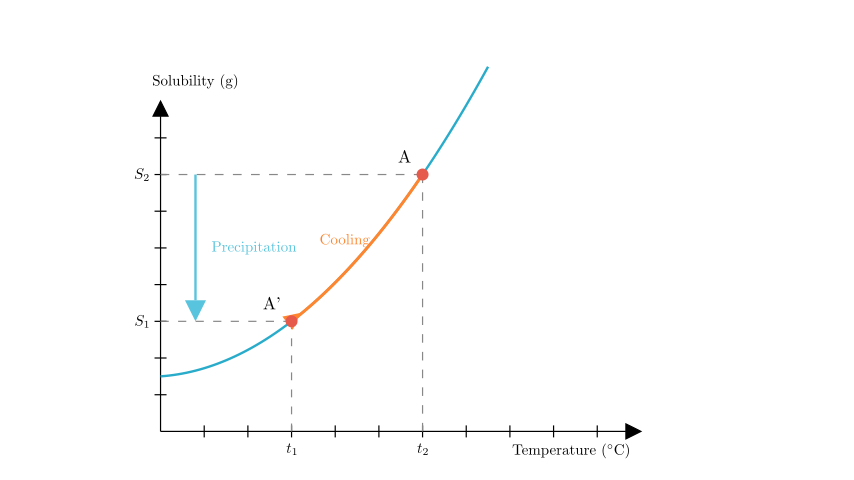
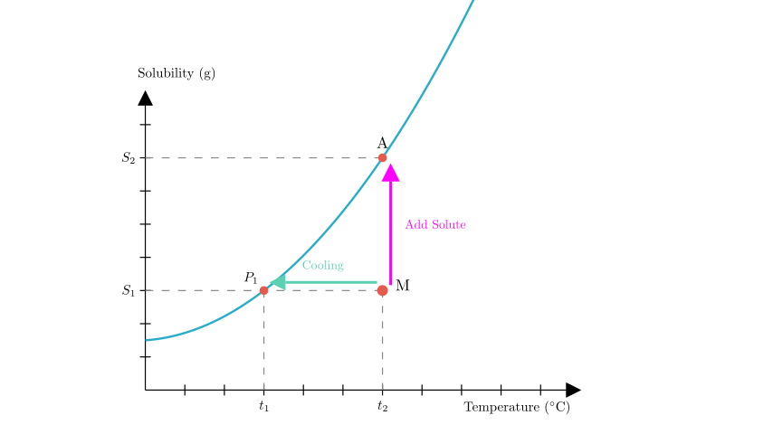

# problem_157_chemistry_g9

**Problem Statement:**

The solubility curve of a solid substance is shown in the figure. Based on the figure, answer the following questions:

(1) The meaning of point B: It represents that at $t_3^\circ$C, an unsaturated solution is formed by dissolving $S_1$g of solute in 100g of solvent. The meaning of point A: $\underline{\hspace{3cm}}$. The expression for the mass fraction of the solute in this solution is $\underline{\hspace{3cm}}$.

(2) If 20g of water is added to the solutions at points A and B respectively while maintaining the temperature, the solubility at point A will $\underline{\hspace{2cm}}$ (fill in "increase", "decrease", or "remain unchanged"); the solute mass fraction of A compared to B is $\underline{\hspace{2cm}}$ (fill in "former is larger", "latter is larger", or "equal").

(3) When the temperature is lowered, how does the mass fraction of the solution at point A change compared to the original after the change? $\underline{\hspace{2cm}}$ (fill in "increase", "decrease", or "unchanged").

(4) Methods to make the $(100+S_1)$g solution at point M saturated: cool down to $\underline{\hspace{1cm}}^\circ$C; add solute $\underline{\hspace{1cm}}$g and $\underline{\hspace{3cm}}$.

**Solution Approach:**
We will analyze the solubility curve to determine the saturation state of points A, B, and M. We will use the definitions of solubility (g solute / 100g solvent) and mass fraction ($\frac{\text{solute}}{\text{solution}}$) to answer questions about dilution, cooling, and saturation methods.

**Part (1): Interpreting Point A**

**Meaning of Point A:**
Point A lies exactly on the solubility curve at temperature $t_2^\circ$C. 
- Any point **on the curve** represents a **saturated solution**.
- The y-coordinate corresponds to $S_2$.
- Therefore, Point A represents a saturated solution at $t_2^\circ$C containing $S_2$g of solute dissolved in 100g of solvent.

**Mass Fraction Expression:**
The mass fraction of the solute is the ratio of the solute's mass to the total solution mass.
- Mass of solute = $S_2$ g
- Mass of solvent = $100$ g
- Total mass of solution = $100 \text{ g} + S_2 \text{ g}$

Formula:
$$ \text{Mass Fraction} = \frac{\text{Mass of Solute}}{\text{Mass of Solution}} \times 100\% = \frac{S_2}{100 + S_2} \times 100\% $$

**Part (2): Adding Water (Dilution)**

**Solubility Change:**
- Solubility is an intrinsic property of a substance that depends only on temperature (and pressure for gases), not on the amount of solvent or solution.
- Since the temperature remains constant at $t_2$ (for A) and $t_3$ (for B), the solubility at Point A **remains unchanged**.

**Comparing Mass Fractions:**
We add 20g of water to both solutions.
- **Solution A:** Originally had $S_2$g solute in 100g water. Now has $S_2$g solute in 120g water.
- **Solution B:** Originally had $S_1$g solute in 100g water. Now has $S_1$g solute in 120g water.

Comparing the two:
$$ \text{Mass Fraction A} \approx \frac{S_2}{120 + S_2} $$
$$ \text{Mass Fraction B} \approx \frac{S_1}{120 + S_1} $$

From the graph (see Scene 2), $S_2$ is vertically higher than $S_1$, so $S_2 > S_1$. Therefore, the mass fraction of A is larger.

**Answer:** former is larger.

**Part (3): Cooling Solution A**

- Solution A is saturated at $t_2^\circ$C.
- As the temperature decreases, the solubility of the substance decreases (the curve goes down).
- Because the solution can no longer hold the original amount of solute ($S_2$), the excess solute will crystallize and precipitate out.
- The solution remains saturated at the new, lower temperature, but the amount of dissolved solute has decreased.
- Consequently, the ratio of solute to solution decreases.

**Answer:** The mass fraction will **decrease**.

**Part (4): Making Solution M Saturated**

Point M represents a solution at $t_2^\circ$C with $S_1$g of solute in 100g of solvent. It is below the curve, meaning it is unsaturated. To make it saturated (reach the curve), we have two main strategies:

**Method 1: Change Temperature (Horizontal Movement)**
- Look to the left of M. The horizontal line at solubility $S_1$ intersects the curve at temperature $t_1$.
- Therefore, cooling the solution from $t_2$ to **$t_1$** will make it saturated.

**Method 2: Add Solute (Vertical Movement)**
- Look directly above M at temperature $t_2$. The saturation point is A, which corresponds to solubility $S_2$.
- Current solute mass = $S_1$ g.
- Required solute mass = $S_2$ g.
- Amount to add = **$(S_2 - S_1)$** g.

**Method 3: Evaporate Solvent**
- The question asks for "add solute ... and ...". The third common method to saturate a solution is to **evaporate solvent** at a constant temperature. This removes water, increasing the concentration until it hits the saturation limit.

**Final Answers Recap:**
(1) Saturated solution containing $S_2$g solute in 100g solvent; $\frac{S_2}{100+S_2} \times 100\%$
(2) remain unchanged; former is larger
(3) decrease
(4) $t_1$; $(S_2 - S_1)$; evaporate solvent

