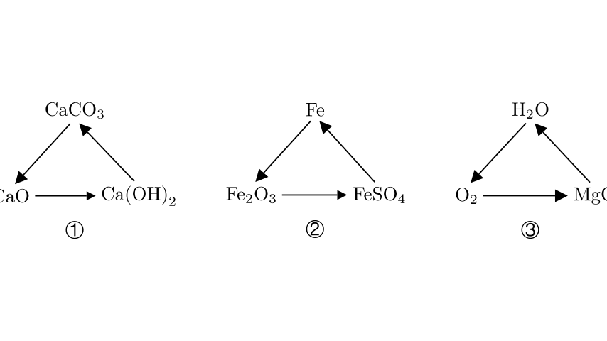
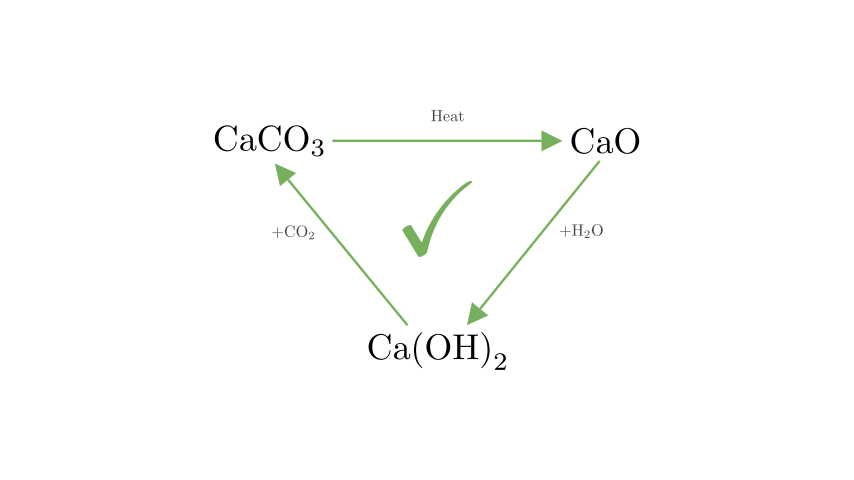
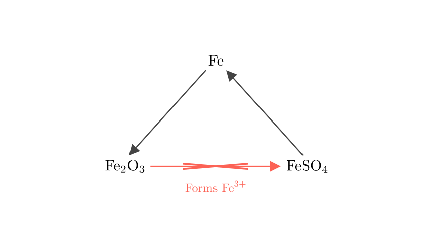
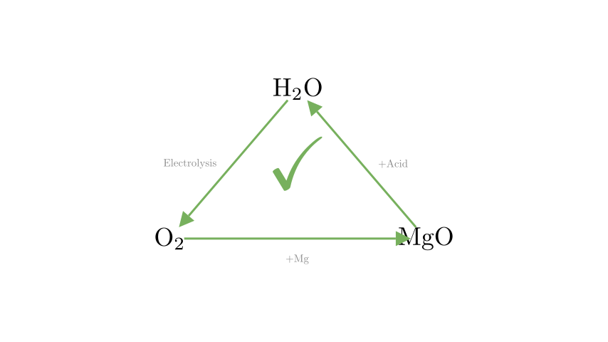

# problem_158_chemistry_g9

**Problem Statement:**
In the following groups of transformations, which ones can be realized in a single step under certain conditions for every step of the cycle?

**Options:**
A. ①②
B. ①③
C. ②③
D. ①②③

**Solution Approach:**
To solve this problem, we need to analyze each reaction cycle (①, ②, and ③) individually. For each arrow in a cycle, we will determine if there exists a standard chemical reaction that converts the starting substance to the product in a single step. We will verify the feasibility based on standard inorganic chemistry principles involving calcium, iron, and magnesium compounds.

**Analysis of Cycle ① (Calcium Compounds):**

Let's examine the transitions for the calcium cycle:

1.  **$\text{CaCO}_3 \rightarrow \text{CaO}$**: Calcium carbonate can be decomposed by heating (calcination) to produce calcium oxide and carbon dioxide.
*   Reaction: $\text{CaCO}_3 \xrightarrow{\text{High Temp}} \text{CaO} + \text{CO}_2\uparrow$ (Feasible)

2.  **$\text{CaO} \rightarrow \text{Ca(OH)}_2$**: Calcium oxide reacts vigorously with water to form calcium hydroxide (slaked lime).
*   Reaction: $\text{CaO} + \text{H}_2\text{O} \rightarrow \text{Ca(OH)}_2$ (Feasible)

3.  **$\text{Ca(OH)}_2 \rightarrow \text{CaCO}_3$**: Calcium hydroxide reacts with carbon dioxide or a soluble carbonate (like sodium carbonate) to form a calcium carbonate precipitate.
*   Reaction: $\text{Ca(OH)}_2 + \text{CO}_2 \rightarrow \text{CaCO}_3\downarrow + \text{H}_2\text{O}$ (Feasible)

Since all steps are possible in one step, Cycle ① is valid.

**Analysis of Cycle ② (Iron Compounds):**

Now let's look at the iron cycle:

1.  **$\text{Fe} \rightarrow \text{Fe}_2\text{O}_3$**: Iron reacts with oxygen and water (rusting) or undergoes oxidation to form iron(III) oxide. While direct burning usually forms $\text{Fe}_3\text{O}_4$, specific oxidation conditions or rusting followed by dehydration can yield $\text{Fe}_2\text{O}_3$. This step is generally considered chemically feasible, though often slow or requiring specific conditions.

2.  **$\text{Fe}_2\text{O}_3 \rightarrow \text{FeSO}_4$**: This step presents a problem.
*   $\text{Fe}_2\text{O}_3$ is an iron(III) oxide. Reacting it with sulfuric acid ($\text{H}_2\text{SO}_4$) produces iron(III) sulfate, $\text{Fe}_2(\text{SO}_4)_3$, not iron(II) sulfate ($\text{FeSO}_4$).
*   Reaction: $\text{Fe}_2\text{O}_3 + 3\text{H}_2\text{SO}_4 \rightarrow \text{Fe}_2(\text{SO}_4)_3 + 3\text{H}_2\text{O}$.
*   To get iron(II) sulfate ($\text{FeSO}_4$), a reduction step would be required, meaning this cannot be done in a single simple metathesis step.

3.  **$\text{FeSO}_4 \rightarrow \text{Fe}$**: Iron(II) sulfate can react with a more reactive metal like zinc to displace the iron.
*   Reaction: $\text{FeSO}_4 + \text{Zn} \rightarrow \text{ZnSO}_4 + \text{Fe}$ (Feasible).

Because the transformation from $\text{Fe}_2\text{O}_3$ to $\text{FeSO}_4$ cannot be achieved in a simple single step (it involves a change in oxidation state from +3 to +2 which acid alone won't do), Cycle ② is invalid.

**Analysis of Cycle ③ (Magnesium and Water):**

Finally, we examine the third cycle:

1.  **$\text{H}_2\text{O} \rightarrow \text{O}_2$**: Water can be split into hydrogen and oxygen via electrolysis.
*   Reaction: $2\text{H}_2\text{O} \xrightarrow{\text{Electrolysis}} 2\text{H}_2\uparrow + \text{O}_2\uparrow$ (Feasible)

2.  **$\text{O}_2 \rightarrow \text{MgO}$**: Magnesium burns in oxygen to form magnesium oxide.
*   Reaction: $2\text{Mg} + \text{O}_2 \xrightarrow{\text{Ignition}} 2\text{MgO}$ (Feasible)

3.  **$\text{MgO} \rightarrow \text{H}_2\text{O}$**: Magnesium oxide is a basic oxide and reacts with acids (like hydrochloric acid or sulfuric acid) to produce a salt and water.
*   Reaction: $\text{MgO} + \text{H}_2\text{SO}_4 \rightarrow \text{MgSO}_4 + \text{H}_2\text{O}$ (Feasible)

All steps in this cycle can be realized in a single step. Thus, Cycle ③ is valid.

**Conclusion:**

Based on the analysis:
- Cycle ① is valid.
- Cycle ② is invalid (conversion of $\text{Fe}_2\text{O}_3$ to $\text{FeSO}_4$ is not a one-step process).
- Cycle ③ is valid.

Therefore, the groups of changes that can be realized in one step are ① and ③.

**Final Answer:**
The correct option is **B. ①③**.

