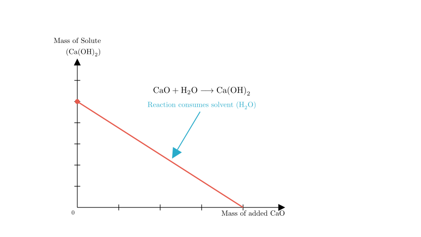
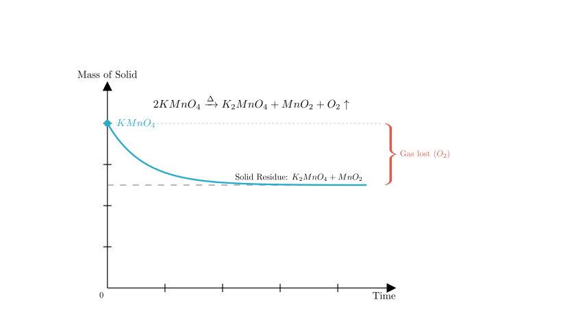
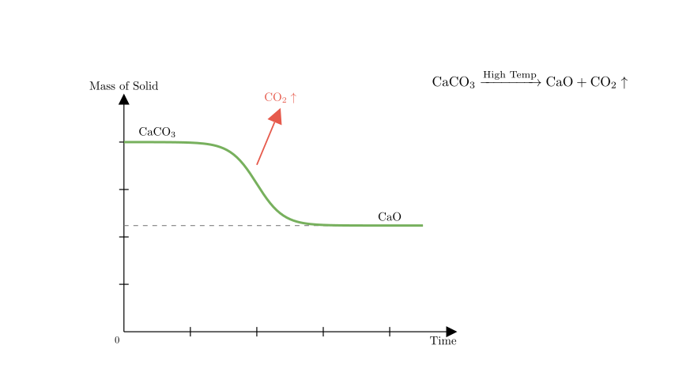
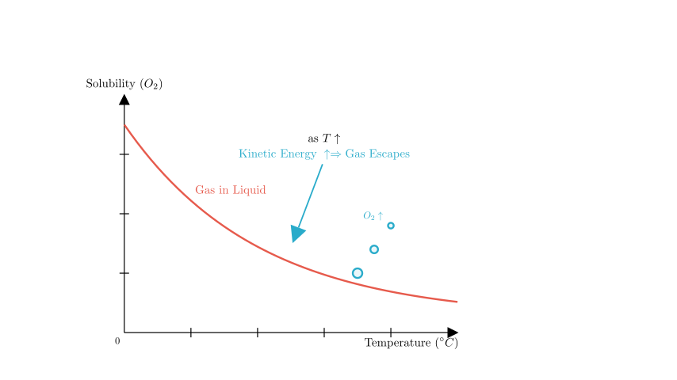

# problem_159_chemistry_g9

**Problem Statement:**
Which of the following graphs correctly reflects the corresponding experimental operation?

*   **A.** Adding calcium oxide (CaO) to a certain amount of saturated limewater (calcium hydroxide solution).
*   **B.** Heating a certain amount of potassium permanganate ($KMnO_4$) solid to produce oxygen.
*   **C.** High-temperature calcination of calcium carbonate ($CaCO_3$).
*   **D.** The solubility of oxygen ($O_2$) in water versus temperature.

**Solution Approach:**
We will analyze the chemical principles behind each experimental operation to determine the theoretical relationship between the variables plotted. We will then compare the theoretical behavior with the graphs provided in the options to identify the correct one.

Let's start by analyzing Option A.

**Analysis of Option A:**

The experiment involves adding calcium oxide ($CaO$) to saturated limewater ($Ca(OH)_2$ solution).

1.  **Chemical Reaction:** Calcium oxide reacts with water in the solution to form calcium hydroxide:
$$CaO + H_2O \rightarrow Ca(OH)_2$$
This reaction consumes the solvent (water).
2.  **Solvent Loss:** As water is consumed, the remaining solvent mass decreases. Since the solution is already saturated, the loss of solvent forces some dissolved solute ($Ca(OH)_2$) to precipitate out.
3.  **Thermal Effect:** This reaction is exothermic (releases heat). The solubility of calcium hydroxide decreases as temperature rises, causing further precipitation.

**Conclusion for A:** The mass of the solute in the solution must **decrease**. The graph provided in Option A shows the mass remaining constant, which is **incorrect**. The diagram above illustrates the correct behavior (decreasing mass).

Now, let's look at Option B.

**Analysis of Option B:**

The experiment involves heating solid potassium permanganate ($KMnO_4$).

1.  **Reaction:** 
$$2KMnO_4 \xrightarrow{\Delta} K_2MnO_4 + MnO_2 + O_2 \uparrow$$
2.  **Mass Change:** The reactant is a solid. The products include two solids ($K_2MnO_4$ and $MnO_2$) and one gas ($O_2$).
3.  **Result:** The oxygen gas escapes, causing the total mass of the solid to decrease. However, the potassium manganate and manganese dioxide remain as solid residues.

**Conclusion for B:** The mass of the solid should decrease but **stop at a non-zero value** (the mass of the residue). The graph provided in Option B shows the mass decreasing to zero, which implies no solid is left. This is **incorrect**. The diagram above shows the correct plateau.

Next, we analyze Option C.

**Analysis of Option C:**

The experiment is the high-temperature calcination of calcium carbonate ($CaCO_3$).

1.  **Reaction:**
$$CaCO_3 \xrightarrow{High\ Temp} CaO + CO_2 \uparrow$$
2.  **Mass Change:** Carbon dioxide ($CO_2$) is a gas and escapes the system. Calcium oxide ($CaO$) is a solid and remains.
3.  **Result:** The total mass of the solid decreases as $CO_2$ is lost. Once the reaction is complete, the mass remains constant (equal to the mass of the $CaO$ produced).

**Conclusion for C:** The graph should show the mass decreasing and then leveling off at a non-zero value. The graph provided in Option C matches this description perfectly. This is **correct**.

Finally, let's check Option D to be sure.

**Analysis of Option D:**

This option looks at the solubility of oxygen gas ($O_2$) in water as temperature changes.

1.  **Physical Principle:** The solubility of gases in liquids generally **decreases** as the temperature increases. As water gets hotter, gas molecules gain kinetic energy and escape the liquid phase.

**Conclusion for D:** The graph should show solubility decreasing (going down) as temperature increases. The graph provided in Option D shows solubility increasing, which is **incorrect**.

**Final Verification:**
*   A is incorrect (Mass of solute should decrease).
*   B is incorrect (Solid mass should not reach zero).
*   C is correct (Solid mass decreases and plateaus).
*   D is incorrect (Gas solubility should decrease with temperature).

**Final Answer:**
The correct graph is **C**.

