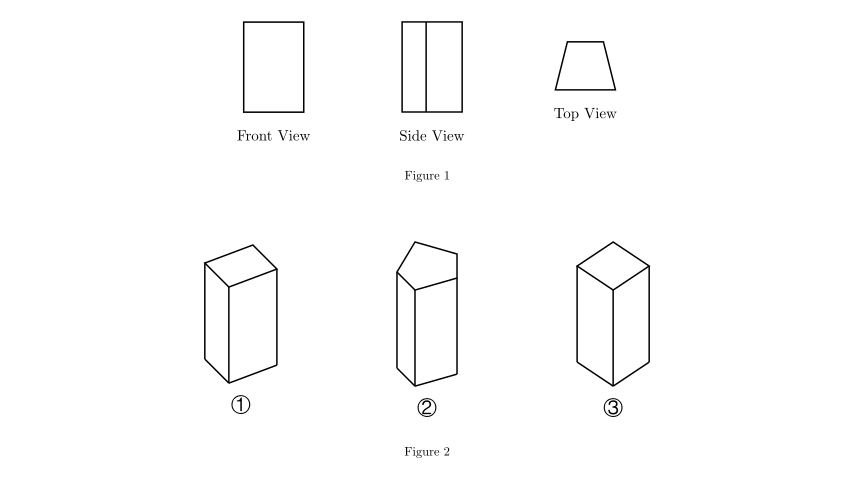
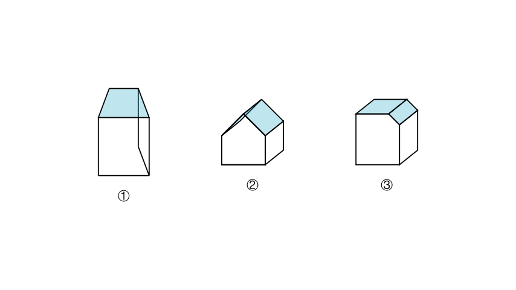
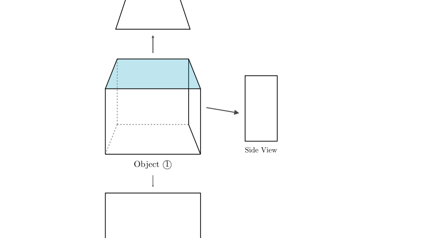

# problem_164_math_g6

**Problem Statement:**
Three different objects are placed on a table. Xiao Ming looks at one of the objects from different angles, and the shapes he sees are shown in Figure 1. Based on these views, which object in Figure 2 did he see?

**Options:**
A. ①
B. ②
C. ③

**Solution Approach:**
To solve this spatial reasoning problem, we will analyze the three given 2D orthographic projections (Front View, Side View, and Top View) provided in Figure 1. We will then compare these views with the 3D geometrical shapes provided in the options (Figure 2) to find the match. The most distinctive view usually provides the quickest elimination of incorrect options.

**Step 1: Analyze the Top View**

In geometric identification problems, the Top View (looking down from above) is often the most unique feature. 

Looking at the given views in Figure 1:
- The **Front View** is a rectangle.
- The **Side View** is a rectangle (or rectangular shape).
- The **Top View** is a **trapezoid**.

This means the object must have a flat top surface (or overall outline from above) shaped like a trapezoid. We will now examine the three 3D objects in Figure 2 to see which one possesses a trapezoidal top.

**Step 2: Evaluate the Options**

Let's compare the top surfaces highlighted in the diagram above with the required **trapezoid** shape:

*   **Object ①:** This is a prism with a trapezoidal base. When standing upright, its top surface is a clear **trapezoid**. This matches the Top View in Figure 1.
*   **Object ②:** The top of this object resembles a roof or a triangle. Its top view would look like two rectangles meeting at a line, or a triangle, not a simple trapezoid.
*   **Object ③:** This object is a rectangular prism with a slanted edge. Its top view would generally appear as a rectangle (possibly with a line indicating the bevel), but the primary outline is rectangular, not trapezoidal.

**Step 3: Verify with Front and Side Views**

Now that Object ① is the primary candidate, let's verify its other views:
*   **Front View:** Looking at the wide face of the trapezoidal prism ①, we see a large **rectangle**. This matches the given Front View.
*   **Side View:** Looking at the side of the prism, we see the projection of the side panel, which appears as a **rectangle**. This matches the given Side View.

**Conclusion**

Object ① is the only shape that produces a trapezoidal Top View while maintaining rectangular Front and Side views. 

Therefore, the object Xiao Ming saw is **①**.

**Final Answer:** A

