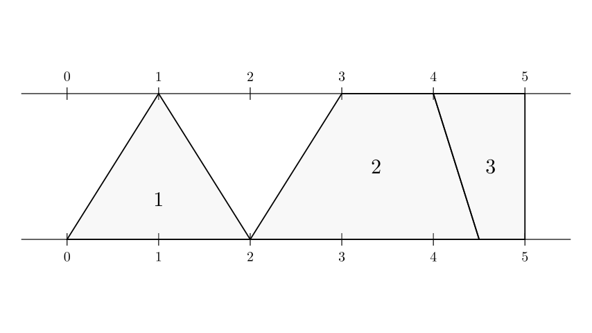
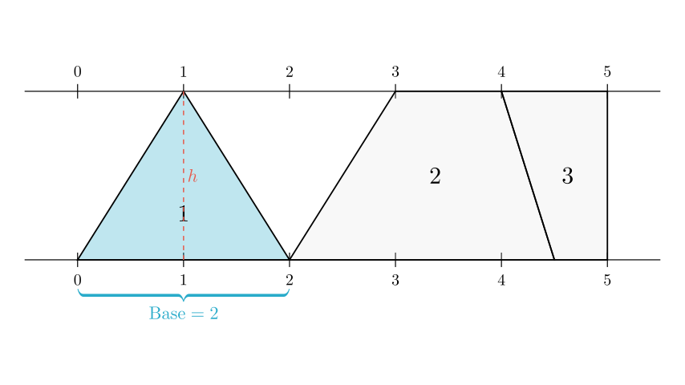
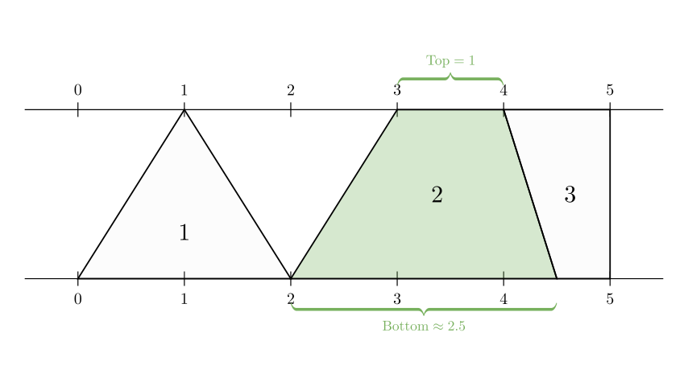
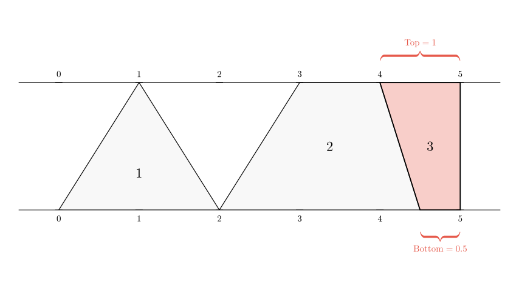

# problem_166_math_g6

**Problem Statement:**
下面的图形中，图（  ）的面积最小．
A．1
B．2
C．3

**Translation:**
In the figure below, which figure ( ) has the smallest area?
A. 1
B. 2
C. 3

**Solution Approach:**
To determine which figure has the smallest area, we will calculate the area of each shape (1, 2, and 3) in terms of the height between the parallel lines. Since all shapes share the same height, we can compare their areas by analyzing their base lengths.

**Step 1: Analyze the Geometry**

All three figures are located between two parallel horizontal lines. Let's define the vertical distance (height) between these lines as $h$. Because the height is constant for all figures, the area of each figure depends entirely on its width or base lengths.

Let's examine **Figure 1**:
- It is a **triangle**.
- Its base lies on the bottom line, extending from tick 0 to tick 2.
- Base length = $2 - 0 = 2$ units.
- The top vertex is on the top line at tick 1.

The area of a triangle is given by:
$$ \text{Area} = \frac{1}{2} \times \text{base} \times \text{height} $$
$$ \text{Area}_1 = \frac{1}{2} \times 2 \times h = 1h $$

**Step 2: Analyze Figure 2**

Now let's look at **Figure 2**.
- It is a **trapezoid** (a quadrilateral with at least one pair of parallel sides—the top and bottom bases).
- **Top Base:** Extends from tick 3 to tick 4 on the top line. Length = $4 - 3 = 1$ unit.
- **Bottom Base:** Starts at tick 2. The right boundary is the line separating Figure 2 and Figure 3. This line connects the top tick 4 to a point on the bottom line. Visually, this line is slanted to the right, landing halfway between 4 and 5 (at 4.5).
- Bottom Base length = $4.5 - 2 = 2.5$ units.

The area of a trapezoid is the average of the bases times the height:
$$ \text{Area} = \frac{\text{top} + \text{bottom}}{2} \times h $$
$$ \text{Area}_2 = \frac{1 + 2.5}{2} \times h = 1.75h $$

*Even without the precise value of 4.5, we can see the bottom base (from 2 to past 4) is clearly longer than 2 units, making the average width greater than 1.5.*

**Step 3: Analyze Figure 3**

Finally, let's examine **Figure 3**.
- It is also a **trapezoid**.
- **Top Base:** Extends from tick 4 to tick 5. Length = $5 - 4 = 1$ unit.
- **Bottom Base:** Extends from the slanted boundary line (at roughly 4.5) to the vertical line at tick 5.
- Bottom Base length = $5 - 4.5 = 0.5$ units.

Notice that the left boundary line slants to the right (from top 4 to bottom 4.5), which "cuts into" the rectangular area between 4 and 5. This makes the bottom base significantly smaller than the top base.

$$ \text{Area}_3 = \frac{1 + 0.5}{2} \times h = 0.75h $$

**Conclusion**

Let's compare the calculated areas in terms of $h$:

- **Figure 1:** $1h$
- **Figure 2:** $1.75h$
- **Figure 3:** $0.75h$

Comparing the values:
$$ 0.75h < 1h < 1.75h $$

Figure 3 has the smallest area.

**Verification:**
Visually, Figure 1 occupies half of a 2-unit wide rectangle (average width 1). Figure 3 occupies a 1-unit wide strip but is "cut" by the slanted line, making its average width less than 1 (specifically 0.75). Figure 2 is the widest, spanning more than 2 units on the bottom. Therefore, Figure 3 is the smallest.

**Final Answer:**
The figure with the smallest area is **3**. (Option C)

