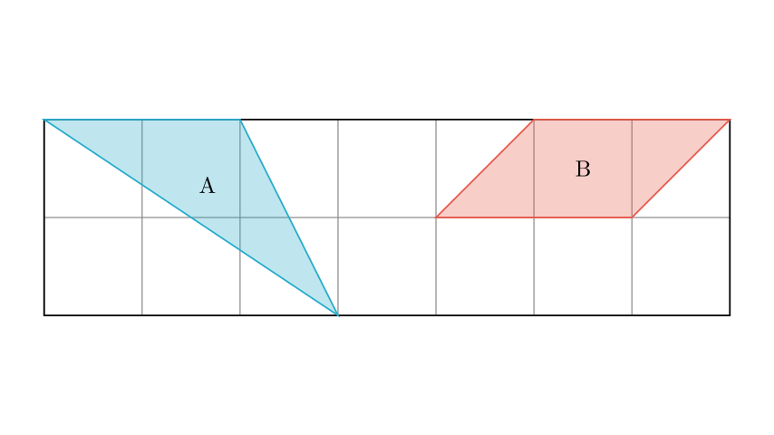
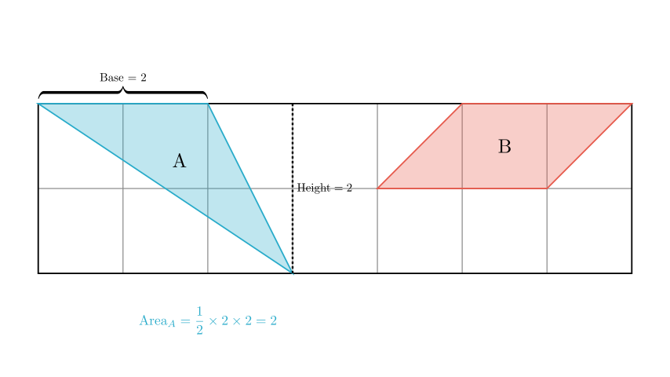
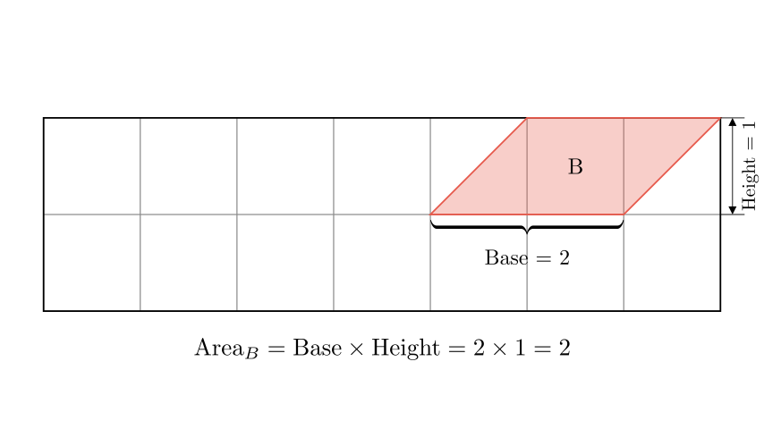

# problem_167_math_g6

**Problem Statement:**
As shown in the figure, the shaded area of A (甲) is (  ) the shaded area of B (乙).
A. Greater than
B. Less than
C. Equal to

**Solution Approach:**
To solve this problem, we need to calculate the area of the two shaded regions, labeled "甲" (A) and "乙" (B), by using the grid squares as units. We will determine the geometric properties (base and height) of each shape relative to the grid and compare their calculated areas.

**Step 1: Analyze the Area of Region A (甲)**

Let's examine the shape labeled "甲" on the left side of the grid.

1.  **Identify the Shape:** This region is a **triangle**.
2.  **Determine the Base:** The top edge of the triangle lies along the top grid line. By counting the grid squares, we can see it spans exactly **2 squares**.
*   Base = 2 units.
3.  **Determine the Height:** The triangle's lowest point touches the bottom grid line. Since the grid is 2 rows high, the vertical distance from the base (top line) to the vertex (bottom line) is **2 squares**.
*   Height = 2 units.

Now, we calculate the area using the formula for a triangle:
$$ \text{Area} = \frac{1}{2} \times \text{base} \times \text{height} $$
$$ \text{Area}_A = \frac{1}{2} \times 2 \times 2 = 2 \text{ square units} $$

**Step 2: Analyze the Area of Region B (乙)**

Now, let's look at the shape labeled "乙" on the right side.

1.  **Identify the Shape:** This region is a **parallelogram**. It is located entirely within the top row of the grid.
2.  **Determine the Base:** Looking at the horizontal width, the shape spans from one grid intersection to another two units away. Both the top edge and the bottom edge of this parallelogram span **2 squares** horizontally.
*   Base = 2 units.
3.  **Determine the Height:** The shape occupies only the top row of the grid, so its vertical height is exactly **1 square**.
*   Height = 1 unit.

We calculate the area using the formula for a parallelogram:
$$ \text{Area} = \text{base} \times \text{height} $$
$$ \text{Area}_B = 2 \times 1 = 2 \text{ square units} $$

*Alternative Method:* You can also count the grid parts. The shape consists of one full square (area 1) in the middle, plus two triangles on the sides that each equal half a square (0.5 + 0.5 = 1). Total Area = 1 + 1 = 2.

**Step 3: Comparison and Conclusion**

We have calculated the areas of both shapes:
*   **Area of A (甲):** 2 square units.
*   **Area of B (乙):** 2 square units.

Since $2 = 2$, the area of the shaded region A is **equal to** the area of the shaded region B.

**Final Answer:**
The correct option is **C. 等于 (Equal to)**.

