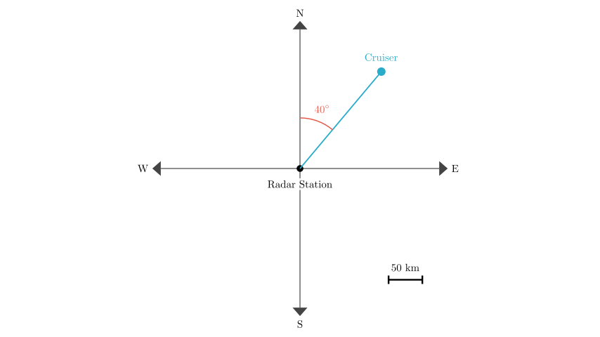
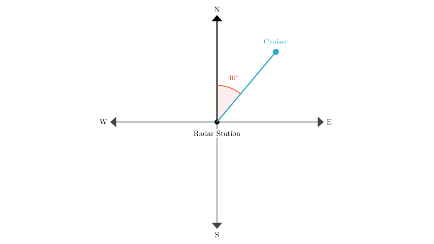
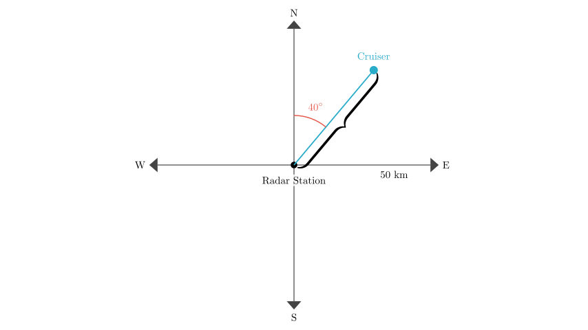

# problem_169_math_g6

**Problem Statement:**
As shown in the figure below, the cruiser is located at the radar station's ( ).

**Options:**
A. North by East $40^\circ$, $50\text{ km}$
B. North by West $40^\circ$, $50\text{ km}$
C. North by East $40^\circ$, $100\text{ km}$

**Solution Approach:**
To solve this problem, we need to determine the position of the cruiser relative to the radar station using a polar coordinate system approach. This involves two steps:
1.  **Direction:** Identify the angle relative to the cardinal directions (North, South, East, West).
2.  **Distance:** Interpret the distance magnitude from the scale or labels provided in the diagram.

**Step 1: Determine the Direction**

First, let's establish the frame of reference. The Radar Station is at the center (the origin). The cardinal directions are marked as North (up), South (down), West (left), and East (right).

Observe the position of the **Cruiser**:
- It is located in the top-right quadrant, which is between **North** and **East**.
- The angle provided in the diagram is $40^\circ$.
- Crucially, this angle is measured starting from the **North** axis, rotating towards the **East** axis.

In navigation and geography, a direction described as "North by East $40^\circ$" (or $N\ 40^\circ\ E$) means starting at North and turning $40^\circ$ towards the East. This matches our diagram perfectly. 

(Note: If the angle were measured from the East axis, it would be $90^\circ - 40^\circ = 50^\circ$, or "East by North $50^\circ$", but the diagram explicitly marks the angle from the North).

**Step 2: Determine the Distance**

Next, we look at the distance from the Radar Station to the Cruiser.

The diagram includes a distance label of **$50\text{ km}$**. In geometric diagrams of this type, when a single distance value is provided alongside a single object vector without additional tick marks or concentric grid circles, that value represents the magnitude of the vector shown.

Therefore, the distance from the center (Radar Station) to the point (Cruiser) is $50\text{ km}$.

Let's evaluate the given options based on our findings:
- **Direction:** North by East $40^\circ$
- **Distance:** $50\text{ km}$

**Conclusion and Verification**

We have determined:
1.  The direction is $40^\circ$ East of North.
2.  The distance is $50\text{ km}$.

Comparing this to the options:
- **A. North by East $40^\circ$, $50\text{ km}$** matches both our findings.
- B. North by West $40^\circ$, $50\text{ km}$ is incorrect because the cruiser is to the East, not the West.
- C. North by East $40^\circ$, $100\text{ km}$ is incorrect because the distance is labeled as $50\text{ km}$, not $100\text{ km}$.

**Final Answer:**
The cruiser is located at **North by East $40^\circ$, distance $50\text{ km}$**. This corresponds to option **A**.

