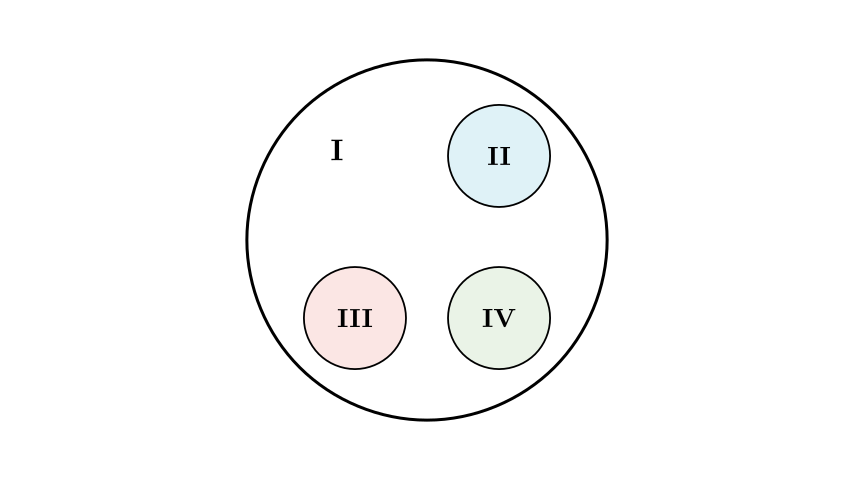
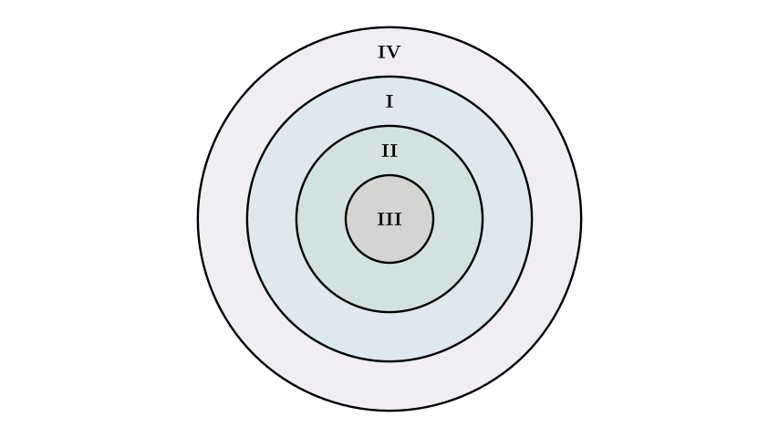
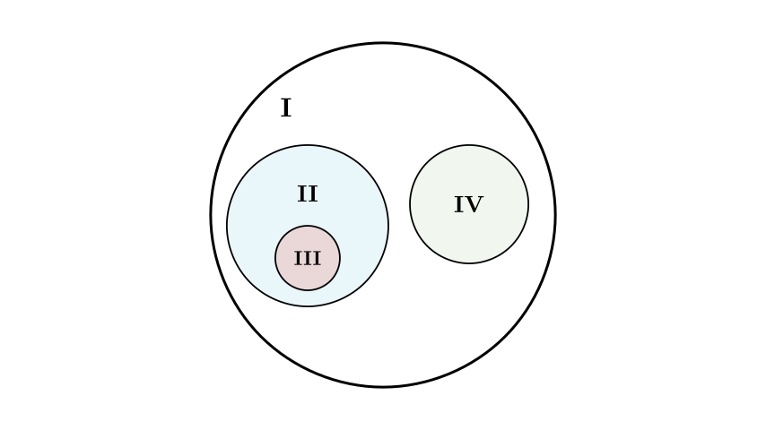
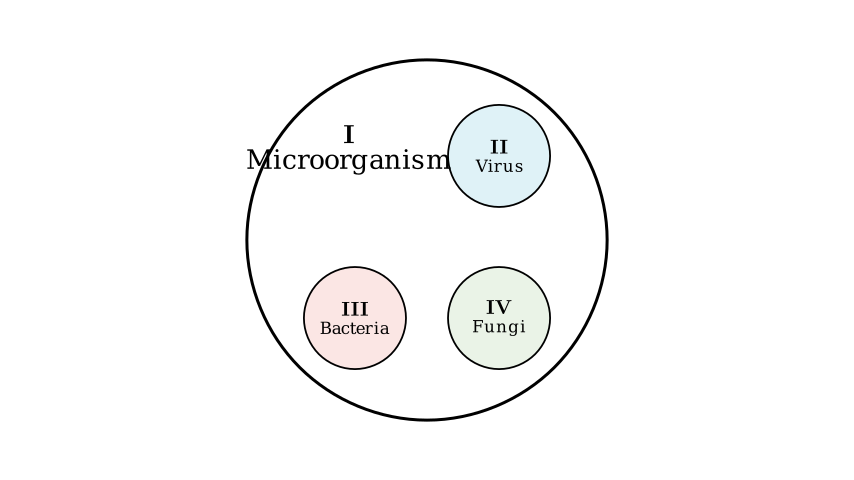

# problem_170_biology_g9

**Problem Statement:**
If the diagram below represents the relationships between relevant concepts, which of the following options matches the diagram?

**Diagram:** A large circle labeled **I** contains three smaller, non-overlapping circles labeled **II**, **III**, and **IV**.

**Options:**
| Option | I | II | III | IV |
| :--- | :--- | :--- | :--- | :--- |
| **A** | Fish | Reptiles | Birds | Mammals |
| **B** | Chromosome | DNA | Gene | Nucleus |
| **C** | Seed | Embryo | Cotyledon | Seed Coat |
| **D** | Microorganism | Virus | Bacteria | Fungi |

**Solution Approach:**
We need to identify the logical relationship shown in the diagram. The diagram depicts a set **I** that includes three distinct, non-overlapping subsets **II**, **III**, and **IV**. We will analyze each option to see which set of biological concepts fits this "inclusive but parallel" structure.

**Analysis of the Diagram's Logic:**
The diagram represents a **classification relationship**:
1.  **Inclusion:** Concept **I** is the supergroup (the whole) that contains concepts **II**, **III**, and **IV**.
2.  **Parallelism:** Concepts **II**, **III**, and **IV** are distinct categories at the same level; they do not overlap (e.g., something cannot be both II and III).

Now, let's evaluate **Option A**:
- **I:** Fish
- **II, III, IV:** Reptiles, Birds, Mammals

Biologically, Fish, Reptiles, Birds, and Mammals are distinct classes within the phylum Chordata (Vertebrates). "Fish" is not a supergroup that contains Reptiles, Birds, or Mammals. If we were to draw this, all four would be separate circles (perhaps all inside a "Vertebrates" circle), but "Fish" would not contain the others. Thus, Option A is incorrect.

Next, let's look at the structure of **Option B**.

**Analysis of Option B:**
- **I:** Chromosome
- **II:** DNA
- **III:** Gene
- **IV:** Nucleus

The biological relationship here is hierarchical:
- The **Nucleus (IV)** contains **Chromosomes (I)**.
- **Chromosomes (I)** are composed of **DNA (II)** and proteins.
- **DNA (II)** contains segments called **Genes (III)**.

Therefore, the relationship is $IV \supset I \supset II \supset III$ (Nucleus > Chromosome > DNA > Gene). This corresponds to a concentric diagram (nested circles), not the parallel sets shown in the problem. Option B is incorrect.

Now, let's evaluate **Option C**.

**Analysis of Option C:**
- **I:** Seed
- **II:** Embryo
- **III:** Cotyledon
- **IV:** Seed Coat

A **Seed (I)** is structurally composed of a **Seed Coat (IV)**, an **Embryo (II)**, and (in some plants) Endosperm.
However, the **Cotyledon (III)** is actually *part of* the **Embryo (II)**.

In the problem diagram, circle III is separate from circle II. In reality, for a seed, circle III (Cotyledon) should be drawn **inside** circle II (Embryo). Because the diagram shows III and II as separate, non-overlapping circles, Option C is incorrect.

Finally, let's evaluate **Option D**.

**Analysis of Option D:**
- **I:** Microorganism
- **II:** Virus
- **III:** Bacteria
- **IV:** Fungi

**Microorganisms (I)** is a broad term that encompasses various microscopic entities. The major groups include:
1.  **Viruses (II)** (non-cellular)
2.  **Bacteria (III)** (prokaryotic cells)
3.  **Fungi (IV)** (eukaryotic cells like yeast and molds)

These three groups (II, III, IV) are distinct from one another (a virus is not a bacterium, a bacterium is not a fungus), yet they all fall under the umbrella of microorganisms (I).

This relationship perfectly matches the diagram: **I** contains **II**, **III**, and **IV**, and the three subgroups are separate.

**Conclusion:**
Option D is the only one where the supergroup (I) contains three distinct, parallel subgroups (II, III, IV).

**Final Answer:** D

