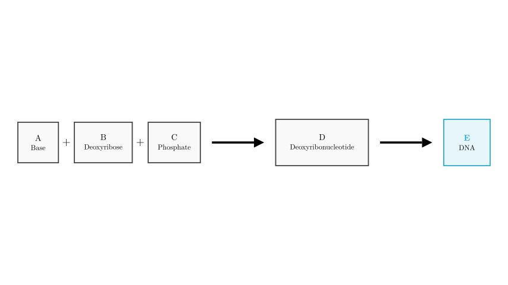
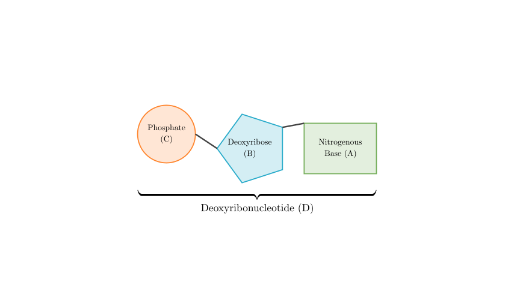
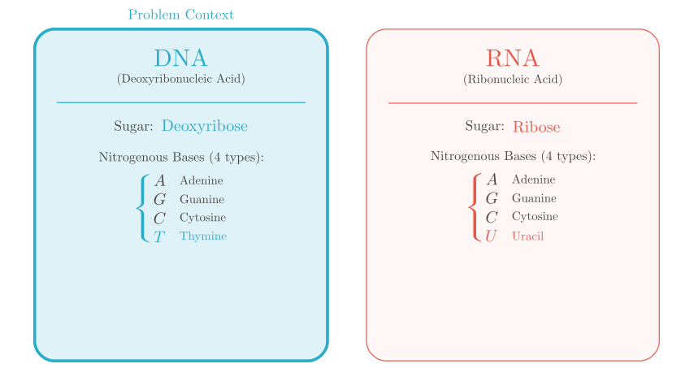

# problem_171_biology_g9

**Problem Statement:**

Based on the concept map below, which statement is correct?

$$ A + B (\text{Sugar}) + C (\text{Phosphate}) \longrightarrow D \longrightarrow E (\text{DNA}) $$

A. There are 5 types of bases represented by A.
B. D represents deoxyribonucleotide.
C. There are 8 types of structures represented by D.
D. B represents ribose.

**Solution Approach:**
To solve this problem, we need to analyze the hierarchical structure of DNA shown in the flowchart. We will identify the chemical components (monomers) that make up DNA, specifically identifying what molecules A, B, C, and D represent. This involves knowledge of nucleic acid chemistry, specifically the difference between DNA and RNA components.

**Step 1: Identify the Final Product and the Monomer (D)**

The flowchart ends with **E**, which is explicitly labeled as **DNA** (Deoxyribonucleic Acid). DNA is a biological macromolecule (polymer) composed of repeating units called monomers.

The structure **D** represents this monomer unit. Since the polymer is DNA, the monomer must be a **Deoxyribonucleotide**.

This immediately suggests that **Option B** ("D represents deoxyribonucleotide") is a strong candidate for the correct answer. Let's verify the components to be sure.

**Step 2: Identify the Sugar (B)**

Nucleotides are composed of three parts: a phosphate group, a pentose sugar, and a nitrogenous base.

- In **RNA**, the sugar is **Ribose**.
- In **DNA**, the sugar is **Deoxyribose**.

Since **E is DNA**, the sugar **B** must be **Deoxyribose**.

*Evaluation of Option D:* Option D claims B is ribose. This is **incorrect** because ribose is found in RNA, not DNA.

**Step 3: Identify the Bases (A)**

The nitrogenous bases found in DNA are specific. While there are 5 primary nitrogenous bases in total (Adenine, Guanine, Cytosine, Thymine, and Uracil), DNA only uses 4 of them.

- **DNA Bases:** Adenine (A), Guanine (G), Cytosine (C), Thymine (T).
- **RNA Bases:** Adenine (A), Guanine (G), Cytosine (C), Uracil (U).

*Evaluation of Option A:* Option A claims there are 5 types of bases represented by A. This is **incorrect**. In the context of DNA, there are only **4 types**.

**Step 4: Determine the Variety of Structure D**

Structure **D** is the Deoxyribonucleotide. Since a deoxyribonucleotide consists of a phosphate, a deoxyribose sugar, and one of the 4 DNA bases, the type of the nucleotide is determined by the base attached.

Because there are **4 types of bases** in DNA (A, T, C, G), there are exactly **4 types of Deoxyribonucleotides**:
1. Deoxyadenosine monophosphate
2. Deoxyguanosine monophosphate
3. Deoxycytidine monophosphate
4. Deoxythymidine monophosphate

*Evaluation of Option C:* Option C claims there are 8 types of structures for D. This is **incorrect**. The number 8 refers to the total types of nucleotides found in *both* DNA and RNA combined (4 deoxyribonucleotides + 4 ribonucleotides). Since the diagram is restricted to DNA, there are only 4.

**Conclusion**

Let's recap our findings:
- **A (Base):** 4 types in DNA. (Option A is wrong)
- **B (Sugar):** Deoxyribose. (Option D is wrong)
- **D (Monomer):** Deoxyribonucleotide. (**Option B is correct**)
- **Types of D:** 4 types. (Option C is wrong)

**Final Answer:**
The correct statement is **B**. D represents deoxyribonucleotide.

