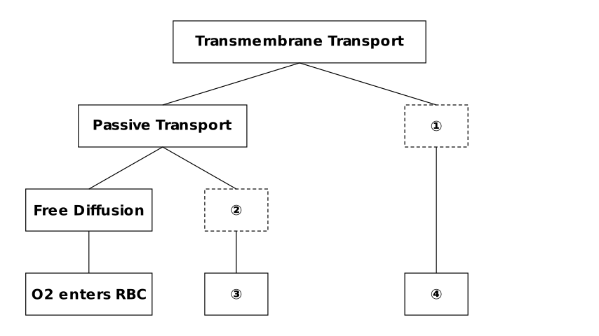
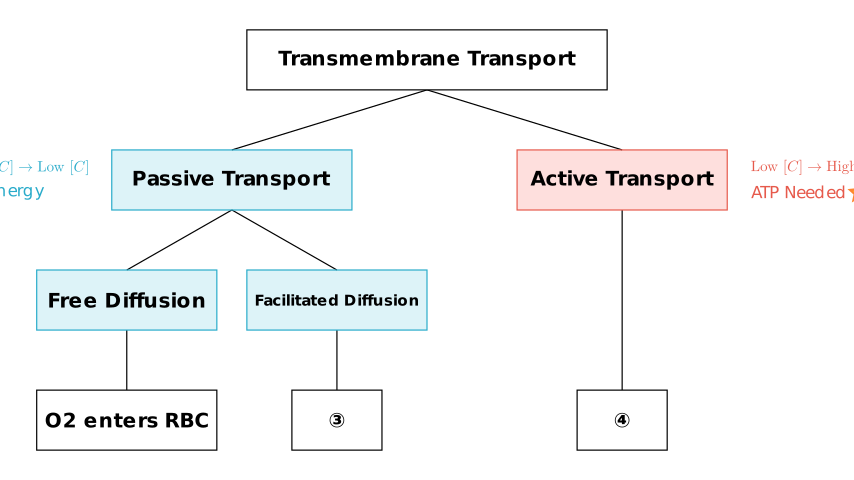

# problem_172_biology_g9

**Problem Statement:**

Regarding the description of the numbered items in the diagram, which of the following is correct?

A. Both processes ① and ② require ATP consumption.
B. Only process ① can transport substances against the concentration gradient.
C. Macromolecules can only enter the cell through process ①.
D. Glucose entering small intestinal epithelial cells is related to process ②.

**Solution Approach:**

1.  **Analyze the Flowchart:** We need to identify the missing terms (①, ②, ③, ④) in the concept map of transmembrane transport.
2.  **Classify Transport Methods:** Distinguish between Passive Transport (Free Diffusion, Facilitated Diffusion) and Active Transport based on energy usage and concentration gradients.
3.  **Evaluate Options:** Check each statement against the characteristics of the identified transport methods.

**Step 1: Decoding the Flowchart**

To solve this, we must first fill in the blanks in the classification tree based on biological principles.

*   **Node ①:** The chart divides "Transmembrane Transport" into "Passive Transport" and another category. The counterpart to Passive Transport is **Active Transport**. Therefore, **① is Active Transport**.
*   **Node ②:** "Passive Transport" is subdivided into "Free Diffusion" and another type. Passive transport consists of Free Diffusion and **Facilitated Diffusion**. Therefore, **② is Facilitated Diffusion**.
*   **Examples (③ & ④):** 
*   **③** would be an example of Facilitated Diffusion (e.g., Glucose entering red blood cells).
*   **④** would be an example of Active Transport (e.g., Glucose entering small intestinal epithelial cells, or ions pumped by Na+/K+ pump).

Now we have the complete picture:
*   **① = Active Transport**
*   **② = Facilitated Diffusion**

**Step 2: Evaluating the Options**

Let's analyze each option based on the characteristics visualized in the diagram above.

**A. Both processes ① and ② require ATP consumption.**
*   **Process ① (Active Transport):** Requires energy (ATP).
*   **Process ② (Facilitated Diffusion):** This is a type of *Passive Transport*. By definition, passive transport is driven by the concentration gradient and **does not** consume ATP.
*   **Conclusion:** This statement is **Incorrect**.

**B. Only process ① can transport substances against the concentration gradient.**
*   **Process ① (Active Transport):** Moves substances from low concentration to high concentration (against the gradient). This requires energy.
*   **Passive Transport (Free Diffusion & Process ②):** Moves substances from high to low concentration (down the gradient).
*   **Conclusion:** Active transport is indeed the only method among these that moves substances *against* the gradient. This statement is **Correct**.

**C. Macromolecules can only enter the cell through process ①.**
*   **Process ①** refers to **Active Transport**, which typically involves carrier proteins transporting small molecules or ions (like Na⁺, K⁺, amino acids, glucose).
*   **Macromolecules** (like proteins and polysaccharides) are too large for these carriers. They enter cells via **Endocytosis** (phagocytosis or pinocytosis) and exit via **Exocytosis**. These processes involve the deformation of the cell membrane and vesicles, not the transmembrane carrier proteins associated with standard Active Transport depicted here.
*   **Conclusion:** This statement is **Incorrect**.

**D. Glucose entering small intestinal epithelial cells is related to process ②.**
*   **Process ②** is **Facilitated Diffusion**. An example of this is glucose entering *red blood cells*.
*   **Glucose entering small intestinal epithelial cells** occurs against the concentration gradient (absorbing glucose from the gut even when blood glucose is high). This requires energy and is a form of **Active Transport** (specifically, secondary active transport). Therefore, it is related to process ①, not ②.
*   **Conclusion:** This statement is **Incorrect**.

**Final Conclusion**

*   **①** = Active Transport (Needs ATP, against gradient)
*   **②** = Facilitated Diffusion (No ATP, with gradient)

The only correct description is **B**, which correctly identifies that Active Transport (①) is the unique mechanism among those shown for transporting substances against their concentration gradient.

**Answer:** B

