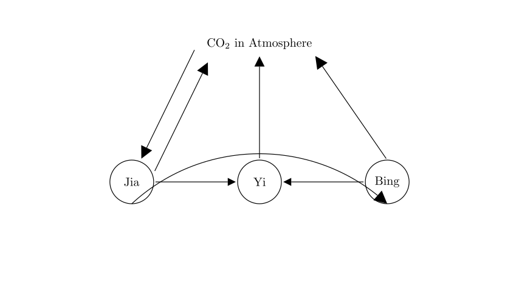
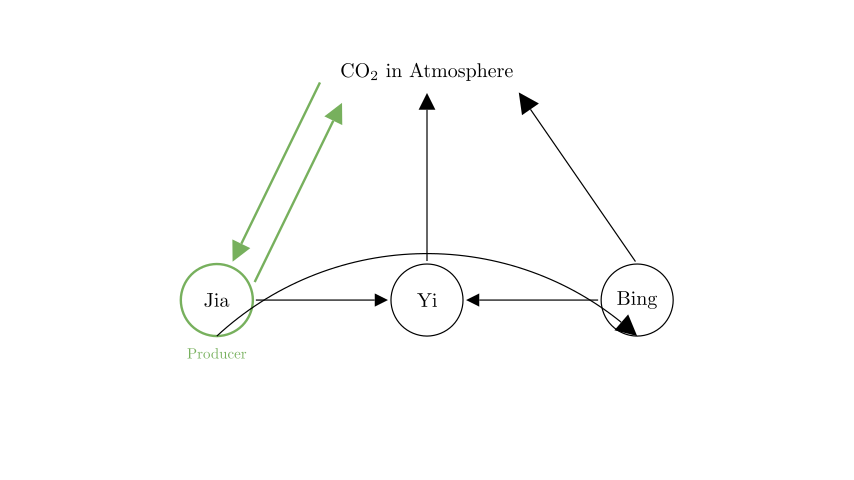
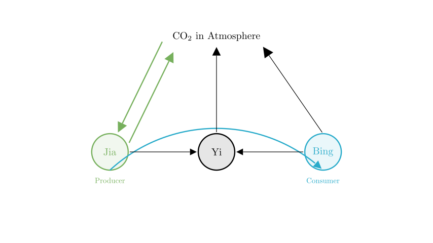
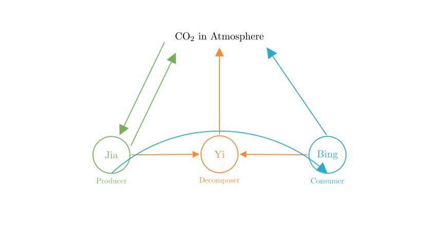

# problem_173_biology_g9

**Problem Statement:**
The figure shows a simplified diagram of the carbon cycle in nature. What do 甲, 乙, and 丙 represent respectively? (   )

A. 甲 is Producer, 乙 is Decomposer, 丙 is Consumer
B. 甲 is Consumer, 乙 is Decomposer, 丙 is Producer
C. 甲 is Decomposer, 乙 is Producer, 丙 is Consumer
D. 甲 is Producer, 乙 is Consumer, 丙 is Decomposer

**Solution Approach:**
To solve this problem, we will analyze the direction of the arrows in the carbon cycle diagram. We need to identify the specific roles (Producer, Consumer, Decomposer) by looking at how carbon enters and leaves each component relative to the atmosphere.

**Step 1: Identify the Producer (甲 / Jia)**

The most critical clue in a carbon cycle diagram is the connection between the biological components and the atmosphere.

- Look for a component that has a **two-way interaction** with the atmosphere or specifically an arrow pointing **from the atmosphere to the organism**.
- In nature, only **Producers** (green plants, algae, etc.) can absorb carbon dioxide from the atmosphere through the process of **photosynthesis**.
- In the diagram, **甲 (Jia)** is the only component with an arrow pointing to it from "Atmosphere". It also has an arrow pointing back to the atmosphere (representing respiration).

Therefore, **甲 is the Producer**.

**Step 2: Identify the Consumer (丙 / Bing)**

Next, we trace the flow of matter and energy from the Producer.

- Animals (Consumers) cannot make their own food; they must eat producers or other animals.
- In the diagram, there is an arrow pointing from **甲 (Producer)** to **丙 (Bing)**. This represents the flow of carbon/energy via feeding (predation).
- **丙** also releases CO2 back into the atmosphere through respiration (indicated by the arrow from 丙 to Atmosphere).

Therefore, **丙 is the Consumer**.

**Step 3: Identify the Decomposer (乙 / Yi)**

Finally, we look at the component that receives material from all other biological components.

- **Decomposers** (bacteria and fungi) break down dead organic matter (waste, dead bodies, fallen leaves) from both Producers and Consumers.
- In the diagram, arrows point from both **甲 (Producer)** and **丙 (Consumer)** towards **乙 (Yi)**.
- **乙** then breaks this matter down and releases CO2 back into the atmosphere (arrow from 乙 to Atmosphere).

Therefore, **乙 is the Decomposer**.

**Conclusion and Verification**

Let's summarize our findings:
- **甲 (Jia)**: Absorbs CO2 (Photosynthesis) $\rightarrow$ **Producer**
- **丙 (Bing)**: Feeds on 甲 $\rightarrow$ **Consumer**
- **乙 (Yi)**: Receives waste from both 甲 and 丙 $\rightarrow$ **Decomposer**

Comparing this with the given options:
- A. 甲 is Producer, 乙 is Decomposer, 丙 is Consumer
- B. 甲 is Consumer, 乙 is Decomposer, 丙 is Producer
- C. 甲 is Decomposer, 乙 is Producer, 丙 is Consumer
- D. 甲 is Producer, 乙 is Consumer, 丙 is Decomposer

Option A matches our analysis perfectly.

**Final Answer:** The correct option is **A**.

