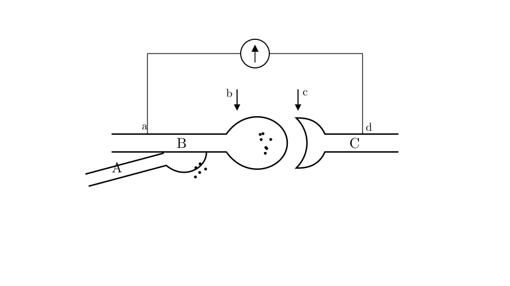
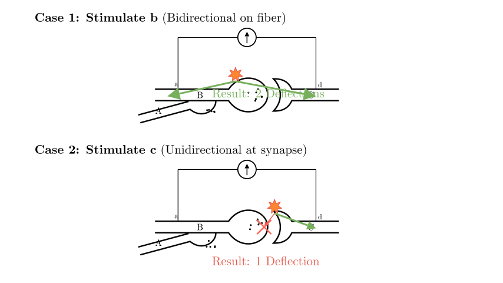
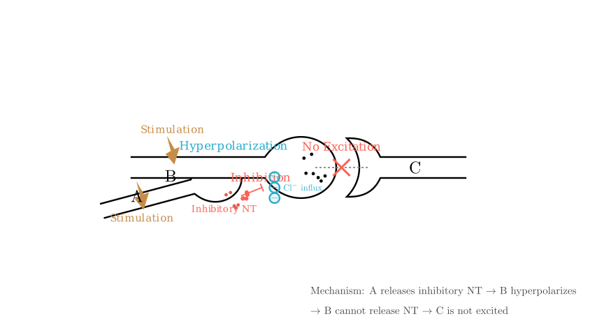

# problem_174_biology_g9

**Problem Statement:**

The figure illustrates the structure of synapses, with a sensitive galvanometer connected at points **a** and **d** to measure potential changes. Which of the following analyses is correct?

**(1)** The structure shown includes 3 neurons and contains 3 synapses.
**(2)** When points **b** and **c** are stimulated respectively, the galvanometer pointer deflects twice in both cases.
**(3)** If **B** is stimulated, **C** becomes excited; if **A** and **B** are stimulated simultaneously, **C** does not become excited. This implies **A** releases an inhibitory neurotransmitter.
**(4)** Neurotransmitters can bind to "receptors" on the postsynaptic membrane, and the chemical nature of these "receptors" is glycoprotein.
**(5)** **A** and **B** must be axons, while **C** could be a dendrite or an axon.

**Options:**
A. ①③④
B. ②④
C. ①③⑤
D. ③④

**Solution Approach:**
We will analyze the anatomical structure of the neurons to determine the number of synapses and the identity of the structures (axons vs. dendrites). Then, we will trace the path of electrical excitation to determine how the galvanometer responds to stimulation at different points. Finally, we will apply principles of synaptic physiology to understand the inhibitory effect described.

**Step 1: Analyzing the Anatomical Structure (Statements ① and ⑤)**

First, let's identify the components in the diagram to evaluate Statement ① ("3 neurons, 3 synapses") and Statement ⑤ ("A, B are axons").

*   **Identifying Neurons:** The diagram shows three distinct structural segments labeled A, B, and C.
*   **Structure A** contains synaptic vesicles and terminates on B. This is an **axon terminal**.
*   **Structure B** receives input from A but also contains synaptic vesicles and terminates on C. Since it releases neurotransmitters, the part touching C is an **axon terminal**. This suggests B is an interneuron or a neuron forming an axo-axonic synapse with A.
*   **Structure C** receives input from B. It could be a dendrite or a cell body (soma).
*   **Conclusion on Statement ⑤:** Since A and B both contain vesicles for release, they function as presynaptic axon terminals. C is the postsynaptic target. Thus, **Statement ⑤ is correct** (though we must see if it fits the final options).

*   **Counting Synapses:** A synapse is the junction between two neurons.
1.  **Synapse 1:** Between A (presynaptic) and B (postsynaptic).
2.  **Synapse 2:** Between B (presynaptic) and C (postsynaptic).
*   There are no other junctions shown.
*   **Conclusion on Statement ①:** The diagram shows 3 neurons but only **2 synapses**. Therefore, **Statement ① is FALSE**.

Since Statement ① is false, we can eliminate options **A** and **C**.

**Step 2: Analyzing Signal Transmission (Statement ②)**

Statement ② claims that stimulating **b** and **c** will both cause the galvanometer to deflect twice. Let's trace the excitation paths:

*   **Stimulation at point 'b' (on Neuron B):**
*   Excitation generates an action potential that travels bidirectionally along the nerve fiber.
*   **Path 1 (b → a):** The signal travels electrically to point **a**. The galvanometer detects a potential change (1st deflection).
*   **Path 2 (b → synapse → C → d):** The signal travels to the terminal of B, crosses the synapse (chemical signal) to C, and triggers an electrical signal to point **d**. The galvanometer detects a potential change (2nd deflection).
*   *Result:* **Two deflections.**

*   **Stimulation at point 'c' (on Neuron C):**
*   Excitation travels to point **d** (1st deflection).
*   **Path backwards (c → synapse → B):** Synaptic transmission is **unidirectional** (presynaptic → postsynaptic). Neurotransmitters are only released from B to C. The signal *cannot* cross from C back to B.
*   Therefore, the signal never reaches point **a**.
*   *Result:* **Only one deflection.**

*   **Conclusion on Statement ②:** Since stimulating 'c' only causes one deflection, **Statement ② is FALSE**.

This eliminates option **B**. By elimination, the answer must be **D**. Let's verify the remaining statements.

**Step 3: Analyzing Inhibition and Receptors (Statements ③ and ④)**

*   **Statement ③ Analysis:**
*   The prompt states: "If B is stimulated, C excites; if A and B are stimulated simultaneously, C does not excite."
*   This phenomenon is known as **presynaptic inhibition** (or simply neural inhibition).
*   Neuron A releases a neurotransmitter that acts on Neuron B. Since the concurrent activity of A prevents B from exciting C, A must be reducing the excitability of B or preventing B from releasing its neurotransmitter.
*   Therefore, **A releases an inhibitory neurotransmitter**.
*   **Conclusion:** **Statement ③ is TRUE**.

*   **Statement ④ Analysis:**
*   Neurotransmitters released into the synaptic cleft bind to specific protein structures on the postsynaptic membrane called receptors.
*   Biochemically, these receptors are typically **glycoproteins** (proteins with carbohydrate chains attached) which are essential for specific recognition and binding.
*   **Conclusion:** **Statement ④ is TRUE**.

**Final Verification:**
*   Statement ①: False (2 synapses, not 3).
*   Statement ②: False (Stimulating 'c' leads to 1 deflection).
*   Statement ③: True (Inhibitory mechanism).
*   Statement ④: True (Receptor chemistry).
*   Statement ⑤: True (A and B are axons), but this statement is not part of the correct option combination (D). The question asks to select the correct analysis set, and option D (③④) contains only true statements without the false ones found in A, B, or C.

**Final Answer:**
The correct statements are ③ and ④.
The correct option is **D**.

