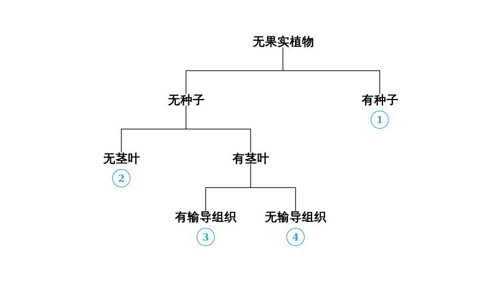
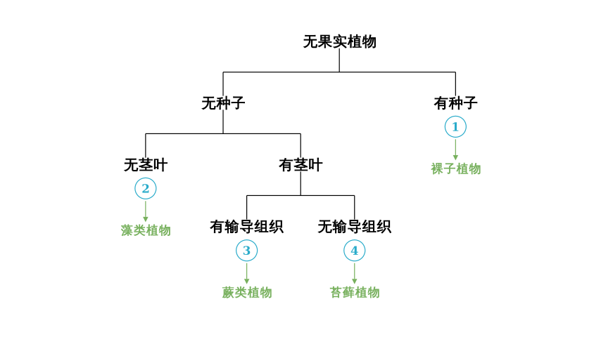

# problem_175_biology_g9

**Problem Statement:**

The diagram below illustrates the classification of certain plant groups. Which of the following analyses is correct?

**Options:**
A. ① refers to seed plants, which are adapted to dry land life.
B. ② refers to algae, which can only live in water.
C. ③ refers to plants that have true roots but are all very short/small.
D. ③ refers to plants with no roots, simple leaf structure, and are easily damaged by toxic gases.

**Solution Approach:**
To solve this, we must first "decode" the classification tree to identify which specific plant group corresponds to each number (①, ②, ③, ④). We will use the biological characteristics provided in the flowchart (presence of seeds, stems, leaves, and vascular tissue) to identify the groups, and then evaluate the options.

**Step 1: Decoding the Classification Tree**

Let's identify the plant groups based on the characteristics shown in the diagram:

1.  **Analyze ①:**
*   Path: Plants without fruit $\rightarrow$ **Has seeds**.
*   Identification: Plants that produce seeds but do not produce fruit (meaning the seeds are "naked") are called **Gymnosperms**.

2.  **Analyze ②:**
*   Path: Plants without fruit $\rightarrow$ No seeds $\rightarrow$ **No stems or leaves**.
*   Identification: Spore-producing plants with no differentiation into roots, stems, or leaves are **Algae**.

3.  **Analyze the "Has Stem/Leaf" branch:**
*   This branch splits based on the presence of **vascular tissue** (transport tissue like xylem and phloem).

4.  **Analyze ③:**
*   Path: No seeds $\rightarrow$ Has stems/leaves $\rightarrow$ **Has vascular tissue**.
*   Identification: Spore-producing plants that have true roots, stems, leaves, and vascular tissue are **Ferns** (Pteridophytes).

5.  **Analyze ④:**
*   Path: No seeds $\rightarrow$ Has stems/leaves $\rightarrow$ **No vascular tissue**.
*   Identification: Spore-producing plants that have stems and leaves (often simple) but lack true vascular tissue and true roots (having rhizoids instead) are **Mosses** (Bryophytes).

**Step 2: Evaluating Options A and B**

*   **Option A: "① refers to seed plants, adapted to dry land life."**
*   **Analysis:** We identified ① as Gymnosperms. Gymnosperms are indeed seed plants. Because they reproduce via seeds (which are more distinct and protective than spores) and have advanced vascular systems, they are well-adapted to terrestrial (land) environments, including dry conditions (e.g., pines, cypresses).
*   **Verdict:** This statement is **Correct**.

*   **Option B: "② refers to algae, which can only live in water."**
*   **Analysis:** We identified ② as Algae. While the majority of algae are aquatic (freshwater or marine), it is scientifically inaccurate to say they *only* live in water. Some algae live in damp soil, on tree bark, or in symbiotic relationships (like lichens) on land.
*   **Verdict:** This statement is **technically incorrect** due to the absolute word "only," though they are primarily aquatic.

**Step 3: Evaluating Options C and D**

*   **Option C: "③ refers to plants that have true roots but are all very short/small."**
*   **Analysis:** We identified ③ as Ferns (vascular spore plants). Ferns have vascular tissue, which allows them to transport water and nutrients efficiently. This means they can grow quite large (e.g., ancient tree ferns). They are not restricted to being "very short" like mosses are.
*   **Verdict:** This statement is **Incorrect**.

*   **Option D: "③ refers to plants with no roots, simple leaf structure, and are easily damaged by toxic gases."**
*   **Analysis:** This description (no true roots, simple leaves, sensitive to air pollution like sulfur dioxide) specifically describes **Mosses (Bryophytes)**. In our diagram, Mosses correspond to **④**, not ③. Group ③ (Ferns) has true roots and vascular tissue.
*   **Verdict:** This statement is **Incorrect** (it describes group ④, not ③).

**Conclusion:**
The only analysis that is scientifically accurate and fits the classification diagram is Option A.

**Final Answer:** A

